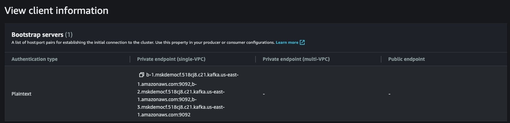
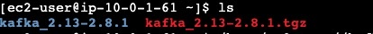
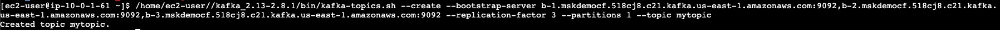
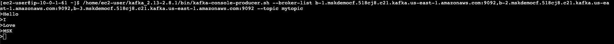
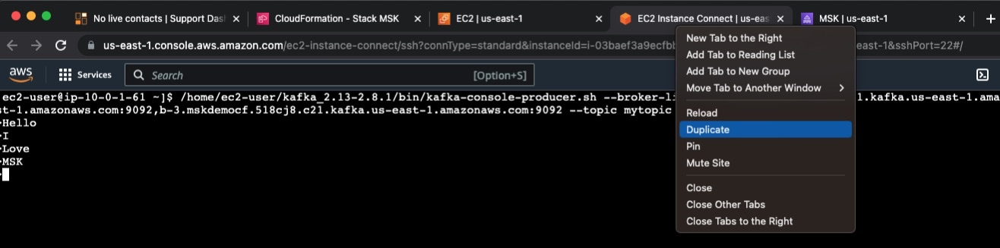
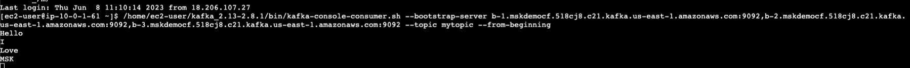
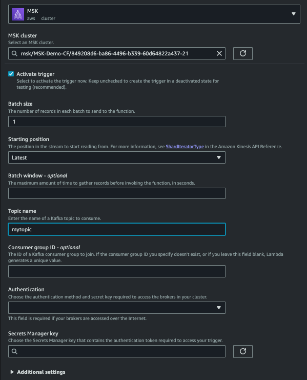
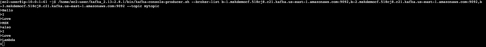

# AWS Lambda and AWS MSK CloudFormation Template

This pattern sets up a networking infrastructure with a VPC, subnets, routing, security groups, NAT gateways, and an MSK cluster.

It also provisions an EC2 instance (Client machine) and a Lambda function for interacting with the MSK cluster.

NOTE - Can take some time to provision, once it starts deploying in Cloud formation


Important: this application uses various AWS services and there are costs associated with these services after the Free Tier usage - please see the [AWS Pricing page](https://aws.amazon.com/pricing/) for details. You are responsible for any AWS costs incurred. No warranty is implied in this example.

## Requirements

* [Create an AWS account](https://portal.aws.amazon.com/gp/aws/developer/registration/index.html) if you do not already have one and log in. The IAM user that you use must have sufficient permissions to make necessary AWS service calls and manage AWS resources.
* [AWS CLI](https://docs.aws.amazon.com/cli/latest/userguide/install-cliv2.html) installed and configured
* [Git Installed](https://git-scm.com/book/en/v2/Getting-Started-Installing-Git)
* [AWS Serverless Application Model](https://docs.aws.amazon.com/serverless-application-model/latest/developerguide/serverless-sam-cli-install.html) (AWS SAM) installed

## Deployment Instructions

1. Create a new directory, navigate to that directory in a terminal and clone the GitHub repository:
    ``` 
    git clone https://github.com/aws-samples/serverless-patterns
    ```
1. Change directory to the pattern directory:
    ```
    cd MSK-Lambda-Ec2Client-VPC-CFtemplate
    ```
1. From the command line, use AWS SAM to deploy the AWS resources for the pattern as specified in the template.yml file:
    ```
    sam deploy --guided
    ```
1. During the prompts:
    * Enter a stack name
    * Enter the desired AWS Region
    * Allow SAM CLI to create IAM roles with the required permissions.

    Once you have run `sam deploy --guided` mode once and saved arguments to a configuration file (samconfig.toml), you can use `sam deploy` in future to use these defaults.

1. Note the outputs from the SAM deployment process. These contain the resource names and/or ARNs which are used for testing.

## How it works

This pattern sets up a networking infrastructure with a VPC, subnets, routing, security groups, NAT gateways, and an MSK cluster.

It also provisions an EC2 instance (Client machine) and a Lambda function for interacting with the MSK cluster.

NOTE - Can take some time to provision, once it starts deploying in Cloud formation

Summary of template resources

- VPC, Subnets, and Routing tables and route associations
- NAT gateways and elastic IPs are created to allow private subnets to access the internet while maintaining security.
- A security group is created with inbound rules allowing access on ports 22, 443, 80, 9094, and 9092. It is associated with the MSK cluster and Lambda function.
- IAM roles are created for the MSK cluster and EC2 instances
- EC2 instance is launched in a public subnet, associated with the security group, and provided with user data to install Java and Kafka.
- An MSK cluster is created with a specified Kafka version, broker node configurations, security groups, and client subnets. It also enables encryption in transit with plaintext.
- A Lambda function is defined with a Python 3.9 runtime. It decodes and prints messages from Kafka records received as input.
- This template sets up a networking infrastructure with a VPC, subnets, routing, security groups, NAT gateways, and an MSK cluster.
- It also provisions an EC2 instance (Client machine) and a Lambda function for interacting with the MSK cluster.


Things to Note

I recommend deploying this template in a region you have little or no resources as it is resource heavy with NAT gateways and ENIs, the template default is US-EAST-1.

The Ec2 machine uses an AMi from AMI catalog, AMIs are a regional resource - default region will be us-east-1, if you are changing region, update the template to a AMI image in the region you wish to deploy.

## Testing

Get bootstrap server from MSK cluster in order to create topics. Navigate to your complete MSK cluster, and select “Client information”

You will see Authentication type as “PlainText” and next to it the Private Endpoint which is what we need



Head over to your Ec2 machine and connect. For this Tutorial I used Ec2 instance connect. You should be able to access your instance with instance connect right away.

Within the Terminal I have already installed Java on the client machine and have downloaded apache Kafka 2.13 version, so you are ready to start creating topics.

If you run “ls” within the terminal, you will see kafka is already installed.



With your BootstrapServerString, run the below command to create your first topic "mytopic"

Create Topic
"/home/ec2-user/kafka_2.13-2.8.1/bin/kafka-topics.sh --create --bootstrap-server *BootstrapServerstring* --replication-factor 2 --partitions 1 --topic mytopic"

If there is no issues with the command, you should receive a “create topic” message, example below.




We can now start are Kafka producer and write messages to are newly created topic “mytopic”, again replace the bootstrapserverstring with the bootstrap server details from your MSK cluster. Then you can start writing messages

Start Producer
"/home/ec2-user/kafka_2.13-2.8.1/bin/kafka-console-producer.sh --broker-list BootstrapServerstring --producer.config --topic mytopic"

Example below


For testing, I would encourage that we duplicate the ec2 window and run the consumer command to check everything is working.

You can duplicate the window by right clicking the Ec2 window in your browser and navigating to “duplicate window”



We have a fresh window open, we can consumer from this window. DO NOT CLOSE OTHER WINDOW, it will cut off the producer.

Again replace the bootstrapserverstring with the bootstrap server details from your MSK cluster. Please see the below command to consume messages on ec2

"/home/ec2-user/kafka_2.13-2.8.1/bin/kafka-console-consumer.sh --bootstrap-server BootstrapServerstring --topic mytopic --from-beginning "

This will pull all the messages from the producer from the beginning. Example below.



Setting up ESM in Lambda for MSK.

First, I would like to high a common misunderstanding with MSK and lambda, When you create a Lambda Event Source Mapping (aka trigger) to an MSK cluster, the trigger will use the VPC settings configured on the target MSK cluster (security group and subnets), rather than the VPC settings of the associated Lambda function.

To allow lambda to consume messages from the MSK cluster, we must add an inbound rule in our security group “MSK-sg” from itself.

I have attached a image below for better understanding, Note the security group IDs. 


Once done we can head over to our lambda function to configure the ESM, Function name “MSKLambdaConsumer”

Once there, click the “add trigger” button to start off.

For this tutorial, keep things simple to start receiving messages from Kafka to lambda. Afterwards you can play again with configuration between lambda and Kafka if you wish.

Sample configuration below,



Note this can take a few minutes to activate.

Once the trigger is enabled, we can head back to the producer and start send messages. Lambda will then start consuming the messages.

In the producer, you can just insert random messages for lambda to consumer for this tutorial.


Once processed, you can check the cloudwatch logs and verify that the messages were correctly process from the python lambda function.

It will also include data on topic, partition, offset, timestamp and other values. Feel free to edit code depending on use case.


## Cleanup
 
1. Delete the stack
    ```bash
    aws cloudformation delete-stack --stack-name STACK_NAME
    ```
1. Confirm the stack has been deleted
    ```bash
    aws cloudformation list-stacks --query "StackSummaries[?contains(StackName,'STACK_NAME')].StackStatus"
    ```
----
Copyright 2023 Amazon.com, Inc. or its affiliates. All Rights Reserved.

SPDX-License-Identifier: MIT-0