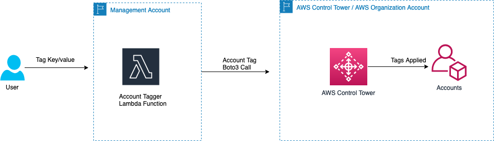

# Account Tagging at Scale
This pattern helps to tag accounts at scale. This solution is complete serverless in nature and is built on `python` and `Terraform`. This solution takes user input (yaml) and asks what are the tag key/value pairs. The solution builds an AWS Lambda funtion that takes the tag input data (key/value pair) and uses AWS Organization API's to tag each and every account mentioned in the YAML file. See `Architecture` section for the architecture flow and `Deployment Instructions` for detailed information.

Important: this application uses various AWS services and there are costs associated with these services after the Free Tier usage - please see the [AWS Pricing page](https://aws.amazon.com/pricing/) for details. You are responsible for any AWS costs incurred. No warranty is implied in this example.


## Architecture




## Important Note

This solution can be deployed in two ways -


1. `[Default and use code as is]` Or, setup lambda function into a seperate account (like a management account) which would do a cross-account call to the account where AWS Control Tower is setup to tag the accounts.

AWS Lambda funtion uses an IAM role called `AFTCrossAccountRole` to tag the account using AWS Organization `boto3` calls. Make sure this role exists in account where AWS Control Tower is setup.


2. Setup Lambda function in the root account where AWS Control Tower is setup. If this is the choice, you will need to perform changes to code not to do cross-account call.


## Requirements

* [Create an AWS account](https://portal.aws.amazon.com/gp/aws/developer/registration/index.html) if you do not already have one and log in. The IAM user that you use must have sufficient permissions to make necessary AWS service calls and manage AWS resources.
* [AWS CLI](https://docs.aws.amazon.com/cli/latest/userguide/install-cliv2.html) installed and configured
* [Git Installed](https://git-scm.com/book/en/v2/Getting-Started-Installing-Git)
* [Terraform](https://developer.hashicorp.com/terraform/tutorials/aws-get-started/install-cli) (Terraform) installed

## Deployment Instructions

1. Create a new directory, navigate to that directory in a terminal and clone the GitHub repository:
    ``` 
    git clone https://github.com/aws-samples/serverless-patterns
    ```

2. Change directory to below directory and update tag key/value pair in `tag-data.yaml`

    ```
    cd account-tagging-at-scale/layers

    ```


3. **Setup IAM Role `AFTCrossAccountRole` role in the Control Tower/ AWS Organization Account**

    Change directory to below directory:

    ```
    cd account-tagging-at-scale/terraform/AFTCrossAccountRole

    ```
4. From the command line, use Terraform CLI to deploy the IAM role:
    ```
    terraform init
    terraform plan
    terraform deploy
    ```
 
    **Note:** Make sure Control Tower/ AWS Organization Account credentials are exported in your terminal.

4. Once the IAM role is setup in Control Tower/ AWS Organization Account in above step, we will now setup core tagging solution **in a Seperate Account (like a management account).**

    **Note:** Make sure Control Tower/ AWS Organization Account credentials are exported in your terminal.

    Change directory to the pattern directory:

    ```
    cd account-tagging-at-scale/terraform/

    ```

    Mention the Control Tower/ AWS Organization Account in the AWS Lambda parameter `AFT_CT_ACCOUNT` in `main.tf` and mention the same in the assule policy for the AWS Lambda in `lambda_policy_assume_policycrssact` in `iam.tf`.

    From the command line, use Terraform CLI to deploy the IAM role:

    ```
    terraform init
    terraform plan
    terraform deploy


## Testing

Check the Account level tags applied in the `AWS Organization` in AWS Console or AWS CLI.

## Cleanup
 
Delete the stack
    ```bash
    terraform destroy
    ```

----
Copyright 2023 Amazon.com, Inc. or its affiliates. All Rights Reserved.

SPDX-License-Identifier: MIT-0