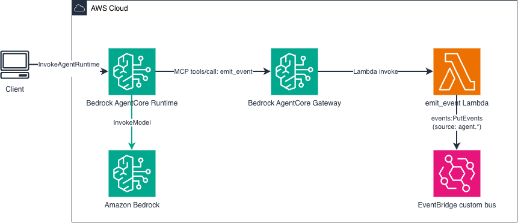

# Amazon Bedrock AgentCore Runtime to Amazon EventBridge via AgentCore Gateway

This pattern demonstrates how an AI agent on **AgentCore Runtime** emits structured business events to **EventBridge** through a governed **AgentCore Gateway MCP tool**. The Gateway provides governance, observability, rate limiting, and schema control over what the agent can emit — without the agent needing direct access to the EventBridge SDK.

The CDK stack is **fully self-contained**: it builds and deploys the agent container, the Gateway with its Lambda tool backend, an EventBridge custom bus, and downstream consumers (DynamoDB decision log + SNS notifications).



```
Strands Agent (AgentCore Runtime)
    → emit_event tool (AgentCore Gateway, MCP Streamable HTTP)
        → Lambda tool backend (validates + PutEvents)
            → EventBridge Custom Bus
                ├── Rule 1: agent.* → DynamoDB (decision log)
                └── Rule 2: notify=true → SNS topic
```

Learn more about this pattern at Serverless Land Patterns: https://serverlessland.com/patterns/

Important: this application uses various AWS services and there are costs associated with these services after the Free Tier usage - please see the [AWS Pricing page](https://aws.amazon.com/pricing/) for details. You are responsible for any AWS costs incurred. No warranty is implied in this example.

## Why Gateway over direct SDK?

| Concern | Direct SDK | Via AgentCore Gateway |
|---------|-----------|----------------------|
| Governance | Agent can emit any event schema | Gateway tool definition constrains allowed schemas |
| Observability | Must instrument yourself | Gateway logs every tool invocation automatically |
| Rate limiting | None by default | Gateway enforces per-tool rate limits |
| Schema evolution | Redeploy agent container to change | Update Gateway tool definition only |
| Multi-agent consistency | Each agent implements PutEvents differently | All agents use the same governed tool |

## How it works

1. The agent (Strands, Claude Haiku 4.5) connects to the AgentCore Gateway via the **MCP Streamable HTTP transport** (2025-03-26 spec).
2. The Gateway exposes an `emit_event` tool backed by a Lambda function.
3. When the agent decides to emit an event, it calls `emit_event` with `source`, `detail_type`, `detail`, and optionally `notify`.
4. The Lambda validates the source prefix (`agent.*` only) and calls `events:PutEvents`.
5. EventBridge routes the event via two rules:
   - All `agent.*` events → DynamoDB (decision log with 30-day TTL)
   - Events with `detail.notify=true` → SNS topic

## Prerequisites

- [AWS account](https://portal.aws.amazon.com/gp/aws/developer/registration/index.html) with sufficient permissions
- [AWS CLI](https://docs.aws.amazon.com/cli/latest/userguide/install-cli.html) installed and configured
- [Node.js 20+](https://nodejs.org/en/download/) and npm
- [AWS CDK CLI](https://docs.aws.amazon.com/cdk/v2/guide/getting_started.html) (`npm i -g aws-cdk`), bootstrapped in the target account/region
- [Docker](https://docs.docker.com/get-docker/) installed and running
- Access to the Amazon Bedrock Claude Haiku 4.5 model (enable in the Amazon Bedrock console)

## Deployment

```bash
git clone https://github.com/aws-samples/serverless-patterns
cd serverless-patterns/agentcore-gateway-eventbridge-cdk/cdk
npm install
cdk deploy
```

Note the stack outputs — in particular `AgentRuntimeArn` and `DecisionLogTableName`.

## Testing

Invoke the agent with a prompt that triggers the `emit_event` tool:

```bash
RUNTIME_ARN="<AgentRuntimeArn from stack outputs>"

aws bedrock-agentcore invoke-agent-runtime \
  --agent-runtime-arn "$RUNTIME_ARN" \
  --qualifier DEFAULT \
  --runtime-session-id "test-session-$(date +%s)" \
  --payload '{"prompt": "Use the emit_event tool to emit an event with source=agent.claims-processor, detail_type=ClaimApproved, detail={claimId: CLM-001, decision: approved, confidence: 0.94}, notify=true"}' \
  --region us-east-1
```

Then verify the event landed in DynamoDB:

```bash
aws dynamodb scan --table-name agent-decision-log --region us-east-1
```

Expected item:
```json
{
  "pk": "agent.claims-processor#ClaimApproved",
  "sk": "2026-08-14T08:00:25Z",
  "detail": "{\"claimId\": \"CLM-001\", \"decision\": \"approved\", \"confidence\": 0.94, \"notify\": true}",
  "eventId": "...",
  "ttl": 1726300825
}
```

## Cleanup

```bash
cdk destroy
```

---

Copyright 2026 Amazon.com, Inc. or its affiliates. All Rights Reserved.

SPDX-License-Identifier: MIT-0
