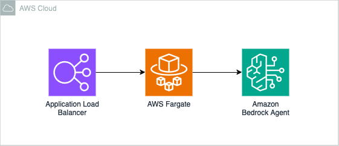
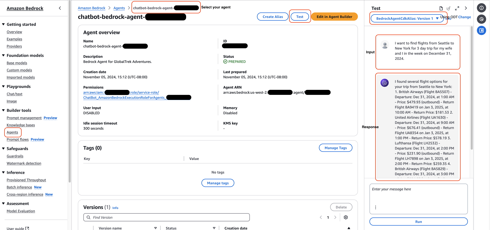
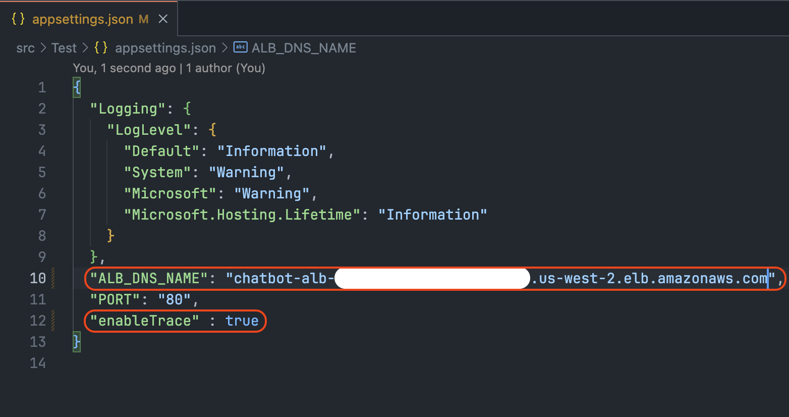
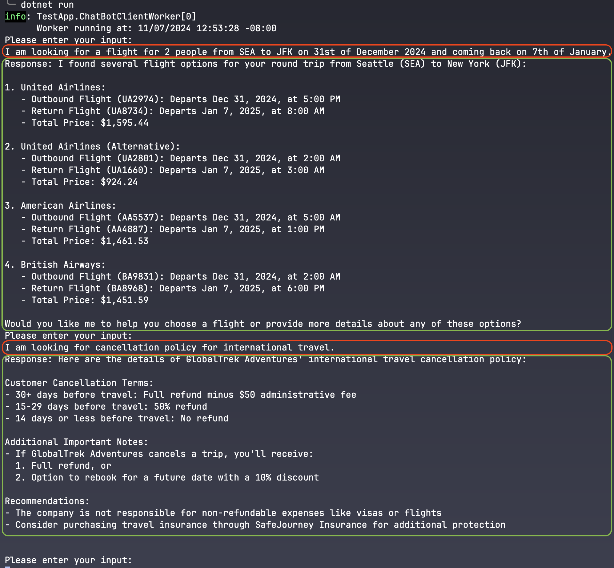
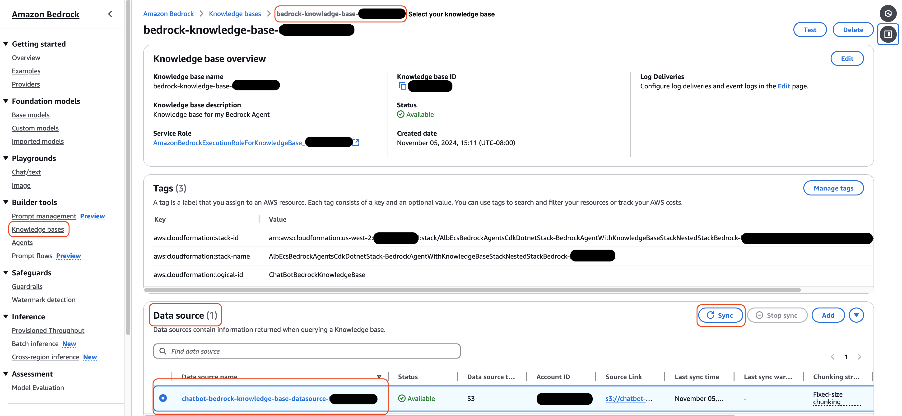

# Travel Service with AI Agent, OpenSearch, and Lambda using AWS CDK .NET

This pattern demonstrates how to create a serverless travel service using Amazon Bedrock Agent, Amazon OpenSearch for vector search, AWS Lambda for processing, and Amazon S3 for data storage. The pattern includes a flight search feature and is implemented using AWS CDK with .NET.

Learn more about this pattern at Serverless Land Patterns: [Add your pattern link here]

Important: this application uses various AWS services and there are costs associated with these services after the Free Tier usage - please see the [AWS Pricing page](https://aws.amazon.com/pricing/) for details. You are responsible for any AWS costs incurred. No warranty is implied in this example.

## Architecture


## Requirements

* [Create an AWS account](https://portal.aws.amazon.com/gp/aws/developer/registration/index.html) if you do not already have one and log in. The IAM user that you use must have sufficient permissions to make necessary AWS service calls and manage AWS resources.
* [AWS CLI](https://docs.aws.amazon.com/cli/latest/userguide/install-cliv2.html) installed and configured
* [Git](https://git-scm.com/book/en/v2/Getting-Started-Installing-Git) installed
* [Node and NPM](https://nodejs.org/en/download/) installed
* [AWS Cloud Development Kit](https://docs.aws.amazon.com/cdk/latest/guide/cli.html) (AWS CDK) installed
* [.NET](https://dotnet.microsoft.com/en-us/download/dotnet/8.0) (.NET 8.0 or later) installed
* [Grant Amazon Bedrock Model Access](https://console.aws.amazon.com/bedrock/home?#/modelaccess) to following models:
    * Titan Text Embeddings V2 (`amazon.titan-embed-text-v2:0`)
    * Claude 3 Haiku (`anthropic.claude-3-haiku-20240307-v1:0`)
    * Claude 3.5 Haiku (`anthropic.claude-3-5-haiku-20241022-v1:0`)

## Deployment Instructions

1. Create a new directory, navigate to that directory in a terminal and clone the GitHub repository:
    ``` 
    git clone https://github.com/aws-samples/serverless-patterns
    ```
2. Change the working directory to this pattern's directory:
    ```
    cd alb-ecs-bedrock-agents-cdk-dotnet
    ```
3. Build the .NET CDK project:
    ```
    dotnet build src
    ```
4. Deploy the stack to your default AWS account and region.

    **Please be aware that the deploy command will take about 5-15 minutes to complete.** The output of this command should give you the ALB endpoint URL:
    ```
    cdk deploy
    ```
5. Other useful commands:
    ```
    cdk diff         compare deployed stack with current state    
    cdk synth        emits the synthesized CloudFormation template
    ```

## How it works

This pattern creates a serverless travel service:

1. An agent powered by Amazon Bedrock interacts with customers and handles their travel-related queries.
2. Knowledge base documents are stored in Amazon S3 and indexed in Amazon OpenSearch for quick retrieval.
3. When a flight search is requested, an AWS Lambda function is triggered from Bedrock Agent Action-Group. The Lambda function processes the request and returns mock flight data.
4. When policy related questions are asked, Bedrock knowledge based is used to answer the questions.
5. All components are secured with appropriate IAM roles and permissions.

The AWS CDK is used to define and deploy all the necessary AWS resources, including the Bedrock Agent, Bedrock KnowledgeBase, OpenSearch Serverless Collection, Lambda functions, S3 bucket and associated IAM roles and permissions.

## Testing

### 1. Testing the AI Agent through Bedrock Console
To access and test the Bedrock Agent:

1. Open the AWS Console and navigate to Amazon Bedrock
   - Go to AWS Console → Bedrock → Agents (in the left sidebar)
   - Find your agent named `chatbot-bedrock-agent-XXXXXXXXX` (find the actual name from CDK output)

2. Accessing the Agent Playground:
   - Click on your agent name
   - In the agent details page, click on "Test" in the top right corner
   - This will open the Agent Playground where you can interact with your agent
   - Change the version from `TestAlias: Working draft` to `BedrockAgentCdkAlias: Version 1`
   - 

3. Example Interactions:

- **Example 1 - Flight Search:**
```
User: "I want to find flights from Seattle to New York for 3 day trip for my wife and I in the week on December 31, 2024." (use future dates)
```
Expected Agent Response:
```
"I found several flight options for your trip from Seattle to New York: 
1. Delta Air Lines: 
    - Outbound Flight: Departs 3:00 AM on Dec 31, arrives 5:00 PM 
    - Return Flight: Departs 3:00 AM on Jan 3, arrives 2:00 PM 
    - Total Price: $848.67 2. 
2. United Airlines (Option 1): 
    - Outbound Flight: Departs 7:00 AM on Dec 31, arrives 11:00 AM 
    - Return Flight: Departs 4:00 PM on Jan 3, arrives 6:00 AM 
    - Total Price: $1,285.44 3. 
3. United Airlines (Option 2): 
    - Outbound Flight: Departs 9:00 AM on Dec 31, arrives 11:00 PM 
    - Return Flight: Departs 7:00 PM on Jan 3, arrives 8:00 PM 
    - Total Price: $1,248.37 4. 
4. Lufthansa: 
    - Outbound Flight: Departs 6:00 AM on Dec 31, arrives 5:00 AM on Jan 1 
    - Return Flight: Departs 10:00 PM on Jan 3, arrives 6:00 AM on Jan 4 
    - Total Price: $1,265.50 
5. British Airways: 
    - Outbound Flight: Departs 1:00 AM on Dec 31, arrives 10:00 PM 
    - Return Flight: Departs 7:00 AM on Jan 3, arrives 6:00 AM on Jan 4 
    - Total Price: $1,399.66 
    
The most budget-friendly option is the Delta Air Lines flight at $848.67. Would you like me to help you book one of these flights?"
```

- **Example 2 - Policy Question:**
```
User: "What is your cancellation policy for international flights?"
```
Expected Agent Response:
```
"Here are the details of GlobalTrek Adventures' cancellation policy for international flights: 
1. Cancellation Timeframes: - 30+ days before travel: Full refund minus $50 administrative fee - 15-29 days before travel: 50% refund - 14 days or less before travel: No refund 
2. Company Cancellations: If GlobalTrek Adventures cancels a trip, they offer: - Full refund, OR - Option to rebook for a future date with a 10% discount 
3. Refund Processing: - Refunds are processed within 10 business days - Refunded to the original payment method Please note that the company is not responsible for any additional incidental expenses you may have already incurred, such as non-refundable flights. "
```

### 2. Testing the REST API through ALB
You can test the flight search functionality directly through the Application Load Balancer endpoint using curl:

- Install `jq` for formatted output. (you can omit it from command-line)
    - On Ubuntu/Debian
    ```
    sudo apt install jq
    ```
    - On CentOS/RHEL
    ```
    sudo yum install jq
    ```
    - On macOS
    ```
    brew install jq
    ```

- Test the flight search feature:
    - Use the `curl` to send a request to the ALB endpoint (replace `<AlbEndpoint>` with the actual URL from the CDK output).
    - Update `<session-id>` to a meaningful value.    
    - Keep the same `<session-id>` for same chat session.    

    ```bash
    curl -X POST \
    http://<AlbEndpoint>/message \
    -H "Accept: application/json" \
    -H "Content-Type: application/json" \
    -d '{
        "SessionId": "<session-id>",
        "Message": "I am looking for a flight for 2 people from SEA to JFK on 31st of December 2024 and coming back on 7th of January.",
        "EndSession": false,
        "EnableTrace": false,
        "SessionAttributes": {},
        "PromptSessionAttributes": {}
    }' \
    -v | jq .
    ```
    Expected agent response:
    ```json
    {
        "sessionId": "<session-id>",
        "memoryId": null,
        "message": "I found several flight options for your round trip from Seattle (SEA) to New York (JFK):\n\n1. American Airlines (Lowest Price Option):\n   - Outbound: Flight AA1958 on Dec 31, 2024, at 5:00 PM\n   - Return: Flight AA6048 on Jan 7, 2025, at 12:00 AM\n   - Total Price: $591.59\n\n2. British Airways Options:\n   a) Flight BA4018:\n      - Outbound: Dec 31, 2024, at 7:00 PM\n      - Return: Flight BA1431 on Jan 7, 2025, at 4:00 PM\n      - Total Price: $1,191.94\n\n   b) Flight BA7836:\n      - Outbound: Dec 31, 2024, at 4:00 AM\n      - Return: Flight BA7778 on Jan 7, 2025, at 10:00 AM\n      - Total Price: $1,315.32\n\n3. Other Airlines:\n   - Lufthansa: Total price around $1,476.94\n   - Another British Airways option: Total price around $1,394.10\n\nThe American Airlines option offers the most budget-friendly choice. Would you like me to help you book one of these flights or provide more details?",
        "files": null,
        "returnControlPayload": null,
        "trace": null,
        "error": null,
        "hasError": false
    }    
    ```

- You can also test the agent's ability to answer questions about travel policies by asking it various policy-related questions.
    - Use the `curl` to send a request to the ALB endpoint (replace `<AlbEndpoint>` with the actual URL from the CDK output).
    - Update `<session-id>` to a meaningful value.
    - Keep the same `<session-id>` for same chat session.

    ```bash
    curl -X POST \
    http://<AlbEndpoint>/message \
    -H "Accept: application/json" \
    -H "Content-Type: application/json" \
    -d '{
        "SessionId": "<session-id>",
        "Message": "I am looking for cancellation policy for international travel.",
        "EndSession": false,
        "EnableTrace": false,
        "SessionAttributes": {},
        "PromptSessionAttributes": {}
    }' \
    -v | jq .
    ```

    Expected agent response:
    ```json
    {
    "sessionId": "<session-id>",
    "memoryId": null,
    "message": "Here are the details of GlobalTrek Adventures' international travel cancellation policy:\n\nCancellation by Customer:\n- 30+ days before travel: Full refund minus $50 administrative fee\n- 15-29 days before travel: 50% refund\n- 14 days or less before travel: No refund\n\nIf GlobalTrek Adventures Cancels:\n- Full refund or option to rebook with a 10% discount\n- Note: Not responsible for additional expenses like visas or non-refundable flights\n\nAdditional Recommendation:\n- The company strongly suggests purchasing travel insurance through SafeJourney Insurance for extra protection.\n\n\n\nWould you like more information about the cancellation policy or travel insurance options?",
    "files": null,
    "returnControlPayload": null,
    "trace": null,
    "error": null,
    "hasError": false
    }  
    ```

### 3. Test using test application.

- You can also use test application to chat with Bedrock Agent.
- Go to `Test` directory from command prompt.
```
cd ./src/Test
```
- Update `<AlbEndpoint>` in `appsettings.json` file.
- Update `enableTrace` to `true` if need to check request traces from Bedrock Agents. Traces will be written to a file in `Test` directory with filename format: `trace_<session-id>_<iteration>.json`.
- Example: `appsettings.json` configuration
    
- Run Test application.
    ```
    dotnet run
    ```
- Press `CTRL+C` or type `exit` and press enter to exit the application.
- Example input/output using test application
    

### 4. Adding and Managing Documents

To add new documents (such as updated policies, travel guides, or FAQs) to the system:

1. Upload Documents to S3
- You can upload new documents to S3 bucket from console, or
- Using CLI: (replace `<KnowledgeBaseBucket>` with the actual bucket name from the CDK output. e.g. `chatbot-bedrock-knowledge-base-XXXXXXXXX`)
    ```bash
    # Upload a single document
    aws s3 cp new-policy.md s3://<KnowledgeBaseBucket>/

    # Upload multiple documents
    aws s3 cp ./travel-docs/ s3://<KnowledgeBaseBucket>/ --recursive
    ```

2. Document Processing:
- Once documents are uploaded to S3, you will have to sync the Bedrock Knowledge base with newly uploaded documents.
- Open the AWS Console and navigate to Amazon Bedrock
- Go to AWS Console → Bedrock → Knowledge bases (in the left sidebar)
- Find your knowledge base named `bedrock-knowledge-base-XXXXXXXXXXX` (from CDK output)
- Click on the name to open it.
- Go to "Data source" section and select the data source named `chatbot-bedrock-knowledge-base-datasource-XXXXXXXXXXX`
- Click `Sync` in top-right corner. This will initiate a new sync, find newly uploaded documents and will index the documents in "Amazon OpenSearch Serveless Collection"
    

3. Test the Agent with New Content:
```
User: "What is the policy regarding [topic from your new document]?"
```
The agent should now be able to reference information from your newly added documents.

Tips for Document Preparation:
- Format documents in clear, well-structured markdown or text
- Break large documents into logical sections
- Include clear headers and subheaders
- Ensure content is accurate and up-to-date
- Use consistent terminology throughout documents

Example Document Structure:
```markdown
# Travel Insurance Policy

## Coverage Types
[Coverage details...]

## Claim Process
[Process details...]

## Contact Information
[Contact details...]
```
Best Practices:
- Test new documents with various queries to ensure proper indexing
- Keep document formats consistent for better processing
- Regularly review and update documents to maintain accuracy
- Check any sync warnings

### 5. CloudWatch Logs
Check the CloudWatch Logs for the Lambda function and ECS Task to see the processing details and any potential errors.

## Cleanup
 
1. Run the given command to delete the resources that were created. It might take some time for the CloudFormation stack to get deleted.
```
cdk destroy
```

----
Copyright 2023 Amazon.com, Inc. or its affiliates. All Rights Reserved.

SPDX-License-Identifier: MIT-0