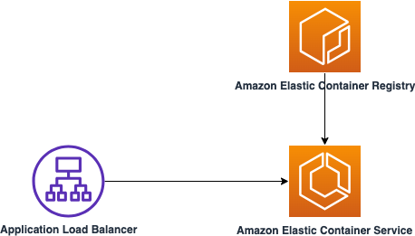

# Deploying Spring-boot application on Amazon ECS Fargate with ALB configuration

This sample project deploys a Java 21 Spring Boot application on Amazon ECS Fargate with Application Load Balancer to route traffic between two ECS Tasks.

Learn more about this pattern at Serverless Land Patterns: https://serverlessland.com/patterns/alb-ecs-java-sam

Important: this application uses various AWS services and there are costs associated with these services after the Free Tier usage - please see the [AWS Pricing page](https://aws.amazon.com/pricing/) for details. You are responsible for any AWS costs incurred. No warranty is implied in this example.

## Requirements

- [Create an AWS account](https://portal.aws.amazon.com/gp/aws/developer/registration/index.html) if you do not already have one and log in. The IAM user that you use must have sufficient permissions to make necessary AWS service calls and manage AWS resources.
- [AWS CLI](https://docs.aws.amazon.com/cli/latest/userguide/install-cliv2.html) installed and configured
- [Git Installed](https://git-scm.com/book/en/v2/Getting-Started-Installing-Git)
- [AWS Serverless Application Model](https://docs.aws.amazon.com/serverless-application-model/latest/developerguide/serverless-sam-cli-install.html) (AWS SAM) installed
- [Java 21 or above](https://docs.aws.amazon.com/corretto/latest/corretto-17-ug/downloads-list.html) installed
- [Maven 3.8.6 or above](https://maven.apache.org/download.cgi) installed
- [Docker](https://docs.docker.com/engine/install/) installed
- [jq](https://jqlang.github.io/jq/download/) installed


## Deployment Instructions

1. Create a new directory, navigate to that directory in a terminal and clone the GitHub repository:
   ```bash
      git clone https://github.com/aws-samples/serverless-patterns
   ```

2. Change directory to the pattern directory:
   ```bash
      cd serverless-patterns/alb-ecs-java-sam
   ```

3. From the command line, execute the below command to build the project.
   ```bash
      mvn clean package
   ```

4. (Optional) Run the application on local box using the below command:
   ```bash
      mvn spring-boot:run
   ```

   Once the application starts, use the below command to insert data into the in-memory database. The script uses POST API exposed by the Spring Boot application:
   ```bash
      bash create-books-local.sh
   ```

   Retrieve the data using using the below script. The script calls the GET API exposed by the Spring Boot application:
   ```bash
      bash retrieve-all-books-local.sh
   ```

   Delete a booking data using the below script. The script calls the DELETE API exposed by the Spring Boot application. Please enter one of the `bookId` from previous GET API call:
   ```bash
      bash delete-book-local.sh
   ```   

5. Please *ensure* that docket is up and running before executing this step. From the command line, run the below command to create ECR repository, build the docker image and push it into the ECR repository.
   ```bash
      bash build.sh
   ```

6. Run the below command to deploy the AWS resources for the pattern as specified in the template.yml file:
   ```bash
      sam deploy --guided
   ```

4. During the prompts:

   - Enter a stack name
   - Enter the same as AWS Region that you provided while building the image. 
   - `ImageURI` Enter the image URI obtained from the previous output.
   - Allow SAM CLI to create IAM roles with the required permissions.
   - Keep default values to the rest of the parameters.

   If you have run `sam deploy --guided` mode once and saved arguments to a configuration file (samconfig.toml), you can use `sam deploy` in future to use these defaults.

5. Note the outputs from the SAM deployment process. These contain the resource names and/or ARNs which are used for next step as well as testing.

## How it works

This sample project deploys a Java 21 Spring Boot application on Amazon ECS Fargate with Application Load Balancer to route traffic between two ECS Tasks. The application exposed REST APIs which can be accessed over HTTP.

Please refer to the architecture diagram below:



Here's a breakdown of the steps:

1. **Amazon Elastic Container Registry**: The repository of the container image of the Spring Boot Application.

2. **Application Load Balancer**: Receives the HTTP request which routes the traffic to one of the Amazon ECS Tasks.

3. **Amazon Elastic Container Service**: Amazon ECS Cluster is configured with one service having 2 Tasks. The 2 Tasks runs the Spring Boot application as container. The container image is retrieved from the Amazon Elastic Container Registry. The application uses in-memory database to store the data.


## Testing

1. Run the below command to create records (books) by invoking the REST API. Provide the Application Load Balancer DNS when asked. The ALB DNS is available in the output of `sam deploy --guided`:

```bash
   bash create-books-aws.sh
```

2. Run the below command to retrieve the list of books. Provide the Application Load Balancer DNS when asked. The ALB DNS is available in the output of `sam deploy --guided`:

```bash
   bash retrieve-all-books-aws.sh
``` 


3. The Application Load Balancer is distributing traffic between two Amazon ECS Tasks. To validat it, please execute the below commands multiple times. This should return two different IP Addresses alternatively.
```bash
   curl http://{ECSALBDNSName}/books/container-ip
``` 


## Cleanup

1. To delete the resources deployed to your AWS account via AWS SAM, run the following command:

```bash
   sam delete
```

2. To delete the ECR registry execute the below command:
```bash
   bash delete-ecr-repo.sh
```

---

Copyright 2024 Amazon.com, Inc. or its affiliates. All Rights Reserved.

SPDX-License-Identifier: MIT-0
