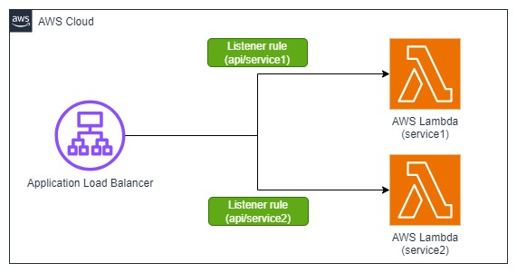

# Application Load balancer with path-based routing and AWS Lambda target using AWS CDK .NET

This pattern shows how to create an Application Load Balancer with path-based routing along with associated listener and target as AWS Lambda. Implemented in AWS CDK .NET.

Learn more about this pattern at Serverless Land Patterns: https://serverlessland.com/patterns/alb-path-based-route-lambda-cdk

Important: this application uses various AWS services and there are costs associated with these services after the Free Tier usage - please see the [AWS Pricing page](https://aws.amazon.com/pricing/) for details. You are responsible for any AWS costs incurred. No warranty is implied in this example.

## Architecture


## Requirements

* [Create an AWS account](https://portal.aws.amazon.com/gp/aws/developer/registration/index.html) if you do not already have one and log in. The IAM user that you use must have sufficient permissions to make necessary AWS service calls and manage AWS resources.
* [AWS CLI](https://docs.aws.amazon.com/cli/latest/userguide/install-cliv2.html) installed and configured
* [Git Installed](https://git-scm.com/book/en/v2/Getting-Started-Installing-Git)
* [Node and NPM](https://nodejs.org/en/download/) installed
* [AWS Cloud Development Kit](https://docs.aws.amazon.com/cdk/latest/guide/cli.html) (AWS CDK) installed
* [.NET](https://dotnet.microsoft.com/en-us/download/dotnet/6.0) (.NET Core 3.1) installed

## Deployment Instructions

1. Create a new directory, navigate to that directory in a terminal and clone the GitHub repository:
    ``` 
    git clone https://github.com/aws-samples/serverless-patterns
    ```
1. Change the working directory to this pattern's directory:
    ```
    cd apigw-http-api-eventbridge-dotnet-cdk
    ```
1. Build the .NET CDK project:
    ```
    dotnet build src
    ```
1. Deploy the stack to your default AWS account and region. The output of this command should give you output as ALB URL:
    ```
    cdk deploy
    ```
1. Other useful commands:
    ```
    cdk diff         compare deployed stack with current state    
    cdk synth        emits the synthesized CloudFormation template
    ```

## How it works

This pattern shows how to create an Application Load Balancer with path-based routing along with associated listener and target as AWS Lambda. Implemented in AWS CDK .NET.

## Testing

1. In the  output, you can see `AlbUrl`. When you access the url, you should see the response "Default Response from ALB" from Lambda.
2. To access the path based route from the ALB, Access `AlbUrl`/api/service1, you should see "Hello from Service1!!!!" and `AlbUrl`/api/service2, you should see ""Hello from Service2!!!!"

## Cleanup
 
1. Run the given command to delete the resources that were created. It might take some time for the CloudFormation stack to get deleted.
    ```
    cdk destroy
    ```

----
Copyright 2023 Amazon.com, Inc. or its affiliates. All Rights Reserved.

SPDX-License-Identifier: MIT-0