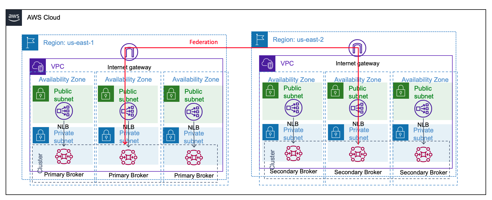

# Demo on how to implement multi-region message replication with Amazon MQ for RabbitMQ

This pattern provides an example on how to implement multi-region message replication with Amazon MQ for RabbitMQ. This solution demonstrates how to configure Amazon MQ for RabbitMQ leveraging the federation plugin across regions. You will learn how federation of exchanges enable asynchronous data replication between two RabbitMQ clusters to achieve multi-region architecture. This code base is deployed using Terraform to simplify the Rabbit MQ configuration.

Learn more about this pattern at Serverless Land Patterns: https://serverlessland.com/patterns/activemq-rabbitmq-message-replication-terraform

Important: this application uses various AWS services and there are costs associated with these services after the Free Tier usage - please see the [AWS Pricing page](https://aws.amazon.com/pricing/) for details. You are responsible for any AWS costs incurred. No warranty is implied in this example.

## Requirements
* [Create an AWS account](https://portal.aws.amazon.com/gp/aws/developer/registration/index.html) if you do not already have one and log in. The IAM user that you use must have sufficient permissions to make necessary AWS service calls and manage AWS resources.
* [AWS CLI](https://docs.aws.amazon.com/cli/latest/userguide/install-cliv2.html) installed and configured
* [Git Installed](https://git-scm.com/book/en/v2/Getting-Started-Installing-Git)
* [Terraform](https://learn.hashicorp.com/tutorials/terraform/install-cli?in=terraform/aws-get-started) installed

## How it works

In RabbitMQ, federation is a feature that allows one broker to federate an exchange to another broker. Federated exchanges copy messages from upstream broker exchanges to downstream broker exchanges. This solution use the RabbitMQ [federation plugin](https://www.rabbitmq.com/federation.html) to enable federation at exchange level and replicate messages from one region to another region. Also, Time to live(TTL) of the replicate message is set 60 seconds, to automatically expire the messages.In the unlikely event of a regional degradation or outage, you can switch application from one region to another region and start processing the messages from the RabbitMQ broker. 

**Note:** 
- In the event of switching application from one region to another region, your application need handle duplicates messages or be idempotent 
- You cannot configure federation if the upstream queue or exchange is in a private broker. You can only configure federation between queues or exchanges in public brokers, or between an upstream queue or exchange in a public broker, and a downstream queue or exchange in a private broker. 

## Architecture Diagram
  
  
  Figure 1 – Architecture of Federated Amazon MQ Brokers

## Parameters

The following variables are needed for deployment of this code base and can be adjust

| Parameter | Default Value | Description |
| ----------| -------------- | ----------- |
| `env_name` | demo | The name of your stack, e.g. \"demo\" |
| `region` | us-east-1 | The AWS region in which primary resources are created and verifying HMAC tags. |
| `sec_region` | us-east-2 | The AWS region in which secondary resources are created |
| `user` | exampleuser | Admin user for the brokers |
| `password` | examplepassword | Admin user password |
| `regex` | ^amq\\. | Regular expression filter for federation |
| `ttl` | 60000 | Time to live of messages in the second region, default is set low for demo purposes to see queue clear (60 seconds)|

## Locals

The following locals varible is used to strcuture the queue policy from the provided `ttl` variable above. This should not be directly modified

| Local | Default Value | Description |
| ----------| -------------- | ----------- |
| `queue_policy` | {"x-message-ttl": ${var.ttl}} | The JSON policy to set queue TTL on secondary queue |

## How to deploy using Terraform

* [TerraForm Cheatsheet](https://res.cloudinary.com/acloud-guru/image/fetch/c_thumb,f_auto,q_auto/https:/acg-wordpress-content-production.s3.us-west-2.amazonaws.com/app/uploads/2020/11/terraform-cheatsheet-from-ACG.pdf)

1. Create a new directory, navigate to that directory in a terminal and clone the GitHub repository:
    ``` 
    git clone https://github.com/aws-samples/serverless-patterns

    ```
2. Change directory to the pattern directory:
    ```
    cd amazonmq-rabbitmq-msg-replication
    ```
3. Customize the variables in ```variable.tf``` to match your deployment. 
    
    Note: You do not need to adjust any variables, you can run this with default variables as is

4.	Initialize the repository:
    ```
    terraform init
    ```
5.	Apply the infrastructure.
    ```
    terraform apply
    ```
6.	During the prompts. 
    * Enter yes
    * Note: This deployement takes about 15 minutes to complete

7.  Note the outputs from the deployment process. These contain the resource names which are used for testing.


## Validating Deployment
1.	Go to AWS console let’s verify that both brokers have been deployed

    a.	If you did not change the regions they will be in ```us-east-1``` and ```us-east-2```

2.	Take the terraform outputs for the admin consoles for both brokers.

    a.	Alternatively, you can get them from the AWS console in each region for the respective broker

3.	Login to the ```primary``` and ```secondary``` brokers

    a.	If you did not change the variables then the login will be:

      i.	User: exampleuser
      
      ii.	Password: examplepassword

4.	On the ```secondary``` broker validate that federation is already established

    a.	Click on the ```Admin``` tab

    b.	Once on the ```Admin``` page click on ```Federation Status``` on the right-hand side

    c.	Once loaded there will be the ```primary_federation``` connection listed 4 times for each of the existing ```amq``` brokers: ```amq.direct```,```amq.fanout```,```amq.headers```,```amq.match```, ```amq.topic```

    
    
    Figure 2 – Federation Status on Secondary Broker

5.	On the ```secondary``` broker validate that the ```demo``` queue exisits

    a.	Click on the ```Queues``` tab

    b.	Once loaded there will be the ```demo``` queue

    
    
    Figure 3 – Demo Queue on Secondary Broker

    c.	Click on ```demo``` to the drill into the queue and validate the binding to the ```amq.direct``` exchange

    
    
    Figure 4 – Confirmed Binding on Demo Queue

## Test Configuration

**Sending Message to Primary Broker**
1.	Logged into the ```primary``` cluster, send a message to the ```amq.direct``` exchange

    a.	Click on the ```Exchanges``` tab

    b.	Once loaded click on the ```amq.direct``` exchange

    c.	Once loaded click on ```Publish Message``` to expand area

    d.	Publish a message matching the below screenshot

    i.	Note: If you *do not* have the ```#``` routing key the message will not show up in ```demo``` queue on the secondary cluster

    e.	Click on the gray ```Publish Message``` button

    
        
    Figure 5 – Test Message ready to publish on Primary Broker

**Validating Message Was Received on Demo Queue**

2.	Validate the message showed up in ```demo``` queue

    a.	Switch over to the ```secondary``` cluster or log back if logged out

    b.	Click on the ```Queues``` tab

    c.	Once loaded there will be the ```demo``` queue

    d.	On the table view under ```Ready``` there will be the number ```1``` indicating that the message has been received and is ready for processing.

    
        
    Figure 6 – Message on demo queue on Secondary Broker

## Cleaning up
**To avoid incurring future charges, delete the resources created by the Terraform script.**
1.	Return to the directory where you deployed your terraform script.
2.	To destroy the infrastructure in AWS, run the command
      ```
      terraform destroy
      ```
      When prompted do you want to destroy the infrastructure, type ```Y``` and press enter.

----
Copyright 2023 Amazon.com, Inc. or its affiliates. All Rights Reserved.

SPDX-License-Identifier: MIT-0
