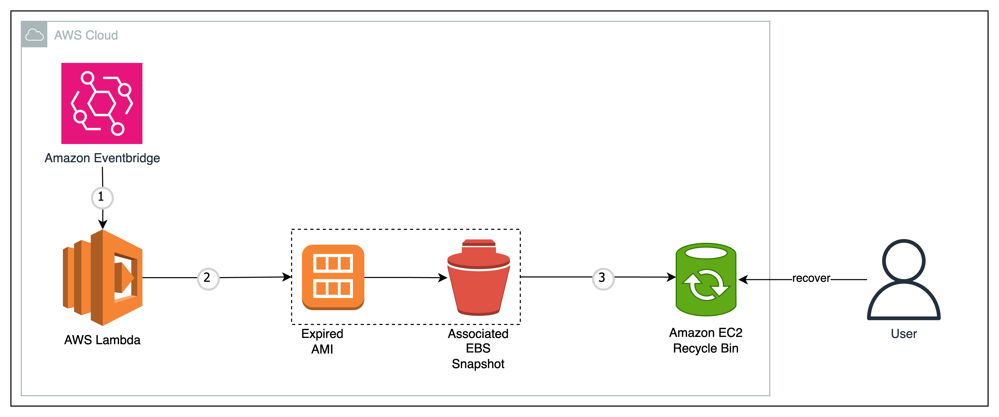

# AMI de-registration with AWS Lambda and retention in Amazon EC2 Recycle Bin

## Description

In this pattern an Amazon EventBridge rule triggers an AWS Lambda function which deregisters an Amazon Machine Image (AMI), deletes the associated snapshot and moves them to the Recycle Bin for retention.

The template creates all the necessary resources including an Amazon EventBridge Rule that triggers the AWS Lambda function once every day. Additionally, Recycle Bin rules for AMI and EBS Snapshots are created to retain deleted resources matching the resources for a retention period.

The AWS Lambda function automates the expiration of Amazon Machine Images (AMIs) by moving the AMIs and their associated snapshots to Recycle Bin. Recycle Bin is a feature of Amazon Elastic Compute Cloud (EC2) that allows you to retain AMIs that you have de-registered for a specified retention period, providing an opportunity to recover them if needed. To recover the deleted AMI, its associated snapshot should be recovered first. The Lambda function also adds corresponding tags to both, the AMI and the EBS snapshot, before moving them to Recycle Bin.


Learn more about this pattern at Serverless Land Patterns: https://serverlessland.com/patterns/ami-recycle-bin

Important: this application uses various AWS services and there are costs associated with these services after the Free Tier usage - please see the [AWS Pricing page](https://aws.amazon.com/pricing/) for details. You are responsible for any AWS costs incurred. No warranty is implied in this example.

## Requirements

* [Create an AWS account](https://portal.aws.amazon.com/gp/aws/developer/registration/index.html) if you do not already have one and log in. The IAM user that you use must have sufficient permissions to make necessary AWS service calls and manage AWS resources.
* [AWS CLI](https://docs.aws.amazon.com/cli/latest/userguide/install-cliv2.html) installed and configured
* [Git Installed](https://git-scm.com/book/en/v2/Getting-Started-Installing-Git)
* [Terraform Installed](https://developer.hashicorp.com/terraform/tutorials/aws-get-started/install-cli) Required Terraform version >= 4.61.0

## Pre-requisite for Testing
An AMI to deregister that has the following Tags:

| Key    | Value |
| -------- | ------- |
| Expire-After  | Date in Zulu format (e.g. 2024-08-30T17:39:00Z)    |
| Same value as <i>resource_tag_key</i> in <i>src/variables.tf</i> | Same value as <i>resource_tag_value</i> in <i>src/variables.tf</i>     |

  
## Deployment Instructions
1. Create a new directory, navigate to that directory in a terminal and clone the GitHub repository:
    ``` 
    git clone https://github.com/aws-samples/serverless-patterns
    ```
2. Change directory to the pattern directory:
    ```
    cd ami-recycle-bin
    ```
3. Bootstrap the input variables in the following file that are used in the Terraform configuration
    ```
    src/variables.tf
    ```
4. Initialize a new or existing Terraform working directory by downloading required provider plugins and modules
    ```
    terraform init
    ```
5. Create an execution plan that shows the changes Terraform will make to your infrastructure based on the current configuration files
    ```
    terraform plan
    ```
6. Apply the changes defined in the Terraform configuration to the infrastructure. Provide the prompts as required
    ```
    terraform apply
    ```

## How It Works

Following is the architectural diagram to demonstrate how the pattern works:



1. An Amazon Eventbridge rule is configured to run daily (on a schedule) with AWS Lambda function as a target
2. The Lambda function performs the following:
- Verifies that Recycle Bin rules matching the `resource_tag_key` and `resource_tag_value` as bootstraped in the `variables.tf` exists
- Filters AMIs matching the `resource_tag_key` and `resource_tag_value` and contains the `Expire-After` tag
- Determines whether any of the filtered AMI are expired using the `Expire-After` tag
- Tags the expired AMI with its Snapshot Id and the associated snapshot with the AMI Id if required for recovery
- Deprecates the expired AMI and deletes its associated snapshot

## Testing

1. Verify the the expired AMI and its snapshot is retained in the Recycle Bin after deletion
2. Verify the AMI and its snapshot can be recovered after deletion before the retention period ends

## Cleanup
 
 Delete the resources

```
terraform destroy
```
----
Copyright 2024 Amazon.com, Inc. or its affiliates. All Rights Reserved.

SPDX-License-Identifier: MIT-0
