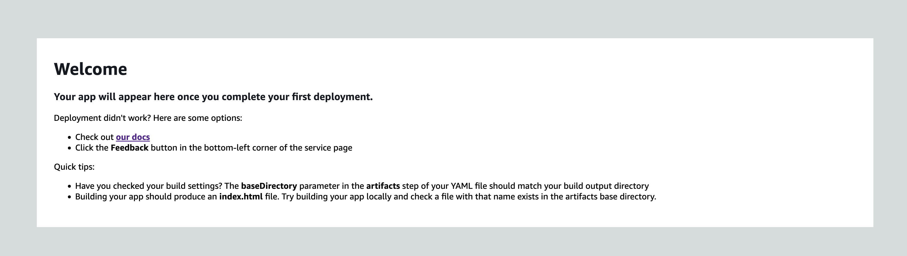
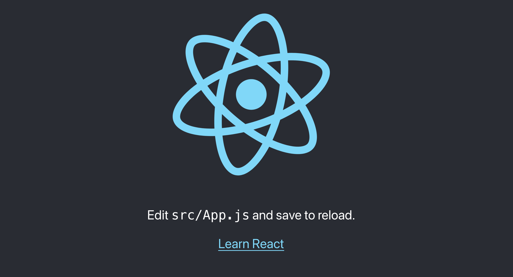

# AWS CodeCommit to AWS Amplify

This sample pattern demonstrates how to deploy an [AWS CodeCommit](https://aws.amazon.com/codecommit/) repository and an [AWS Amplify](https://aws.amazon.com/amplify/) App from a local web application folder or repository. This pattern is useful for quickly deploying and hosting a web application on AWS from your local machine.

Learn more about this pattern at Serverless Land Patterns: [AWS CodeCommit to AWS Amplify](https://github.com/aws-samples/serverless-patterns/tree/main/amplify-codecommit)

Important: this application uses various AWS services and there are costs associated with these services after the Free Tier usage - please see the [AWS Pricing page](https://aws.amazon.com/pricing/) for details. You are responsible for any AWS costs incurred. No warranty is implied in this example.

## Requirements

* [Create an AWS account](https://portal.aws.amazon.com/gp/aws/developer/registration/index.html) if you do not already have one and log in. The IAM user that you use must have sufficient permissions to make necessary AWS service calls and manage AWS resources.
* [AWS CLI](https://docs.aws.amazon.com/cli/latest/userguide/install-cliv2.html) installed and configured
* [Git Installed](https://git-scm.com/book/en/v2/Getting-Started-Installing-Git)
* [AWS Serverless Application Model](https://docs.aws.amazon.com/serverless-application-model/latest/developerguide/serverless-sam-cli-install.html) (AWS SAM) installed

## Deployment Instructions

1. Create a new directory, navigate to that directory in a terminal and clone the GitHub repository:
    ``` 
    git clone https://github.com/aws-samples/serverless-patterns
    ```
2. Change directory to the pattern directory:
    ```
    cd amplify-codecommit
    ```
3. Install dependencies:
    ```
    npm install
    ```
4. From the command line, use AWS SAM to deploy the AWS resources for the pattern as specified in the template.yml file:
    ```
    cdk deploy
    ```

5. Note the outputs from the CDK deployment process. These contain the resource names and/or ARNs which are used for testing. See below for a sample output from this pattern. 
    ```
    Outputs:
        AmplifyWebAppStack.AmplifyWebAppConstructAppIDF7BCB5B3 = XXXXXXXX
        AmplifyWebAppStack.AmplifyWebAppConstructWebApp = https://main.XXXXXXXXXXX.amplifyapp.com
        Stack ARN:
        arn:aws:cloudformation:us-east-1:XXXXXXXXXXXX:stack/AmplifyWebAppStack/a645e700-ae5b-11ee-8d3c-12d2d2a31ce9
    ```

## How it works

This pattern first creates a CodeCommit repository from the web application code in the local folder 'local-webapp-code'. In this example pattern, the web application is the basic React single-page application. Then, the pattern creates an Amplify app using the CodeCommit repository as the source repository. Next, it creates a new Amplify branch. Finally, it creates a Custom Resource that creates an Amplify job to build and deploy the Amplify app from the Amplify branch previously created. Without this Custom Resource, your Amplify app will not build or deploy. 

If your web application communicates with a backend, the pattern demonstrates how to pass an API endpoint from the CDK to the Amplify app as an environment variable. In the pattern code, the API endpoint is hardcoded, but in practice this should be retrieved dynamically. 

After the cdk deployment is successful, it will take about 3-6 minutes for the Amplify application to be built and deployed. 

## Testing

1. Determine that the CDK application successfully deployed - Once the CDK deployment is complete you will see the following output:
    ```
    Outputs:
        AmplifyWebAppStack.AmplifyWebAppConstructAppIDF7BCB5B3 = XXXXXXXX
        AmplifyWebAppStack.AmplifyWebAppConstructWebApp = https://main.XXXXXXXXXXX.amplifyapp.com
        Stack ARN:
        arn:aws:cloudformation:us-east-1:XXXXXXXXXXXX:stack/AmplifyWebAppStack/a645e700-ae5b-11ee-8d3c-12d2d2a31ce9
    ```

    Navigate to the 'https://main.XXXXXXXXXXX.amplifyapp.com' URL in your browser. You should see the default Amplify application. 
    
    
    
    Your application will not be deployed yet. It will take about 3-6 minutes for your web application to build and deploy on Amplify.  

2. Get status of Amplify build job. The job will complete when the status is 'SUCCEED.'

    ```
    aws amplify list-jobs --app-id <AmplifyWebAppConstructAppID> --branch-name main --region <your region>
    ```

3. Determine that your web application has successfully deployed. Navigate to the 'https://main.XXXXXXXXXXX.amplifyapp.com' URL in your browser. You should see the default single-page react application. 

    

If you do not see your web application, or if there are errors, navigate to the [AWS Amplify console](https://us-east-1.console.aws.amazon.com/amplify/home?region=us-east-1#/home), view the codecommit-amplify-webApp web app, and review the build logs. 

## Common Deployment Errors

The most common error when deploying the cdk application is:

```
 AmplifyWebAppStack failed: Error: The stack named AmplifyWebAppStack failed creation, it may need to be manually deleted from the AWS console: ROLLBACK_COMPLETE: Code archive supplied cannot be more than 20 MB compressed at FullCloudFormationDeployment.monitorDeployment. 
```

This is because your 'local-webapp-code' cannot be greater than 20 MB when compressed. If your app is smaller than 20 MB when compressed and you are still encountering this error, ensure that your dependencies are not being uploaded with your application code. 

## Cleanup
 
1. Delete the cdk application
    ```bash
    cdk destroy 
    ```

----
Copyright 2023 Amazon.com, Inc. or its affiliates. All Rights Reserved.

SPDX-License-Identifier: MIT-0
