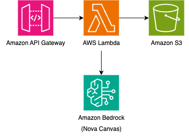

# Serverless Text-to-Image Generation with Amazon Bedrock Nova Canvas



This pattern implements a serverless text-to-image generation service using Amazon API Gateway, AWS Lambda and Amazon Bedrock's Nova Canvas model. It provides a REST API endpoint where users can submit text prompts. 

This invokes a Lambda function containing the request and the function makes a call to Amazon Bedrock's Nova Canvas model to generate an image based on the text description. Once the image is generated, the Lambda function saves it to an S3 bucket and returns this filename to the user through the API Gateway API.

Learn more about this pattern at Serverless Land Patterns: https://serverlessland.com/patterns/apigw-bedrock-nova-canvas

Important: this application uses various AWS services and there are costs associated with these services after the Free Tier usage - please see the [AWS Pricing page](https://aws.amazon.com/pricing/) for details. You are responsible for any AWS costs incurred. No warranty is implied in this example.

## Requirements

* [Create an AWS account](https://portal.aws.amazon.com/gp/aws/developer/registration/index.html) if you do not already have one and log in. The IAM user that you use must have sufficient permissions to make necessary AWS service calls and manage AWS resources.
* [AWS CLI](https://docs.aws.amazon.com/cli/latest/userguide/install-cliv2.html) installed and configured
* [Git Installed](https://git-scm.com/book/en/v2/Getting-Started-Installing-Git)
* [Terraform](https://learn.hashicorp.cxom/tutorials/terraform/install-cli?in=terraform/aws-get-started) installed
* [Amazon Bedrock Nova Canvas Foundation Model Access](https://docs.aws.amazon.com/bedrock/latest/userguide/model-access.html#add-model-access)

## Deployment Instructions

For this pattern, you would need access only to Amazon Nova Canvas foundation model (Model ID: amazon.nova-canvas-v1:0) in us-east-1 region, since the pattern uses us-east-1 region by default.

You must request access to the model before you can use it. If you try to use the model before you have requested access to it, you will receive an error message.

1. Create a new directory, navigate to that directory in a terminal and clone the GitHub repository:
    ``` 
    git clone https://github.com/aws-samples/serverless-patterns
    ```
1. Change directory to the pattern directory:
    ```
    cd apigw-bedrock-nova-canvas
    ```
1. From the command line, initialize terraform to downloads and installs the providers defined in the configuration:
    ```
    terraform init
    ```
1. From the command line, apply the configuration in the main.tf file:
    ```
    terraform apply
    ```
1. During the prompts
    ```
    #var.prefix
    - Enter a value: {enter any prefix to associate with resources}
    ```

## Testing

1. Make a POST request to the API using the following cURL command:

    ```
    curl -X POST 'API_ENDPOINT' --header "Content-Type: application/json" --data '{"prompt": "YOUR_PROMPT"}'
    ```

    Note: Replace `API_ENDPOINT` with the generated `api_endpoint` from Terraform (refer to the Terraform Outputs section), "YOUR_PROMPT" with your desired prompt. For ex,

    ```
    curl -X POST 'https://1234abcde.execute-api.us-east-1.amazonaws.com/dev/image_gen' --header "Content-Type: application/json" --data '{"prompt": "Kitten playing the piano"}'
    ```

1. Once the API Gateway responds with the image ID, you can navigate to the S3 bucket (refer to the Terraform Outputs section for the bucket name) and select the correct image ID to view the generated image.

## Cleanup

1. Change directory to the pattern directory:
    ```
    cd serverless-patterns/apigw-bedrock-nova-canvas
    ```

1. Delete all created resources
    ```
    terraform destroy
    ```
    
1. During the prompts:
    ```
    Enter all details as entered during creation.
    ```

1. Confirm all created resources has been deleted
    ```
    terraform show
    ```
----
Copyright 2025 Amazon.com, Inc. or its affiliates. All Rights Reserved.

SPDX-License-Identifier: MIT-0