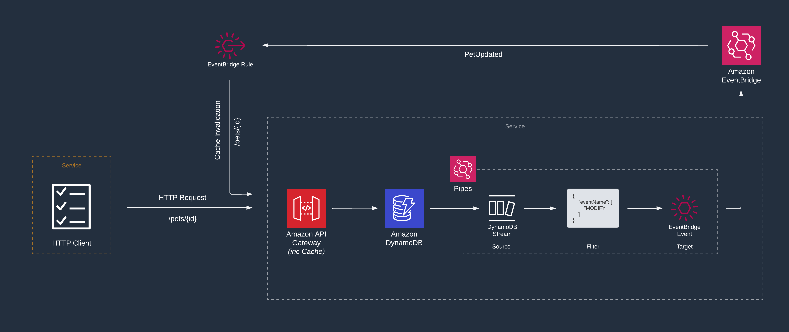

# AWS API Gateway to DynamoDB, including EventBridge for cache invalidation

This pattern creates a basic create, read, update, and delete (CRUD) REST API with DynamoDB as the backend storage. The API Gateway showcases a cache configuration for the /< id >:GET endpoint, where the cache is invalidated when the same record is modified in the DynamoDB. This is captured and processed with DynamoDB Streams, EventBridge Pipes & EventBridge.

Learn more about this pattern at Serverless Land Patterns: https://serverlessland.com/patterns/apigw-cache-invalidation-eventbridge

> **Important**
>
> This application uses various AWS services and there are costs associated with these services - please see the [AWS Pricing page](https://aws.amazon.com/pricing/) for details. To avoid unexpected costs be sure the hourly charged [API Gateway Cache](https://aws.amazon.com/api-gateway/pricing/) and resources are cleaned up at the end. You are responsible for any AWS costs incurred. No warranty is implied in this example.

## Requirements

- [Create an AWS account](https://portal.aws.amazon.com/gp/aws/developer/registration/index.html) if you do not already have one and log in. The IAM user that you use must have sufficient permissions to make necessary AWS service calls and manage AWS resources.
- [AWS CLI](https://docs.aws.amazon.com/cli/latest/userguide/install-cliv2.html) installed and configured
- [Git Installed](https://git-scm.com/book/en/v2/Getting-Started-Installing-Git)
- [AWS Serverless Application Model](https://docs.aws.amazon.com/serverless-application-model/latest/developerguide/serverless-sam-cli-install.html) (AWS SAM) installed

## Deployment Instructions

1. Create a new directory, navigate to that directory in a terminal and clone the GitHub repository:
   ```
   git clone https://github.com/aws-samples/serverless-patterns
   ```
2. Change directory to the pattern directory:
   ```
   cd apigw-cache-invalidation-eventbridge
   ```
3. From the command line, use AWS SAM to deploy the AWS resources for the pattern as specified in the template.yml file:
   ```
   sam deploy --guided
   ```
4. During the prompts:

   - Enter a stack name
   - Enter the desired AWS Region
   - Allow SAM CLI to create IAM roles with the required permissions.

   Once you have run `sam deploy --guided` mode once and saved arguments to a configuration file (samconfig.toml), you can use `sam deploy` in future to use these defaults.

5. Outputs from the SAM deployment process. These contain the resource names and/or ARNs which are used for testing.

> **Note**: Creating or deleting a cache takes about 4 minutes for API Gateway to complete. When a cache is created, the API status value changes from Create in progress to Active. When cache deletion is completed, the Cache status value changes from Delete in progress to Inactive. _Source: [Api Gateway Developer Guide](https://docs.aws.amazon.com/apigateway/latest/developerguide/api-gateway-caching.html#enable-api-gateway-caching)_

This sample contains an example collection of Cloudwatch Metrics as a dashboard to aid solution understanding. This will be deployed by default, to opt out of this deployment there is an additional parameter `DeployMetricsDashboard` that is required during the `sam deploy` step. This will instruct the cloudformation not to deploy the Cloudwatch dashboard.

To provide the value for `DeployMetricsDashboard`, it is possible to provide an override with the initial command by including `--parameter-overrides DeployMetricsDashboard=false`. This will override the guided process and update the default value to `true`. Alternatively, this can be provided as part of the guided flow.

## How it works

Upon the first request for each record, within the configured cache time frame, the response will be stored within a cache layer associated with the API. Updating a record will function-lessly trigger a process to invalidate the record currently persisted inside the cache. This is achieved via event driven systems and database change capture. When retrieving the updated record, this will be served from the cache due to the invalidation process that had occurred in the background.

> **Note:** This process has been implemented with the assumption that the update record can be published into a wider architecture and consumed by many consumers through use of the event bus and suitable filters.



## Testing

1. After the application is deployed, grab the ApiUrl endpoint from the outputs. If you missed it, simple use the SAM list command to retrieve.

```
sam list stack-outputs --stack-name STACK_NAME
```

2. using Postman or another API tool send a POST request to the endpoint `<endpoint>/pets` with the following payload:

```json
{
  "message": "Hello World!"
}
```

3. Using the returned ID, you can do a GET request to the endpoint `<endpoint>/pets/<returned ID>` to fetch the record.

This record will be stored in the cache, configured on the API Gateway. You can observe this via CloudWatch Metrics using `CacheHitCount` & `CacheMissCount`.

An additional header has been included in the response `cache-timestamp` from the endpoint `<endpoint>/pets/<returned ID>`. This will support validation of a functioning cache.

> **Note**: Caching is best-effort. You can use the `CacheHitCount` and `CacheMissCount` metrics in Amazon CloudWatch to monitor requests that API Gateway serves from the API cache. _Source : [Api Gateway Developer Guide](https://docs.aws.amazon.com/apigateway/latest/developerguide/api-gateway-caching.html)_

4. Using the PUT endpoint `<endpoint>/pets/<returned ID>` you can request an update the record by providing a different value in the `message` property.

```json
{
  "message": "Hello Serverless Gurus!"
}
```

This will return the updated record. Based on the record update within DynamoDB, through the configured stream a `MODIFY` event will be published to an EventBridge via EventBridge Pipes.

The published event will subsequently trigger a rule configured using Targets and authorized via IAM to complete a GET request to the endpoint `<endpoint>/pets/<returned ID>` including cache invalidation headers `Cache-Control: max-age=0`. CloudWatch Metrics can provide visibility of the EventBridge Pipe processing the change capture event.

This will ensure the updated record is available for other services requesting the record via the GET `<endpoint>/pets/<returned ID>` endpoint. You can observe this in CloudWatch Logs, in the execution Log Group for the API Gateway by viewing the Method Request Headers log line.

Available endpoints are:

- < endpoint >/pets:GET - lists all items
- < endpoint >/pets:POST - creates an item
- < endpoint >/pets/< id >:GET - retrieves one item
- < endpoint >/pets/< id >:PUT - updates one item
- < endpoint >/pets/< id >:DELETE - delete one item

## Cleanup

1. Delete the stack

   _This will also remove the package uploaded to S3 created by the `sam deploy` command_

   ```bash
   sam delete --stack-name STACK_NAME
   ```

1. Confirm the stack has been deleted
   ```bash
   sam list resources --stack-name STACK_NAME
   ```

---

Copyright 2023 Amazon.com, Inc. or its affiliates. All Rights Reserved.

SPDX-License-Identifier: MIT-0
