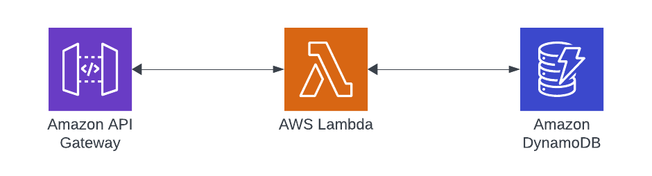

# AWS API Gateway to DynamoDB via Lambda and Rust

This pattern demonstrates how to handle an API Gateway event which is used to trigger a Lambda and Query DynamoDB. The Lambda is coded in Rust and leverages the AWS Rust SDK

Learn more about this pattern at Serverless Land Patterns: << Add the live URL here >>

Important: this application uses various AWS services and there are costs associated with these services after the Free Tier usage - please see the [AWS Pricing page](https://aws.amazon.com/pricing/) for details. You are responsible for any AWS costs incurred. No warranty is implied in this example.

## Requirements

-   [Create an AWS account](https://portal.aws.amazon.com/gp/aws/developer/registration/index.html) if you do not already have one and log in. The IAM user that you use must have sufficient permissions to make necessary AWS service calls and manage AWS resources.
-   [AWS CLI](https://docs.aws.amazon.com/cli/latest/userguide/install-cliv2.html) installed and configured
-   [Git Installed](https://git-scm.com/book/en/v2/Getting-Started-Installing-Git)
-   [AWS Serverless Application Model](https://docs.aws.amazon.com/serverless-application-model/latest/developerguide/serverless-sam-cli-install.html) (AWS SAM) installed
-   [Rustlang](https://www.rust-lang.org/tools/install) installed for your local computer
-   [Cargo Lambda](https://www.cargo-lambda.info/guide/installation.html) which SAM will use to build and test locally

## Deployment Instructions

1. Create a new directory, navigate to that directory in a terminal and clone the GitHub repository:
    ```
    git clone https://github.com/aws-samples/serverless-patterns
    ```
1. Change the directory to the pattern directory:
    ```
    cd apigw-ddb-rust
    ```
1. From the command line, use AWS SAM to deploy the AWS resources for the pattern as specified in the template.yml file:
    ```
    sam deploy --guided --beta-features
    ```
1. During the prompts:

    - Enter a stack name
    - Enter the desired AWS Region
    - Allow SAM CLI to create IAM roles with the required permissions.

    Once you have run `sam deploy --guided --beta-features` mode once and saved arguments to a configuration file (samconfig.toml), you can use `sam deploy` in future to use these defaults.

1. Note the outputs from the SAM deployment process. These contain the resource names and/or ARNs which are used for testing.

## How it works

The stack will deploy the following AWS resources.

-   API Gateway
-   Lambda
-   DyanmoDB Table



Once deployment is complete, make requests to the API URL that is returned in the stack output and to the stage Prod.

## Testing

Once the stack is created and there is a URL for the API Gateway endpoint, add records to the DynamoDB table.

```json
{
    "pk": "one",
    "sk": "one"
}
```

Execute a cURL command or HTTP request that looks like this:

```bash
curl  https:/{APIGW-URL}/Prod/one

# response
{
   "pk" : "one",
   "sk" : "one"
}
```

## Cleanup

1. Delete the stack
    ```bash
    aws cloudformation delete-stack --stack-name STACK_NAME
    ```
1. Confirm the stack has been deleted
    ```bash
    aws cloudformation list-stacks --query "StackSummaries[?contains(StackName,'STACK_NAME')].StackStatus"
    ```

---

Copyright 2023 Amazon.com, Inc. or its affiliates. All Rights Reserved.

SPDX-License-Identifier: MIT-0
