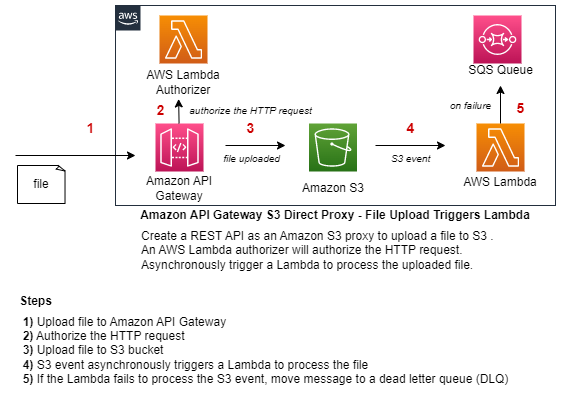

# Amazon API Gateway S3 Direct Proxy - File Upload Triggers Lambda
This pattern demonstrates how to create an Amazon API Gateway REST API with a direct proxy to an Amazon S3 bucket. The API allows files to be uploaded to the S3 bucket. An AWS Lambda authorizer will authorize the incoming HTTP requests. Asynchronously trigger a Lambda to process the uploaded file.
	  
An Amazon API Gateway REST API is deployed, one AWS Lambda Authorizer, one Amazon S3 bucket, and one AWS Lambda that will be triggered after a file is uploaded.
	  
The Amazon API Gateway is defined in the AWS Serverless Application Model (SAM) ```template.yaml``` file using the OpenAPI specification.

Learn more about this pattern at Serverless Land Patterns: https://serverlessland.com/patterns/apigw-s3-lambda-dotnet

## Architecture


## Requirements

* [Create an AWS account](https://portal.aws.amazon.com/gp/aws/developer/registration/index.html) if you do not already have one and log in. The IAM user that you use must have sufficient permissions to make necessary AWS service calls and manage AWS resources.
* [AWS CLI](https://docs.aws.amazon.com/cli/latest/userguide/install-cliv2.html) installed and configured
* [Git Installed](https://git-scm.com/book/en/v2/Getting-Started-Installing-Git)
* [AWS Serverless Application Model](https://docs.aws.amazon.com/serverless-application-model/latest/developerguide/serverless-sam-cli-install.html) (AWS SAM) installed
* [.NET 8.0](https://dotnet.microsoft.com/en-us/download/dotnet/8.0)


## Deployment Instructions
1. Create a new directory, navigate to that directory in a terminal and clone the GitHub repository:
    ``` 
    git clone https://github.com/aws-samples/serverless-patterns
    ```
2. Change directory to the pattern directory:
    ```
    cd apigw-s3-lambda-dotnet
    ```
3. From the command line, use AWS SAM to build and deploy the AWS resources for the pattern as specified in the template.yaml file:
    ```
    sam build
    sam deploy --guided
    ```
4. During the prompts:
    * Enter a stack name
    * Enter the desired AWS Region
    * Allow SAM CLI to create IAM roles with the required permissions.

    Once you have run `sam deploy -guided` mode and saved arguments to a configuration file (samconfig.toml), you can use `sam deploy` in future to use these defaults.

5. Note the outputs from the SAM deployment process. These contain the API Gateway endpoint URL,Lambda Authorizer, S3 bucket, the Lambda triggered from a file upload, and an SQS queue that's used to store S3 events that failed to be processed by the Lambda.

## Testing
In order to test, follow the steps given below:

### Step 1. Find the API Gateway Endpoint URL
After deploying the ```template.yaml``` file, copy the URL of the API Gateway endpoint that was created. Navigate to CloudFormation in the AWS Console. Click on the Stack that was created after deploying the ```template.yaml``` file. Find the CloudFormation output value named: ```API``` 

### Step 2. Submit an HTTP PUT Request to API Gateway
Submit an HTTP PUT request to API Gateway to upload a file to S3. The file will be stored in the S3 bucket and asynchronously trigger the Lambda function to process the file.

Below is an example HTTP PUT request to upload an image file to S3. Replace the URL with your API Gateway URL. Replace the ```key``` query parameter to the name of the S3 bucket created after deploying the ```template.yaml``` file.
```
curl -i --location --request PUT "https://<your-url>.execute-api.us-east-1.amazonaws.com/prod/s3?key=file-upload-bucket-111111111111>%2Funicorn1.jpg" --header "Authorization: mytesttoken" --header "Content-Type: image/jpeg" --data "C:/Temp/pictures/unicorn1.jpg"
```

### Step 3. Validate File Uploaded to S3
Navigate to CloudFormation in the AWS Console. Click on the Stack that was created after deploying the ```template.yaml``` file. Find the S3 bucket name by viewing the CloudFormation output value named ```Bucket```.

Navigate to S3 in the AWS Console to validate the new file has been uploaded.

### Step 4. Validate Lambda was Triggered 
Navigate to CloudFormation in the AWS Console. Click on the Stack that was created after deploying the ```template.yaml``` file. Find the name of the Lambda function that will be invoked after a file is uploaded to S3 by viewing the CloudFormation output value named ```S3FileProcessorFunction```.

## Cleanup
1. Delete the stack
    ```bash
    sam delete
    ```
2. Confirm the stack has been deleted
    ```bash
    aws cloudformation list-stacks --query "StackSummaries[?contains(StackName,'STACK_NAME')].StackStatus"
    ```
----
Copyright 2023 Amazon.com, Inc. or its affiliates. All Rights Reserved.

SPDX-License-Identifier: MIT-0