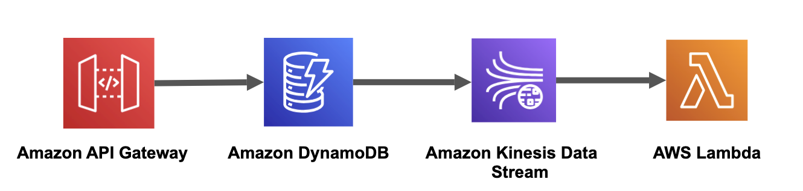

# Amazon API Gateway to Amazon DynamoDB to Amazon Kinesis Data Stream to AWS Lambda

This pattern will help you to deploy Amazon API Gateway, Amazon DynamoDB, Amazon Kinesis Data stream, AWS Lambda. You can use deployed API Gateway's endpoint URL to make HTTP POST request to make PutItem API call to Amazon DynamoSB table. Amazon DynamoDB table has Amazon Kinesis Data stream to capture item-level changes in your table, and replicates the changes to a Kinesis data stream. Next, AWS Lambda will consume those changes from Amazon Kinesis.

Learn more about this pattern at Serverless Land Patterns: https://serverlessland.com/patterns/apigw-dynamodb-kinesis-lambda-python-sam. Important: this application uses various AWS services and there are costs associated with these services after the Free Tier usage - please see the AWS Pricing page for details.

## Requirements

* [Create an AWS account](https://portal.aws.amazon.com/gp/aws/developer/registration/index.html) if you do not already have one and log in. The IAM user that you use must have sufficient permissions to make necessary AWS service calls and manage AWS resources.
* [AWS CLI](https://docs.aws.amazon.com/cli/latest/userguide/install-cliv2.html) installed and configured
* [Git Installed](https://git-scm.com/book/en/v2/Getting-Started-Installing-Git)
* [AWS Serverless Application Model](https://docs.aws.amazon.com/serverless-application-model/latest/developerguide/serverless-sam-cli-install.html) (AWS SAM) installed

## Architecture 
The following diagram illustrates the solution architecture:



## Deployment Instructions

1. Create a new directory, navigate to that directory in a terminal and clone the GitHub repository:
    ```
    git clone https://github.com/aws-samples/serverless-patterns
    ```
1. Change directory to the pattern directory:
    ```
    cd apigw-dynamodb-kinesis-lambda
    ```
1. From the command line, use AWS SAM to deploy the AWS resources for the pattern as specified in the template.yml file:
    ```
    sam deploy --guided
    ```
1. During the prompts:
    * Enter a stack name
    * Enter the desired AWS Region
    * Allow SAM CLI to create IAM roles with the required permissions.

    Once you have run `sam deploy --guided` mode once and saved arguments to a configuration file (samconfig.toml), you can use `sam deploy` in future to use these defaults.

1. Note the outputs from the SAM deployment process. These contain the resource names and/or ARNs which are used for testing.

## How it works

You can use API Gateway endpoint appeared in Outputs of SAM deployment to make PutItem action of DynamoDB.

1. Makes use of POST method on the API's /comment resource to push item to the DynamoDB table.

## Testing

From the SAM deploy output in a previous step, you can get the URL of the API Gateway endpoint and Lambda ARN. 
 
Use your preferred client to send a HTTP request. Use API Gateway Id which you received in the Outputs of SAM deploy.

1. Push an Item in DynamoDB table

```bash
curl --location --request POST 'https://<api-gateway-id>.execute-api.<region>.amazonaws.com/v1/comment' \
--header 'Content-Type: application/json' \
--data-raw '{
   "username": "myname",
   "message": "My First Comment"
}'                      
```
Amazon API Gateway will add item to the Amazon DynamoDB. Further, Amazon Kinesis Data Streams for DynamoDB captures item-level changes in your table, and replicates the changes to a Kinesis data stream. Lastly, AWS Lambda will consume changes received from Amazon Kinesis.

You can review Lambda function's execution logs from the Cloudwatch,

- Navigate to Lambda function from AWS Lambda console.
- Navigate to 'Monitor' tab.
- Click on 'View CloudWatch logs' button.
- Open latest log stream.
- Now, you should be able to see decoded message from the Kinesis Stream.


## Cleanup

1. In your command line, from the sam application project directory, run the following:
    ```bash
    sam delete

    ```
----
