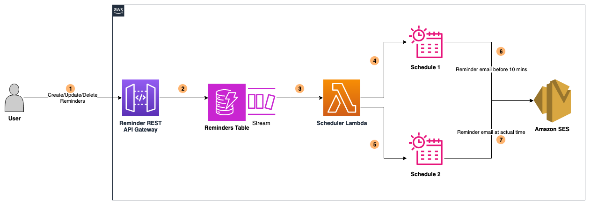

# Serverless Reminders Application using direct integration of Amazon EventBridge Scheduler with Amazon SES

This pattern deploys a serverless reminder application comprising Amazon API Gateway, DynamoDB Streams, Lambda Function, Amazon Event Bridge Scheduler and Amazon SES services.

Learn more about this pattern at Serverless Land Patterns: https://serverlessland.com/patterns/apigw-dynamodb-lambda-scheduler-ses-auto-deletion-sam

Important: this application uses various AWS services and there are costs associated with these services after the Free Tier usage - please see the [AWS Pricing page](https://aws.amazon.com/pricing/) for details. You are responsible for any AWS costs incurred. No warranty is implied in this example.

## Requirements

* [Create an AWS account](https://portal.aws.amazon.com/gp/aws/developer/registration/index.html) if you do not already have one and log in. The IAM user that you use must have sufficient permissions to make necessary AWS service calls and manage AWS resources.
* [AWS CLI](https://docs.aws.amazon.com/cli/latest/userguide/install-cliv2.html) installed and configured
* [Git Installed](https://git-scm.com/book/en/v2/Getting-Started-Installing-Git)
* [AWS Serverless Application Model](https://docs.aws.amazon.com/serverless-application-model/latest/developerguide/serverless-sam-cli-install.html) (AWS SAM) installed

## Deployment Instructions

1. Create a new directory, navigate to that directory in a terminal and clone the GitHub repository:
    ``` 
    git clone https://github.com/aws-samples/serverless-patterns
    ```
2. Change directory to the pattern directory:
    ```
    cd apigw-dynamodb-lambda-scheduler-ses-auto-deletion-sam
    ```
3. From the command line, use AWS SAM to deploy the AWS resources for the pattern as specified in the template.yml file:
    ```
    sam deploy --guided
    ```
4. During the prompts:
    * Enter a stack name
    * Enter the desired AWS Region
    * Specify value for SenderEmailAddress. The email address should be verified identity from Amazon SES.
    * Allow SAM CLI to create IAM roles with the required permissions.

    Once you have run `sam deploy --guided` mode once and saved arguments to a configuration file (samconfig.toml), you can use `sam deploy` in future to use these defaults.

5. Note the outputs from the SAM deployment process. These contain the resource names and/or ARNs which are used for testing.

## Architecture



## How it works

- When a user creates/updates/deletes a reminder using REST API Gateway endpoint, the data is updated in DynamoDB Table.
- Scheduler Lambda function is triggered in response to event in DynamoDB table and then creates/updates/deletes one-time schedules using [Amazon EventBridge Scheduler](https://aws.amazon.com/blogs/compute/introducing-amazon-eventbridge-scheduler/).
- Email reminders are sent to the specified email address before 10 minutes and at the scheduled time.
- Amazon EventBridge Scheduler is directly integrated with Amazon SES using [Universal Targets](https://docs.aws.amazon.com/scheduler/latest/UserGuide/managing-targets-universal.html).
- All schedules are removed once they run (auto deletion).

## Testing
    
Once the application is deployed, use Postman to test the API using the following instructions.

1) Copy the API Gateway Stage Invoke URL from the SAM deployment output
2) In order to create a new reminder, specify the below values.

    - HTTP Method: POST
    - Endpoint: https://{ApiId}.execute-api.{Region}.amazonaws.com/v1/reminders
    - Request Body (JSON)
    	```
            {
                "description": "Order Food",
                "datetime": "2023-11-10T05:40:00Z",
                "email": "youremail@verifieddomain.com"
            }
	    ```
    - Kindly note that all the three parameters are required and datetime parameter is of the format **YYYY-MM-DDTHH:MM:SSZ** in UTC. Email must be valid.
    - The API response includes the unique id of the reminder and other attributes.
    - One-time Event Bridge Schedules are created and auto-deleted upon event completion.

3) In order to update a reminder, specify the below values.

    - HTTP Method: PUT
    - Endpoint: https://{ApiId}.execute-api.{Region}.amazonaws.com/v1/reminders/{reminderid}
    - Request Body (JSON)
    	```
            {
                "description": "Order Food",
                "datetime": "2023-11-10T05:40:00Z",
                "email": "youremail@verifieddomain.com"
            }
	    ```
    - Kindly note that all the three parameters are required and datetime parameter is of the format YYYY-MM-DDTHH:MM:SSZ in UTC.
    - Existing One-time Event Bridge Schedules are updated and auto-deleted upon event completion.

4) In order to delete a specific reminder, specify the below values.

    - HTTP Method: DELETE
    - Endpoint: https://{ApiId}.execute-api.{Region}.amazonaws.com/v1/reminders/{reminderid}
    - The records are deleted from DynamoDB and the corresponding One-time Event Bridge Schedules are deleted.

5) In order to list all reminders, specify the below values.
    - HTTP Method: GET
    - Endpoint: https://{ApiId}.execute-api.{Region}.amazonaws.com/v1/reminders
    - The API response lists the active and expired reminders.

## Cleanup
 
1. Delete the stack
    ```bash
    sam delete
    ```
----
Copyright 2023 Amazon.com, Inc. or its affiliates. All Rights Reserved.

SPDX-License-Identifier: MIT-0