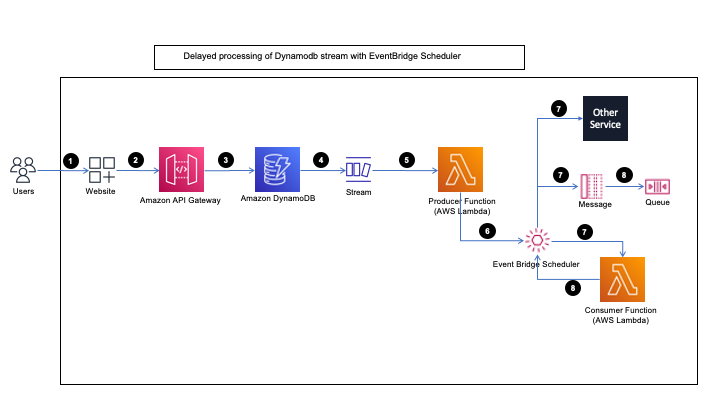

# AWS DynamoDB to EventBridge Scheduler via AWS Lambda function

This pattern demonstrates a sample to delay Amazon DynamoDB Stream processing using Amazon EventBridge Scheduler. EventBridge Scheduler invokes a target one-time or at regular intervals defined by a cron or rate expression.

Amazon DynamoDB streams are used to deliver event payload to the handlers in near real time. This pattern will help customers with usecases such as process stream events at a particular time window, as well as triggring one target AWS service from EventBridge Scheduler. 

Learn more about this pattern at Serverless Land Patterns: [Delayed processing of Dynamodb stream with EventBridge Scheduler](https://serverlessland.com/patterns/apigw-dynamodb-lambda-scheduler-sqs-cdk)

Important: this application uses various AWS services and there are costs associated with these services after the Free Tier usage - please see the [AWS Pricing page](https://aws.amazon.com/pricing/) for details. You are responsible for any AWS costs incurred. No warranty is implied in this example.

## Requirements

-   [Create an AWS account](https://portal.aws.amazon.com/gp/aws/developer/registration/index.html) if you do not already have one and log in. The IAM user that you use must have sufficient permissions to make necessary AWS service calls and manage AWS resources.
-   [AWS CLI](https://docs.aws.amazon.com/cli/latest/userguide/install-cliv2.html) installed and configured
-   [Git Installed](https://git-scm.com/book/en/v2/Getting-Started-Installing-Git)
-   [Node and NPM](https://nodejs.org/en/download/) installed
-   [AWS CDK](https://docs.aws.amazon.com/cdk/v2/guide/getting_started.html) (AWS CDK) installed

## Deployment Instructions

1. Create a new directory, navigate to that directory in a terminal and clone the GitHub repository:
    ```bash
    git clone https://github.com/aws-samples/serverless-patterns
    ```
2. Change directory to the pattern directory:
    ```bash
    cd serverless-patterns/apigw-dynamodb-lambda-scheduler-sqs-cdk
    ```
3. Install the project dependencies
    ```bash
     npm run init
    ```
4. Build the project to convert typescript to js
    ```bash
     npm run build
    ```
5. Deploy the stack to your default AWS account and region
    ```bash
    cdk deploy
    ```

## Architecture



## How it works

In this sample, Amazon Apigateway receives a request from end-users that has a schedule time and event category provided in the request body. The data is stored in Amazon DynamoDB table. Amazon DynamoDB table has stream enabled and it publishes event to a Lambda function. Lambda function invokes Amazon EventBridge Scheduler and selects the groups provided the request body. EventBridge Scheduler provides a universal target parameter that you can use to create customized triggers that targets more than 270 AWS service and over 6,000 API operation on a schedule. In this example, we are showing integration with two targets, i.e. AWS Lamdba Function, and Amazon SQS queue.

Once the pattern is deployed to AWS, you will have the following resources created with the described capabilities

-   An edge optimized Amazon API Gateway endpoint that will receive user request
    - A Post method to add a new record in Amazon DynamoDB.
    - A Get method sent with an id to retrive the scheduler. 
- DynamoDB table with DynamoDB Stream enabled.
- Amazon Lambda functions
    - Producer Lambda function that listens to DynamoDB stream and calls Amazon EventBridge Scheduler
    - Consumer Lambda function acts as a target and listens to EventBridge Scheduler. It performs given actions and deletes the schedule. 
-  An EventBridge Schedule groups in which Producer Lambda function can categories an event.
-  An SQS Queue as another sample target for EventBridge Scheduler.
- Messages with `eventType:"Lambda"` go to Lambda function at a given schedule under EventBridge Schedule group name - Lambda.
- Messages with `eventType:"Queue"` or others will go to Queue at a given schedule via EventBridge Schedule group name - Queue.

## Testing

In the AWS Console, browse to the API Gateway and find the `EBSchedulerDemo Service` that is created. Once the API is opened, go to `Resources` then select method `POST`. Select inbuild `Test` feature to `Submit a request`. Enter the below in the Message Body


```javascript
{
    "eventName":"TestEventLambda",
    "eventType":"Lambda",
    "scheduleTime":"1679566052"
}
```

#### or

```javascript
{
    "eventName":"TestEventQueue",
    "eventType":"Queue",  
    "scheduleTime":"1679566052"
}
```

After publishing, browse to the Schedules and EventBridge Scheduler, and inspect that the scheduler has placed an entry to schedule a message at a given time, for the given target. 

## Cleanup

1. Delete the stack
    ```bash
    cdk destroy
    ```

## Documentation

-   [Amazon EventBridge Scheduler](https://docs.aws.amazon.com/scheduler/latest/UserGuide/what-is-scheduler.html)
-   [Amazon EventBridge](https://docs.aws.amazon.com/eventbridge/latest/userguide/eb-what-is.html)

---

Copyright 2023 Amazon.com, Inc. or its affiliates. All Rights Reserved.

SPDX-License-Identifier: MIT-0