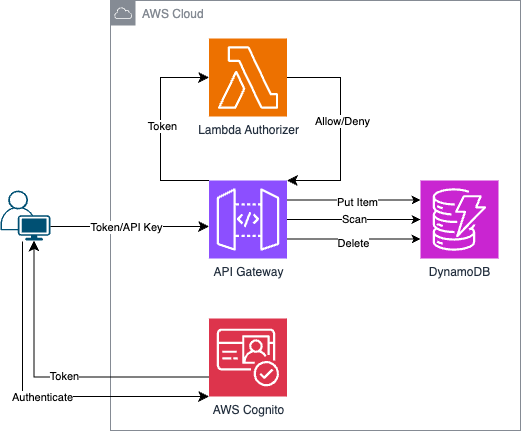

# Amazon API Gateway direct integration to Amazon DynamoDB

This pattern shows how to create an API Gateway with direct integration to DynamoDB. 
The pattern showcase transformation of request/response using VTL and CDK and implement examples for using Cognito, Lambda authorizer and API keys. 

Learn more about this pattern at Serverless Land Patterns: [Serverless Land Patterns](https://serverlessland.com/patterns/apigw-dynamodb-python-cdk).

Important: this application uses various AWS services and there are costs associated with these services after the Free Tier usage - please see the [AWS Pricing page](https://aws.amazon.com/pricing/) for details. You are responsible for any AWS costs incurred. No warranty is implied in this example.



## Requirements

* [Create an AWS account](https://portal.aws.amazon.com/gp/aws/developer/registration/index.html) if you do not already have one and log in. The IAM user that you use must have sufficient permissions to make necessary AWS service calls and manage AWS resources.
* [Git Installed](https://git-scm.com/book/en/v2/Getting-Started-Installing-Git)
* [AWS Cloud Development Kit](https://docs.aws.amazon.com/cdk/latest/guide/cli.html) (AWS CDK) installed

## Deployment Instructions

1. Create a new directory, navigate to that directory in a terminal and clone the GitHub repository:
```
git clone https://github.com/aws-samples/serverless-patterns/ 
```
2. Change directory
```
cd serverless-patterns/apigw-dynamodb-python-cdk
```
3. To manually create a virtualenv on MacOS and Linux:
```
python3 -m venv .venv
```
4. After the init process completes and the virtualenv is created, you can use the following to activate virtualenv.
```
source .venv/bin/activate
``` 
6. After activating your virtual environment for the first time, install the app's standard dependencies:
```
python -m pip install -r requirements.txt
```
7. Install jwt package for Lambda:
```
cd src; pip install pyjwt --target . 
```
8. Zip the Lambda function and dependencies 
```
zip -r lambda.zip . ; cd
```
9. To generate a cloudformation templates (optional)
```
cdk synth
```
10. To deploy AWS resources as a CDK project
```
cdk deploy 
```

## How it works
At the end of the deployment the CDK output will list stack outputs, and an API Gateway URL. In the customer's AWS account, a REST API along with an authorizer, Cognito user pool, and a DynamoDB table will be created.
Put resource - uses Lambda authorizer to authenticate the client and send allow/deny to API Gateway. 
Get resource - uses API key to control the rate limit. Need to provide valid key for the request with x-api-key header.
Delete resource - uses Cognito to authenticate the client. Cognito token need to be provided with Authorization header. 

## Testing
1. Run pytest
```
pytest tests/test_apigw_dynamodb_python_stack.py 
```
## Cleanup
 
1. Delete the stack
    ```bash
   cdk destroy
    ```
1. Confirm the stack has been deleted
    ```bash
    cdk list
    ```
----
Copyright 2024 Amazon.com, Inc. or its affiliates. All Rights Reserved.

SPDX-License-Identifier: MIT-0
