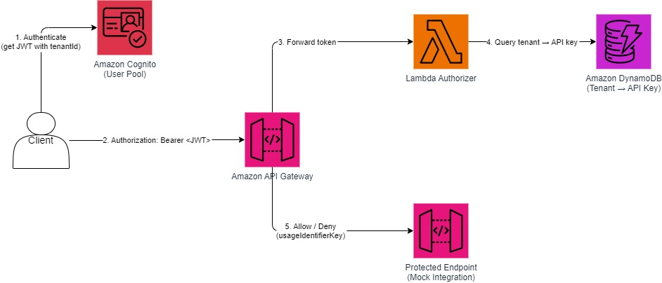

# Amazon API Gateway with Cognito, Lambda Authorizer, and DynamoDB for Tenant API Key Authentication

API Gateway's usage plans and API keys are fundamentally disconnected from authorization tokens.
Usage plans enforce rate limits via API keys, but auth tokens (JWTs from Cognito, Auth0, etc.) carry identity and permissions — these are two separate systems with no native link. This means customers cannot simply issue an auth token that inherently comes with rate-limiting attached. At scale (millions of auth tokens across thousands of tenants), managing this disconnect manually becomes untenable.

This pattern demonstrates how to implement a secure tenant-based API key authorization system using Amazon Cognito, Amazon API Gateway, AWS Lambda Authorizer, and Amazon DynamoDB. Cognito authenticates users and issues JWTs containing a custom `tenantId` claim. The Lambda authorizer extracts the tenant ID from the JWT, looks up the corresponding API key in DynamoDB, and returns a policy document enabling API Gateway access.

What this pattern solves:
  - Bridges the auth–throttling gap — The Lambda authorizer acts as the glue between identity (JWT tenantId) and rate-limiting (API Gateway API key). By looking up the tenant's API key in DynamoDB and returning it via usageIdentifierKey, a single auth token automatically activates the correct usage plan. Auth and throttling become one  unified flow rather than two disconnected systems.
  - Scales to millions of tokens per tenant — Any number of JWTs can map to the same tenant's API key. You don't need a  1:1 relationship between auth tokens and API keys. A tenant can have millions of active tokens, but they all resolve  to one API key and one rate-limit policy — making management tractable at scale. 
  - Eliminates per-application auth logic — Backend services no longer independently validate tenants or enforce limits.  The gateway handles both centrally, preventing inconsistency and reducing overhead.
  - Prevents noisy neighbors transparently — Tenants only interact with their auth credentials. The API key mapping and  usage plan enforcement happen internally, so rate-limiting is invisible to consumers but enforced consistently.
  - Makes auth and usage a single operational concern — Onboarding a new tenant means: create identity (Cognito/Auth0),  create API key with a usage plan, store the mapping in DynamoDB. One workflow governs both auth and throttling, rather  than managing them as separate systems that drift apart over time.


Important: this application uses various AWS services and there are costs associated with these services after the Free Tier usage - please see the [AWS Pricing page](https://aws.amazon.com/pricing/) for details. You are responsible for any AWS costs incurred. No warranty is implied in this example.

## Requirements

* [Create an AWS account](https://portal.aws.amazon.com/gp/aws/developer/registration/index.html) if you do not already have one and log in. The IAM user that you use must have sufficient permissions to make necessary AWS service calls and manage AWS resources.
* [AWS CLI](https://docs.aws.amazon.com/cli/latest/userguide/install-cliv2.html) installed and configured
* [Git](https://git-scm.com/book/en/v2/Getting-Started-Installing-Git) installed
* [Node.js and npm](https://nodejs.org/) installed
* [AWS CDK](https://docs.aws.amazon.com/cdk/latest/guide/getting_started.html) installed

## Deployment Instructions

1. Create a new directory, navigate to that directory in a terminal and clone the GitHub repository:
    ```
    git clone https://github.com/aws-samples/serverless-patterns
    ```
1. Change directory to the pattern directory:
    ```
    cd apigw-dynamodb-apikey-cdk
    ```
1. Install dependencies:
    ```
    npm install
    ```
1. Deploy the stack:
    ```
    cdk deploy
    ```

Note the outputs from the CDK deployment process. The output will include the API Gateway URL, DynamoDB table name, Cognito User Pool ID, and User Pool Client ID.

## How it works



1. Client authenticates with Amazon Cognito and receives a JWT (ID token) containing the custom `tenantId` claim
2. Client makes a request to the API with the JWT in the `Authorization` header
3. API Gateway forwards the token to the Lambda Authorizer
4. The Lambda Authorizer decodes the JWT, extracts the `custom:tenantId` claim, and looks up the tenant in the DynamoDB table
   - If the tenant exists, the associated API key is retrieved and returned in the authorization context via [`usageIdentifierKey`] (https://docs.aws.amazon.com/apigateway/latest/developerguide/api-gateway-lambda-authorizer-output.html)
   - If the tenant does not exist or the token is invalid, the request is denied
5. The API Gateway allows or denies access to the protected endpoint based on the policy returned by the authorizer

The DynamoDB table uses `tenantId` as the partition key and stores the corresponding `apiKey` for each tenant.

## Testing

1. Get the outputs from the deployment:
    ```bash
    # The outputs will be similar to
    ApigwDynamodbApikeyCdkStack.ApiUrl = https://abc123def.execute-api.us-east-1.amazonaws.com/prod/
    ApigwDynamodbApikeyCdkStack.TableName = ApigwDynamodbApikeyCdkStack-TenantApiKeyTableXXXXXX-YYYYYY
    ApigwDynamodbApikeyCdkStack.UserPoolId = us-east-1_XXXXXXXXX
    ApigwDynamodbApikeyCdkStack.UserPoolClientId = XXXXXXXXXXXXXXXXXXXXXXXXXX
    ```

1. Create a Cognito user with a tenantId:
    ```bash
    aws cognito-idp admin-create-user \
      --user-pool-id USER_POOL_ID \
      --username user@example.com \
      --user-attributes Name=email,Value=user@example.com Name=custom:tenantId,Value=sample-tenant \
      --temporary-password "TempPass1!"
    ```

1. Set a permanent password for the user:
    ```bash
    aws cognito-idp admin-set-user-password \
      --user-pool-id USER_POOL_ID \
      --username user@example.com \
      --password "MySecurePass1!" \
      --permanent
    ```

1. Insert a tenant mapping into the DynamoDB table:
    ```bash
    aws dynamodb put-item \
      --table-name TABLE_NAME \
      --item '{"tenantId": {"S": "sample-tenant"}, "apiKey": {"S": "my-api-key-123"}}'
    ```

1. Get a token and call the API using the helper script:
    ```bash
        node get-token.js --user-pool-id USER_POOL_ID --client-id CLIENT_ID \
        --username user@example.com --password "MySecurePass1!" \
        --api-url https://REPLACE_WITH_API_URL/protected
    ```
    If successful, you should receive a response like:
    ```json
    { "message": "Access granted" }
    ```

1. Try with an invalid or missing token:
    ```bash
    curl https://REPLACE_WITH_API_URL/protected
    ```
    You should receive an unauthorized error.

## Cleanup

1. Delete the stack:
    ```bash
    cdk destroy
    ```

----
Copyright 2025 Amazon.com, Inc. or its affiliates. All Rights Reserved.

SPDX-License-Identifier: MIT-0
