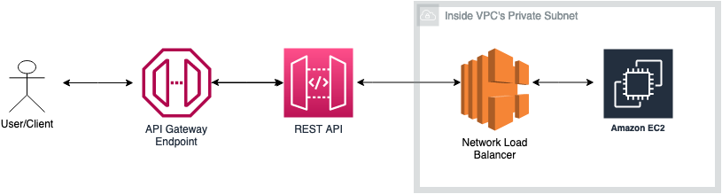

# Deploy a NGINX server on private EC2 server and proxy it via REST API
## Architecture
* Account Setup

    

This sample pattern allows users to quickly deploy a REST API, Network Load Balancer and NGINX server on a EC2 machine in their own VPC. The pattern uses Amazon API Gateway with VPC Link to securely connect to the NLB which routes traffic to EC2 instances running NGINX server. By using this pattern, users can ensure that their private resources are not exposed to the public internet while still allowing secure access through API Gateway. This pattern can be useful in scenarios where there is a need to integrate with private resources, such as internal databases or applications, while also maintaining a high level of security.

Learn more about this pattern at Serverless Land Patterns: https://serverlessland.com/patterns/apigw-ec2

Important: this application uses various AWS services and there are costs associated with these services after the Free Tier usage - please see the [AWS Pricing page](https://aws.amazon.com/pricing/) for details. You are responsible for any AWS costs incurred. No warranty is implied in this example.

## Requirements
* [Create one AWS account for this setup](https://portal.aws.amazon.com/gp/aws/developer/registration/index.html) if you do not already have, create them and log in. The IAM user that you use must have sufficient permissions to make necessary AWS service calls and manage AWS resources.

* [AWS CLI](https://docs.aws.amazon.com/cli/latest/userguide/install-cliv2.html) install and configure one profiles with credentials for the accounts as below:
    ```
    [default]
    ```
* [Git Installed](https://git-scm.com/book/en/v2/Getting-Started-Installing-Git)
* [SAM](https://docs.aws.amazon.com/serverless-application-model/latest/developerguide/serverless-sam-cli-install.html) installed
* You need a existing VPC with 2 private subnets and one security group that allows http traffic on port 80 within the VPC i.e VPC Cidr range.
* One route table that should be 2 private subnet association.
* One pre-existing key pair for EC2 machine.

## Deployment Instructions

1. Create a new directory, navigate to that directory in a terminal and clone the GitHub repository:
    ``` 
    git clone https://github.com/aws-samples/serverless-pattern
    ```
1. Change directory to the pattern directory:
    ```
    cd apigw-ec2
    ```
1. From the command line, use AWS SAM to deploy the AWS resources for the pattern as specified in the template.yml file:
    ```
    sam deploy --guided --capabilities CAPABILITY_NAMED_IAM
    ```
1. During the prompts:

    #Stack name of your choice
    - Enter a stack name

    #Enter a region name where you want to deploy the resources. For Eg: us-east-1
    - Enter a AWS Region:

    #Enter a Instance type for EC2. Before entering a value, confirm that the instance type is available in your desired region. In case if you get an error that instance type is not a allowed value then cross check the instancetype name in template.yaml file at line 10 under AllowedValues attribute. For Eg: t2.micro
    - Enter a InstanceType:

    #Enter a valid KeyPair name that exists in your account
    - Enter a KeyPair:

    #Enter a valid VPC Id in which you want to deploy the resources
    - Enter a VPC:

    #Enter Private Subnet Ids in which you want to deploy the resources. Enter value like this -> subnet-1234,subnet-5678
    - Enter a PrivateSubnetIds:

    #Enter a existing security group Id in which you want to deploy the resources. Make sure that security group allows port 80 traffic from the VPC CIDR range or from 0.0.0.0/0. This is required to allow traffic from NLB and install NGINX files successfully on EC2 machine
    - Enter a SecurityGroupIDsForNLBAndEC2:

    #Enter a Route Table Ids used by the above entered private subnet. This is required to create a VPC Endpoint which is responsible for fetching NGINX files for EC2.  
    - Enter a RouteTableId:

## Testing

1. You can now invoke the REST API by executing a GET request via the CURL command present in the output section or invoke the REST API from the browser using the API URL obtained from the Outputs section after deployment. 

## Cleanup
 
1. Change directory to the pattern directory:
    ```
    cd serverless-patterns/apigw-ec2
    ```
1. Delete all created resources in same account.
    ```
    sam delete --stack-name <stackname>
    ```
----
Copyright 2023 Amazon.com, Inc. or its affiliates. All Rights Reserved.

SPDX-License-Identifier: MIT-0
