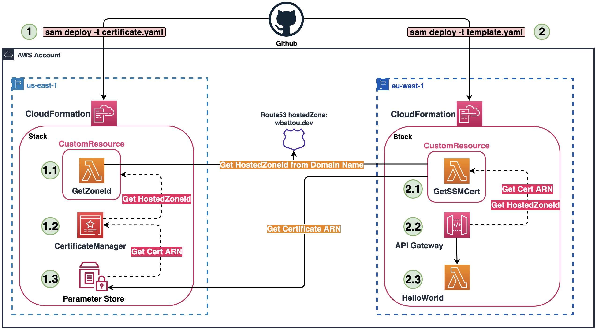

# Edge-optimized Amazon API Gateway with custom domain name
This pattern deploys an Edge-optimized Amazon API Gateway with a single method (/hello) in your preferred region with an AWS Certificate Manager certificate in us-east-1 (which is mandatory for Edge-optimized API Gateways).

## Requirements
* [Create an AWS account](https://portal.aws.amazon.com/gp/aws/developer/registration/index.html) if you do not already have one and log in. The IAM user that you use must have sufficient permissions to make necessary AWS service calls and manage AWS resources.
* [AWS CLI](https://docs.aws.amazon.com/cli/latest/userguide/install-cliv2.html) installed and configured
* [Git Installed](https://git-scm.com/book/en/v2/Getting-Started-Installing-Git)
* [AWS Serverless Application Model](https://docs.aws.amazon.com/serverless-application-model/latest/developerguide/serverless-sam-cli-install.html) (AWS SAM) installed
* Having your Route53 zone in the same AWS account.

## Deployment Instructions
1. Create the certificate in us-east-1
    ```
    $ sam deploy \ # Deploy command for SAM
        -t certificate.yaml \ # the path to the SAM template to deploy the ACM certificate
        --stack-name cert-sample-api \ # Specifies the name of the CloudFormation stack
        --parameter-overrides "Domain=sample.com" \ # Overrides parameters defined in the SAM template
        --region us-east-1 \ # Specifies the AWS region where the stack will be deployed, us-east-1 is mandatory for certificate
        --resolve-s3 \ # Automatically create an Amazon S3 bucket to use for packaging and deploying
        --capabilities CAPABILITY_IAM \ # Specifies the IAM capabilities required for the stack to create/modify IAM resources
        --no-fail-on-empty-changeset \ # Indicates that the deployment should not fail if there are no changes to be made
        --no-progressbar # Do not display a progress bar when uploading artifacts to Amazon S3
    ```
1. Create the main stack in your preferred region
    ```
    $ sam deploy \ # Deploy command for SAM
        -t template.yaml \ # the path to the SAM template to deploy our application (EDGE API Gateway)
        --stack-name sample-api \ # Specifies the name of the CloudFormation stack
        --parameter-overrides "Domain=sample.com" \ # Overrides parameters defined in the SAM template
        --region eu-west-1 \ # Specifies your preferred AWS region where the stack will be deployed, eu-west-1 for me
        --resolve-s3 \ # Automatically create an Amazon S3 bucket to use for packaging and deploying
        --capabilities CAPABILITY_IAM \ # Specifies the IAM capabilities required for the stack to create/modify IAM resources
        --no-fail-on-empty-changeset \ # Indicates that the deployment should not fail if there are no changes to be made
        --no-progressbar # Do not display a progress bar when uploading artifacts to Amazon S3
    ```
## How it works


This pattern uses CloudFormation custom resources to implement custom provisioning logic using Lambda functions. For more information, please refer to this [workshop](https://mng.workshop.aws/cloudformation/customresource.html).

1. Create the "certificate.yaml" file.

To create an ACM certificate on AWS with DNS as `DomainValidationOptions`, provide the `DomainName` and the `HostedZoneId`. CloudFormation does not dynamically retrieve the `HostedZoneId`. A custom resource is used to get these values dynamically instead of hardcoding them.
To get the ARN of this certificate from the other stack I store it in a ParameterStore.

2. Deploy the main stack with the template named "template.yaml".

To deploy the main stack, the EDGE API Gateway, get the certificate created in Step 1 and the HostedZoneId for the domain. This creates a second custom resource.

## Testing
This is a sample 'hello world' API, you can test it with the following command.

    $ wget sample-api.<your-domain-name>/hello # The domain name you set during your deployment ("--parameter-overrides")

## Cleanup

1. Delete the stack
    ```
    $ sam delete --stack-name sample-api --region eu-west-1
    $ sam delete --stack-name cert-sample-api --region us-east-1
    ```

----
Copyright 2024 Amazon.com, Inc. or its affiliates. All Rights Reserved.

SPDX-License-Identifier: MIT-0
