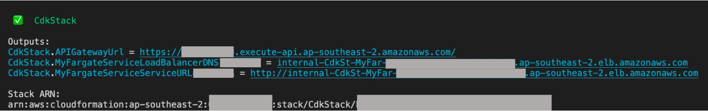
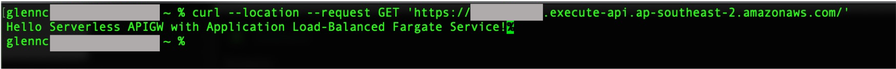

# Amazon API Gateway to AWS Fargate

This project contains a sample AWS Cloud Development Kit (AWS CDK) template for deploying an AWS Fargate service running on an Amazon Elastic Container Service (ECS) cluster with a private Application Load Balancer in-front. The Application Load Balanced Fargate Service is integrated with Amazon API Gateway HTTP API to expose the endpoint. This template uses a custom image without having to pre-push the image to Amazon Elastic Container Registry (ECR) or another container library. This makes use of the in-built `ecs.ContainerImage.fromAsset` method. The custom image has a base route `/` to output a message.

Learn more about this pattern at Serverless Land Patterns: https://serverlessland.com/patterns/apigw-fargate-cdk.

Important: this application uses various AWS services and there are costs associated with these services after the Free Tier usage - please see the [AWS Pricing page](https://aws.amazon.com/pricing/) for details. You are responsible for any AWS costs incurred. No warranty is implied in this example.

Warning: As of this writing, there are known issues with the images built on Apple's M1 chip, which is based on the ARM architecture. You might encounter the following error log on ECS `standard_init_linux.go:228: exec user process caused: exec format error fargate`. More details can be found at [Stackoverflow 'exec user process caused: exec format error' in AWS Fargate Service](https://stackoverflow.com/questions/67361936/exec-user-process-caused-exec-format-error-in-aws-fargate-service)

## Requirements

- [Create an AWS account](https://portal.aws.amazon.com/gp/aws/developer/registration/index.html) if you do not already have one and log in. The IAM user that you use must have sufficient permissions to make necessary AWS service calls and manage AWS resources.
- [AWS CLI](https://docs.aws.amazon.com/cli/latest/userguide/install-cliv2.html) installed and configured
- [Git Installed](https://git-scm.com/book/en/v2/Getting-Started-Installing-Git)
- [AWS CDK](https://docs.aws.amazon.com/cdk/latest/guide/cli.html) installed and configured

## Deployment Instructions

1. Create a new directory, navigate to that directory in a terminal and clone the GitHub repository:
   ```bash
   git clone https://github.com/aws-samples/serverless-patterns
   ```
2. Change directory to the pattern directory:
   ```bash
   cd serverless-patterns/apigw-fargate-cdk/cdk
   ```
3. Install dependencies:
   ```bash
   npm install
   ```
4. From the command line, configure AWS CDK:
   ```bash
   cdk bootstrap ACCOUNT-NUMBER/REGION # e.g.
   cdk bootstrap 1111111111/us-east-1
   cdk bootstrap --profile test 1111111111/us-east-1
   ```
5. Ensure that the bucket name is unique in [cdk-stack.ts](./cdk/lib/cdk-stack.ts)
6. From the command line, use AWS CDK to deploy the AWS resources for the pattern as specified in the `lib/cdk-stack.ts` file:
   ```bash
   cdk deploy
   ```
7. Note the outputs from the CDK deployment process. This contains the apigw endpoint that is used to make the GET request

## How it works

- The image is constructed directly from sources on disk when `cdk deploy` is executed
- The image is automatically pushed to Amazon ECR
- The VPC and subnets are created
- The ECS cluster is created
- The Task Definitions are created
- The API Gateway Integration, Route, and VPC Link are created
- The Fargate Service is created

## Testing

Retrieve the API Gateway URL from the `cdk deploy` output. Example of the output is:

```
CdkStack.APIGatewayUrl = https://abcd123efg.execute-api.ap-southeast-2.amazonaws.com/
```

For reference:



The API Gateway allows a GET request to `/`. To call it, run the following:

```bash
curl --location --request GET '<REPLACE WITH API GATEWAY URL>'
# Example
curl --location --request GET 'https://abcd123efg.execute-api.ap-southeast-2.amazonaws.com/'
```

Running the request above should produce the following output:



## Cleanup

1. Delete the stack
   ```bash
   cdk destroy
   ```
2. Navigate to ECR in the AWS console and delete the container images created

## Documentation and useful references

- [GitHub issue where one of the contributors provided an example with a pre-built image and any type of request](https://github.com/aws/aws-cdk/issues/8066)
- [CDK documentation for ApplicationLoadBalancedFargateService](https://docs.aws.amazon.com/cdk/api/latest/docs/@aws-cdk_aws-ecs-patterns.ApplicationLoadBalancedFargateService.html)
- [CDK documentation for APIGatewayv2 CfnIntegration](https://docs.aws.amazon.com/cdk/api/latest/docs/@aws-cdk_aws-apigatewayv2.CfnIntegration.html)
- [CDK documentation for APIGatewayv2 CfnRoute](https://docs.aws.amazon.com/cdk/api/latest/docs/@aws-cdk_aws-apigatewayv2.CfnRoute.html)
- [CDK documentation for APIGatewayv2 HttpApi](https://docs.aws.amazon.com/cdk/api/latest/docs/@aws-cdk_aws-apigatewayv2.HttpApi.html)
- [CDK documentation for CDK Core CfnResource](https://docs.aws.amazon.com/cdk/api/latest/docs/@aws-cdk_core.CfnResource.html)

---

Copyright 2021 Amazon.com, Inc. or its affiliates. All Rights Reserved.

SPDX-License-Identifier: MIT-0
