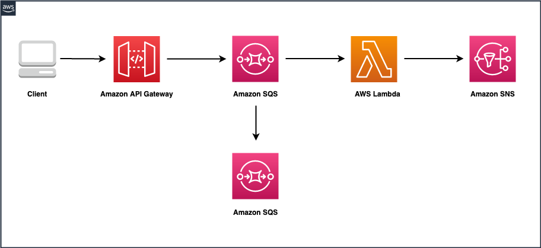

# Amazon API Gateway to Amazon Fifo SQS Queue to AWS Lambda to Amazon SNS

This pattern explains how to deploy SAM application with Amazon API Gateway HTTP API, Amazon SQS Fifo Queue, AWS Lambda function and Amazon SNS topic. When a request is sent to API Gateway, the request will be forwarded to a FIFO SQS Queue, which is a backend to the API. A Lambda function is configured to poll messages from the queue. If messages fail to be proessed, they will be sent to a Dead-Letter queue. Upon successful processing by Lambda, a notification is sent to an SNS topipic, which will have an email subscription.

Important: this application uses various AWS services and there are costs associated with these services after the Free Tier usage - please see the [AWS Pricing page](https://aws.amazon.com/pricing/) for details. You are responsible for any AWS costs incurred. No warranty is implied in this example.

## Requirements

* [Create an AWS account](https://portal.aws.amazon.com/gp/aws/developer/registration/index.html) if you do not already have one and log in. The IAM user that you use must have sufficient permissions to make necessary AWS service calls and manage AWS resources.
* [AWS CLI](https://docs.aws.amazon.com/cli/latest/userguide/install-cliv2.html) installed and configured
* [Git Installed](https://git-scm.com/book/en/v2/Getting-Started-Installing-Git)
* [AWS Serverless Application Model](https://docs.aws.amazon.com/serverless-application-model/latest/developerguide/serverless-sam-cli-install.html) (AWS SAM) installed

## Deployment Instructions

1. Create a new directory, navigate to that directory in a terminal and clone the GitHub repository:
    ``` 
    git clone https://github.com/aws-samples/serverless-patterns
    ```
1. Change directory to the pattern directory:
    ```
    cd apigw-http-api-fifo-sqs-lambda-sns-sam
    ```
1. From the command line, use AWS SAM to deploy the AWS resources for the pattern as specified in the template.yml file:
    ```
    sam deploy --guided
    ```
1. During the prompts:
    * Enter a stack name
    * Enter the desired AWS Region
    * Allow SAM CLI to create IAM roles with the required permissions.

    Once you have run `sam deploy --guided` mode once and saved arguments to a configuration file (samconfig.toml), you can use `sam deploy` in future to use these defaults.

1. Note the outputs from the SAM deployment process. These contain the resource names and/or ARNs which are used for testing.

## How it works



- This pattern is designed to deploy an Amazon API Gateway HTTP API with a single route at /
- When the API Gateway receives a request from a client, it immediately sends the message to a FIFO (First-In-First-Out) queue.
- The FIFO queue ensures that messages are processed in the order they were received, maintaining strict ordering
- As the messages arrive in the FIFO queue, it automatically invokes a Lambda function responsible for message processing
- The Lambda function handles each message one by one in FIFO order.
- Depending on the use case, the Lambda may perform various actions, such as data processing, validation, or invoking other AWS services.
- Once the Lambda function has processed a message, it publishes the relevant information or processed data to an SNS (Simple Notification Service) standard topic.
- You can then Subscribe email addresses to the topic to be notified through the SNS topic, providing users with timely updates or notifications via email.

## Testing

Once the application is deployed:
- Retrieve the HttpApiEndpoint value from CloudFormation Outputs
- Retrieve the SNS Topic ARN and navigate to the topic and add an email subscription. i.e. https://docs.aws.amazon.com/sns/latest/dg/sns-create-subscribe-endpoint-to-topic.html
- Invoke the endpoint from Postman using some json payload and verify that you received the notification on the subscribed email.

Request:
- Request URL: https://{RestApiEndpoint}.execute-api.{Region}.amazonaws.com/{gatewayStage}/
    - Region - Name of AWS Region, Example: us-east-1
    - gatewayStage - Name of the API Gateway Stage. A stage is a named reference to a deployment, which is a snapshot of the API. "prod" is the stage name used in the SAM template.
- Request Method: POST
- Request Header: "Content-Type: application/json"
- Request Body: {"messagegroup":"2", "message":"event message for testing"} (This could be any JSON payload)
- Ensure that the message json payload contains "messagegroup" field, this is required for fifo queues.

Example URL: https://abc1234def.execute-api.us-east-1.amazonaws.com/prod/

Body/Payload:

{
    "message":"event message for testing",
    "messagegroup": "2"
}

## Cleanup
 
1. Delete the stack
    ```bash
    aws cloudformation delete-stack --stack-name STACK_NAME
    ```
1. Confirm the stack has been deleted
    ```bash
    aws cloudformation list-stacks --query "StackSummaries[?contains(StackName,'STACK_NAME')].StackStatus"
    ```
----
Copyright 2023 Amazon.com, Inc. or its affiliates. All Rights Reserved.

SPDX-License-Identifier: MIT-0