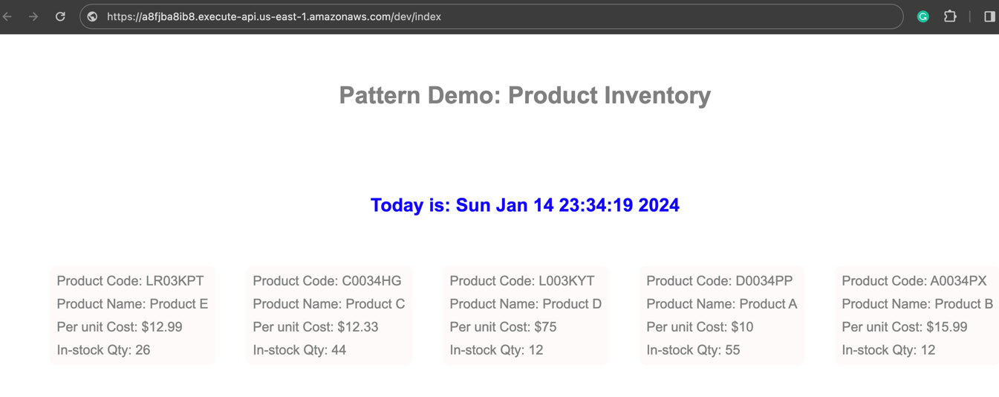
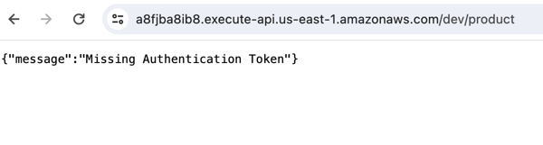

# AWS API Gateway HTTP API, Lambdas, IAM Auth, DynamoDB, Python, and the Serverless Framework

This pattern uses an AWS_IAM authorizer to secure an API endpoint using Python 3 and the Serverless framework. 
It demonstrates how to sign the HTTP request using IAM credentials and follow the
[AWS v4 signing process](https://docs.aws.amazon.com/IAM/latest/UserGuide/reference_aws-signing.html) in order to grant access to the secured endpoint to a public API. 
AWS DynamoDB data is further interacted with by the secured endpoint. AWS ApiGateway facilitates all communication with the APIs.

Learn more about this pattern
at [Serverless Land Patterns](https://serverlessland.com/patterns/apigw-lambdas-ddb-authorizer-sigv4a-sls-py).

**Important**: this application uses various AWS services and there are costs associated with these services after the Free
Tier usage - please see the [AWS Pricing page](https://aws.amazon.com/pricing/) for details. You are responsible for any
AWS costs incurred. No warranty is implied in this example.

## Requirements

* [Create an AWS account](https://portal.aws.amazon.com/gp/aws/developer/registration/index.html) if you do not already
  have one and log in. The IAM user that you use must have sufficient permissions to make necessary AWS service calls
  and manage AWS resources.
* [AWS CLI](https://docs.aws.amazon.com/cli/latest/userguide/install-cliv2.html) installed and configured
* [Git Installed](https://git-scm.com/book/en/v2/Getting-Started-Installing-Git)
* [Serverless Framework](https://www.serverless.com/framework/docs/getting-started) installed
* [Python 3 installed](https://www.python.org/downloads/)

## Setup and Deployment Instructions

1. Create a new directory, navigate to that directory in a terminal and clone the GitHub repository:
    ```commandline
    git clone https://github.com/aws-samples/serverless-patterns
    ```
2. Change directory to the pattern directory:
    ```commandline
    cd apigw-http-api-iam-authorizer-sigv4a-ddb-sls-py
    ```
3. Install dependencies:
    ```commandline
    pipenv install
    ```
4. From the command line, install following Serverless (sls) Framework plugins:
    ```commandline
    sls plugin install -n serverless-python-requirements
    sls plugin install -n serverless-export-env
    sls plugin install -n serverless-plugin-log-retention
    ```
   - `serverless-python-requirements` plugin will automatically detect `Pipfile` and pipenv installed and generate a `requirements.txt` file
   - `serverless-export-env` plugin will export the environment variables to a `.env` file
   - `serverless-plugin-log-retention` plugin will control the retention of serverless function's cloudwatch logs

5. Deploy the AWS resources specified in [serverless.yml](./serverless.yml) for the pattern using:
   ```commandline
      sls deploy --stage dev --verbose
   ```
6. Note the outputs from the Serverless deployment process. These contain the resource names and/or ARNs which are used for
   testing.The output would look something like below:
   
```text
✔ Service deployed to stack serverless-land-bb245-dev (41s)

endpoints:
  GET - https://a8fjba8ib8.execute-api.us-east-1.amazonaws.com/dev/index
  GET - https://a8fjba8ib8.execute-api.us-east-1.amazonaws.com/dev/products
functions:
  get-index: serverless-land-bb245-dev-get-index (1.3 MB)
  get-products: serverless-land-bb245-dev-get-products (1.3 MB)

Stack Outputs:
  ProductsTableNameArn: arn:aws:dynamodb:us-east-1:812440860992:table/serverless-land-bb245-dev-ProductsTable-4Z98SPMNAV2X
  ProductsTableName: serverless-land-bb245-dev-ProductsTable-4Z98SPMNAV2X
  ServiceEndpoint: https://a8fjba8ib8.execute-api.us-east-1.amazonaws.com/dev
  ServerlessDeploymentBucketName: serverless-land-bb245-dev-serverlessdeploymentbuck-n2n4sp4tzz7v
  GetDashindexLambdaFunctionQualifiedArn: arn:aws:lambda:us-east-1:812440860992:function:serverless-land-bb245-dev-get-index:3
  GetDashproductsLambdaFunctionQualifiedArn: arn:aws:lambda:us-east-1:812440860992:function:serverless-land-bb245-dev-get-products:3

   ```
7. From the project root folder run:
    ```commandline
      sls export-env --all
    ```
    This command generates a `.env` file in the project root, and the file content would look something like this:
    ```
   products_api=https://a8fjba8ib8.execute-api.us-east-1.amazonaws.com/dev/products
   default_results=10
   products_table=serverless-land-bb245-dev-ProductsTable-4Z98SPMNAV2X
    ```
8. Run the seed-products.py script to populate some dummy data to DynamoDB:
   ```commandline
      python3 seed-products.py
   ```

## How it works

The high-level diagram below serves to visually represent this pattern.


In this setup, the `get-products` endpoint is secured with AWS_IAM. 
Requests to the `GET /products` endpoint require signing the HTTP request using IAM credentials, following the [AWS v4 signing process](https://docs.aws.amazon.com/IAM/latest/UserGuide/reference_aws-signing.html). 
The requester must also have the required IAM permission to execute this endpoint, granted to the `GET /index` function. Notably, the `get_products` function has been modified to use the [aws-requests-auth package](https://github.com/davidmuller/aws-requests-auth) for signing HTTP requests.

## Testing

This example can be tested using the [curl command](https://github.com/curl/curl/blob/master/docs/MANUAL.md), [xh utility](https://github.com/ducaale/xh), or directly in the browser by accessing the `GET /index` endpoint.

```commandline
xh https://${ApiGatewayRestApi}.execute-api.${AWS::Region}.amazonaws.com/${sls:stage}/index

curl --request GET --url https://${ApiGatewayRestApi}.execute-api.${AWS::Region}.amazonaws.com/${sls:stage}/index
```
`curl` or `xh` would yield the same response, as below:

```html
HTTP/2.0 200 OK
content-length: 4302
content-type: text/html; charset=UTF-8
date: Sat, 13 Jan 2024 21:25:34 GMT
via: 1.1 e7803a00a023f1e04faef1ed4f572ace.cloudfront.net (CloudFront)
x-amz-apigw-id: RfzoIF00IAMESUg=
x-amz-cf-id: WebgnpebYYlLm82UtHMKtva-KcWeZxsZn1MgxYbjVXFnrgs_hdWLVg==
x-amz-cf-pop: IAD55-P4
x-amzn-requestid: 34e658ea-9aa3-4677-8a37-73c4765dc504
x-amzn-trace-id: Root=1-65a2ffcd-06b2fb6a607fe88c0cf61158;Sampled=0;lineage=9671dea5:0
x-cache: Miss from cloudfront

<!DOCTYPE html>
<html>
 <head>
    <title>Pattern Demo: Dummy Product Inventory</title>
    <style>

...
```
#### Browser testing:



When `GET /products` is directly called as:

```commandline
xh https://${ApiGatewayRestApi}.execute-api.${AWS::Region}.amazonaws.com/${sls:stage}/products

curl --request GET --url https://${ApiGatewayRestApi}.execute-api.${AWS::Region}.amazonaws.com/${sls:stage}/products

```
`curl` , `xh` or via a browser all would yield the same http 403 response, as below:

Response:

```commandline
HTTP/2.0 403 Forbidden
content-length: 42
content-type: application/json
date: Sat, 13 Jan 2024 22:09:26 GMT
via: 1.1 2b7c8ceb84f453714fcea5cf4f7202c8.cloudfront.net (CloudFront)
x-amz-apigw-id: Rf6DhHa2IAMEU1w=
x-amz-cf-id: l-oT0qWu6dBIjzlHjoW4L06Q_REKrvJXvwzE_agxLYDOPeuBP6Yzsg==
x-amz-cf-pop: IAD55-P4
x-amzn-errortype: MissingAuthenticationTokenException
x-amzn-requestid: e8b00a71-8a11-4906-b5e7-4eac83040b61
x-cache: Error from cloudfront

{
    "message": "Missing Authentication Token"
}
```


## Cleanup

1. Delete the stack
    ```commandline
    sls remove --verbose
    ```
2. Confirmation line on successful delete
   ```text
   ✔ Service serverless-land-bb245 has been successfully removed
   ```
----
Copyright 2024 Amazon.com, Inc. or its affiliates. All Rights Reserved.

SPDX-License-Identifier: MIT-0
