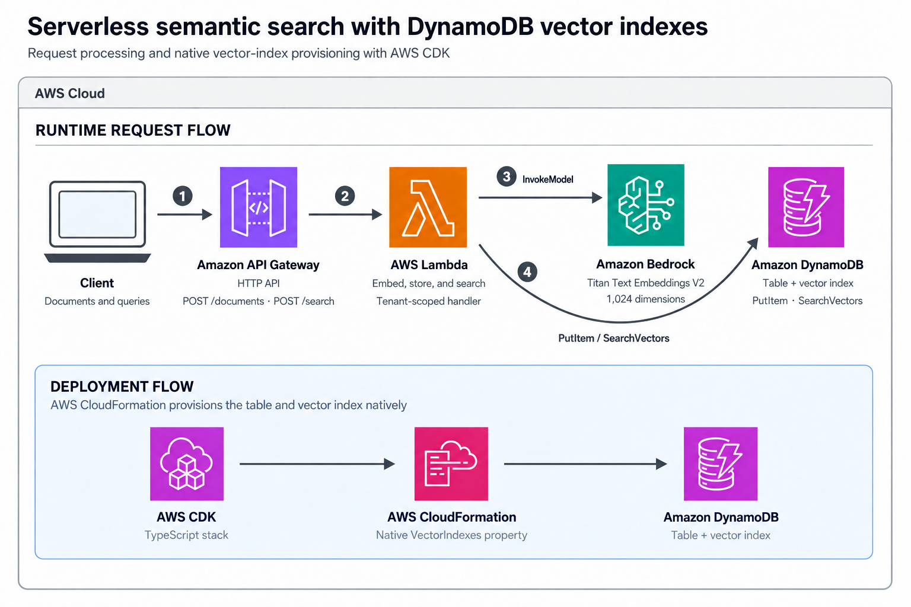

# API Gateway HTTP API to Lambda, Bedrock, and DynamoDB vector search

This pattern deploys a serverless semantic-search API. Clients ingest text documents and run natural-language searches through Amazon API Gateway. AWS Lambda generates embeddings with Amazon Bedrock and stores or searches those embeddings in a native Amazon DynamoDB vector index. The source content, metadata, and embedding remain together in one DynamoDB item.

Learn more about this pattern at Serverless Land Patterns: https://serverlessland.com/patterns/apigw-http-api-lambda-bedrock-dynamodb-vector-search-cdk

Important: this application uses various AWS services and there are costs associated with these services after the Free Tier usage. See the [AWS Pricing page](https://aws.amazon.com/pricing/) for details. You are responsible for any AWS costs incurred. No warranty is implied in this example.

## Requirements

* [Create an AWS account](https://portal.aws.amazon.com/gp/aws/developer/registration/index.html) if you do not already have one and log in. The identity used to deploy must be able to create the resources in this pattern.
* [AWS CLI](https://docs.aws.amazon.com/cli/latest/userguide/getting-started-install.html) installed and configured.
* [Git](https://git-scm.com/book/en/v2/Getting-Started-Installing-Git) installed.
* [Node.js 22 or later](https://nodejs.org/en/download) installed.
* [AWS CDK v2 prerequisites](https://docs.aws.amazon.com/cdk/v2/guide/prerequisites.html) completed, including a bootstrapped environment.
* Access to invoke the Amazon Titan Text Embeddings V2 model (`amazon.titan-embed-text-v2:0`) in the deployment Region.

## Architecture



The diagram uses the official [AWS Architecture Icons](https://aws.amazon.com/architecture/icons/).

### Flow

1. A client sends a document to `POST /documents` or a natural-language query to `POST /search` through the API Gateway HTTP API.
2. API Gateway passes the request to the vector-search Lambda function.
3. Lambda invokes Amazon Titan Text Embeddings V2 to generate a normalized 1,024-dimensional vector.
4. For document ingestion, Lambda stores the source content, metadata, and embedding together in DynamoDB with `PutItem`.
5. For search, Lambda calls `SearchVectors` using the query embedding, required `tenantId` partition, optional `category` filter, and requested `topK`.
6. DynamoDB returns projected document attributes ordered by cosine distance, where lower scores indicate closer semantic matches.
7. During deployment, AWS CDK synthesizes the table and its native `VectorIndexes` property; CloudFormation provisions the table and index together.

### Resources

- An Amazon API Gateway HTTP API with `POST /documents` and `POST /search` routes.
- An AWS Lambda function that validates requests, invokes Bedrock, stores documents, and performs vector searches.
- Amazon Bedrock with Amazon Titan Text Embeddings V2 for document and query embeddings.
- An on-demand Amazon DynamoDB table with AWS-managed KMS encryption, a native vector index, tenant partitioning, inline category filtering, and projected content attributes.

The vector index is declared directly on `AWS::DynamoDB::Table` using its native [VectorIndexes property](https://docs.aws.amazon.com/AWSCloudFormation/latest/TemplateReference/aws-resource-dynamodb-table.html#cfn-dynamodb-table-vectorindexes). The pinned CDK version does not expose this property, so the stack uses `CfnTable.addPropertyOverride` with CloudFormation property names. Search-schema attributes are declared in the table’s `AttributeDefinitions`. CloudFormation manages the index lifecycle without a custom-resource provider or polling Lambda functions.

## How it works

The table uses on-demand capacity, which is required for DynamoDB vector indexes. Its composite primary key uses `tenantId` as the partition key and `documentId` as the sort key, so different tenants can safely reuse document identifiers. The vector index projects only `title` and `content`; the table key and inline filter attributes are available automatically. The Lambda execution role can put items in this table, search only this vector index, and invoke only the selected Bedrock embedding model.

The handler validates required fields, DynamoDB key byte limits, the `topK` range, and the Titan Text Embeddings V2 maximum input length before calling AWS services. Requests that fail validation return HTTP 400 without invoking Bedrock or DynamoDB.

The HTTP API is intentionally unauthenticated to keep the integration focused. Add an authorizer and stricter CORS configuration before adapting this sample for production.

## Deployment Instructions

1. Clone the repository and change to the pattern directory:

    ```bash
    git clone https://github.com/aws-samples/serverless-patterns.git
    cd serverless-patterns/apigw-http-api-lambda-bedrock-dynamodb-vector-search-cdk
    ```

2. Install dependencies:

    ```bash
    npm install
    ```

3. Bootstrap the account and Region if necessary:

    ```bash
    npx cdk bootstrap
    ```

4. Deploy the stack:

    ```bash
    npx cdk deploy
    ```

5. Note the `ApiEndpoint`, `TableName`, `VectorIndexName`, and `VectorSearchFunctionName` stack outputs.

The stack creates one vector index on a new, empty on-demand table through CloudFormation. The table explicitly uses `TableEncryption.AWS_MANAGED` for encryption with the AWS-managed DynamoDB KMS key.

### Optional CI/CD deployment pipeline

For automated deployments, use short-lived credentials from your CI/CD provider's OpenID Connect integration instead of storing AWS access keys. Configure the deployment role and Region outside the repository, then run these stages:

1. Check out the repository and configure Node.js 22.
2. Install dependencies with `npm install`.
3. Run `npm run build`, `npm test`, and `npm run synth` as validation gates.
4. Assume the deployment role through OpenID Connect.
5. Run `npx cdk deploy --require-approval never` only after the validation stages pass.

Scope the deployment role to the CDK bootstrap resources and permissions required by this stack. Protect the deployment environment with branch rules and approvals appropriate to your organization. Do not commit account IDs, role ARNs, profiles, access keys, CDK output files, or API endpoints.

## Testing

Set the API endpoint from the deployment output:

```bash
export API_ENDPOINT="https://example.execute-api.us-east-1.amazonaws.com"
```

Ingest two sample documents:

```bash
curl -X POST "${API_ENDPOINT}/documents" \
  -H 'content-type: application/json' \
  -d '{
    "documentId": "doc-1",
    "title": "DynamoDB vector search",
    "content": "Amazon DynamoDB stores vector embeddings alongside operational data and supports similarity search with the SearchVectors API.",
    "tenantId": "tenant-1",
    "category": "aws"
  }'

curl -X POST "${API_ENDPOINT}/documents" \
  -H 'content-type: application/json' \
  -d '{
    "documentId": "doc-2",
    "title": "AWS Lambda",
    "content": "AWS Lambda runs event-driven code without provisioning or managing servers.",
    "tenantId": "tenant-1",
    "category": "aws"
  }'
```

After a short delay for asynchronous table-to-index synchronization, run a semantic search:

```bash
curl -X POST "${API_ENDPOINT}/search" \
  -H 'content-type: application/json' \
  -d '{
    "query": "How can I search embeddings without a separate vector database?",
    "tenantId": "tenant-1",
    "category": "aws",
    "topK": 5
  }'
```

The response contains the most similar projected documents and their cosine-distance scores:

```json
{
  "query": "How can I search embeddings without a separate vector database?",
  "results": [
    {
      "score": 0.12,
      "documentId": "doc-1",
      "title": "DynamoDB vector search",
      "content": "Amazon DynamoDB stores vector embeddings alongside operational data and supports similarity search with the SearchVectors API.",
      "category": "aws"
    }
  ]
}
```

The `events` directory also contains complete Lambda test events. Invoke the function directly with the ingest event:

```bash
aws lambda invoke \
  --function-name YOUR_VECTOR_SEARCH_FUNCTION_NAME \
  --cli-binary-format raw-in-base64-out \
  --payload fileb://events/ingest-event.json \
  /tmp/ingest-output.json

cat /tmp/ingest-output.json
```

Then invoke the search event after the item has propagated to the vector index:

```bash
aws lambda invoke \
  --function-name YOUR_VECTOR_SEARCH_FUNCTION_NAME \
  --cli-binary-format raw-in-base64-out \
  --payload fileb://events/search-event.json \
  /tmp/search-output.json

cat /tmp/search-output.json
```

## Local validation

```bash
npm run build
npm test
npm run synth
```

The pinned CDK release may warn that `VectorIndexes` is an unexpected property during synthesis because its bundled validation schema predates CloudFormation support. The property override follows the current CloudFormation specification; this warning does not prevent synthesis.

## Updating the vector index

Vector index properties do not support in-place updates. CloudFormation supports creating or deleting only one vector index per stack operation. To replace an index, first add a differently named index while retaining the existing one and deploy; after the new index is ready, switch the application to it, then remove the old index in a separate deployment. Keep the application’s `VECTOR_INDEX_NAME`, the `SearchVectors` IAM resource, and the stack output aligned with the active index. See the [CloudFormation vector index reference](https://docs.aws.amazon.com/AWSCloudFormation/latest/TemplateReference/aws-properties-dynamodb-table-vectorindex.html) before changing the schema.

## Cleanup

Delete the deployed resources:

```bash
npx cdk destroy
```

CloudFormation deletes the DynamoDB table and its vector index. The application Lambda log group is also removed by the stack’s `DESTROY` removal policy.

Confirm that no active stack with this name remains; the expected result is an empty array:

```bash
aws cloudformation list-stacks \
  --query "StackSummaries[?StackName=='DynamoDbVectorSearchPatternStack' && StackStatus!='DELETE_COMPLETE']"
```

----

Copyright 2026 Amazon.com, Inc. or its affiliates. All Rights Reserved.

SPDX-License-Identifier: MIT-0
