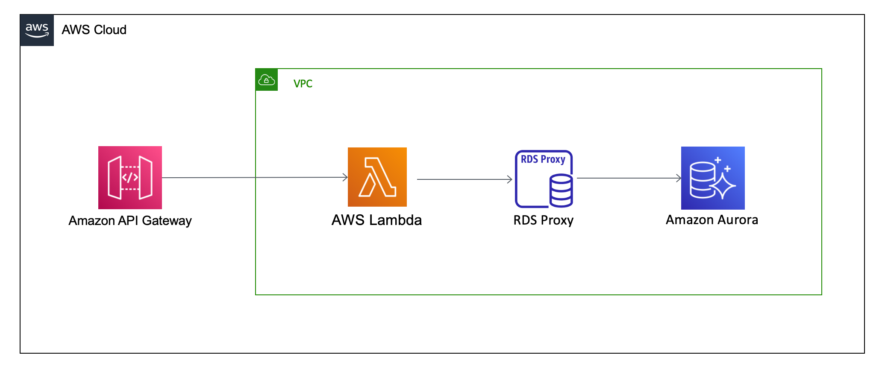

# AWS API Gateway HTTP API to AWS Lambda to RDS Proxy

This pattern sets up API Gateway HTTP API using AWS Lambda function as an integration which talks to RDS Aurora(Postgres) via RDS Proxy
with IAM Authentication enabled. The Lambda function will only be using short-lived credentials to authenticate through RDS proxy via IAM authentication using the popular JavaScript ORM [sequelize](https://sequelize.org).

Learn more about this pattern at Serverless Land Patterns: [https://serverlessland.com/patterns/apigw-http-api-lambda-rds-proxy-cdk](https://serverlessland.com/patterns/apigw-http-api-lambda-rds-proxy-cdk)

Important: this application uses various AWS services and there are costs associated with these services after the Free Tier usage - please see the [AWS Pricing page](https://aws.amazon.com/pricing/) for details. You are responsible for any AWS costs incurred. No warranty is implied in this example.

## Requirements

* [Create an AWS account](https://portal.aws.amazon.com/gp/aws/developer/registration/index.html) if you do not already have one and log in. The IAM user that you use must have sufficient permissions to make necessary AWS service calls and manage AWS resources.
* [AWS CLI](https://docs.aws.amazon.com/cli/latest/userguide/install-cliv2.html) installed and configured
* [Git Installed](https://git-scm.com/book/en/v2/Getting-Started-Installing-Git)
* [AWS CDK Installed](https://docs.aws.amazon.com/cdk/latest/guide/getting_started.html#getting_started_install)

## Deployment Instructions

1. Create a new directory, navigate to that directory in a terminal and clone the GitHub repository:
    ``` bash
    git clone https://github.com/aws-samples/serverless-patterns
    ```
2. Change directory to the pattern directory:
    ```bash
    cd apigw-http-api-lambda-rds-proxy-cdk/src
    ```
3. Install dependencies:
    ```bash
    npm install
    ```
4. Deploy the application. This will take some time to provision the database.
    ```bash
    cdk deploy
    ```

## How it works

This pattern sets up API Gateway HTTP API using AWS Lambda function as an integration which talks to RDS Aurora(Postgres) via RDS Proxy with IAM Authentication enabled. The Lambda function will only be using short-lived credentials to authenticate through RDS proxy via IAM authentication using the popular JavaScript ORM [sequelize](https://sequelize.org).

RDS Proxy has to exist in the same VPC as your database and it cannot be public. Security groups are configured to [only allow communication from the lambda functions to RDS proxy](./src/lib/rds-proxy-sequelize-stack.ts#L55), and [from the RDS proxy to the Aurora database](./src/lib/rds-proxy-sequelize-stack.ts#L61).

[The lambda functions are granted the ability to connect to the RDS proxy using the provided username](./src/lib/rds-proxy-sequelize-stack.ts#L137). 

While the lambda authenticates to your proxy using IAM authentication, RDS proxy still connects to your database using native database authentication. Therefore, a new set of RDS credentials are created in secrets manager which allow RDS proxy to connect to the database. See [the connecting to a database through RDS Proxy documentation](https://docs.aws.amazon.com/AmazonRDS/latest/AuroraUserGuide/rds-proxy-setup.html#rds-proxy-iam-setup) for more information.

RDS proxy supports connecting to your database with multiple database users. This means that different usernames with limited privileges *inside your database* could be configured for different lambda functions if necessary.

The [`beforeConnect` lifecycle hook](./src/lambda/sequelize.ts#L26) provided by sequelize is used to generate a current, short-lived access token.



## Testing

Once `cdk deploy` has completed, you will receive 2 URL outputs similar to:

```bash
Outputs:
RdsProxySequelizeStack.populateEndpointUrl = https://aabbccddee.execute-api.us-west-2.amazonaws.com/populate
RdsProxySequelizeStack.stadiumsEndpointUrl = https://aabbccddee.execute-api.us-west-2.amazonaws.com/

Stack ARN:
arn:aws:cloudformation:us-west-2:001122334455:stack/RdsProxySequelizeStack/11111111-1111-1111-1111-111111111111
```

If you did not retain these URLs, they are also available in the Outputs tab of the CloudFormation stack inside the AWS console.

First, we will create and populate a simple `Stadium` table in our new database by sending a `POST` request to the `/populate` endpoint URL:

```bash
curl -request POST https://aabbccddee.execute-api.us-west-2.amazonaws.com/populate
{"message":"Stadium table and data successfully created."}
```

Now that we have data stored inside of our database, we can retrieve it to verify that it has been persisted using the stadiums endpoint URL:

```bash
curl -request GET https://aabbccddee.execute-api.us-west-2.amazonaws.com/
[{"id":1,"name":"Los Angeles Memorial Coliseum","capacity":93607,"location":"Los Angeles, California","surface":"Natural grass","roof":"Open","team":"Los Angeles Rams","yearOpened":"1923","createdAt":"2021-12-01T20:58:08.906Z","updatedAt":"2021-12-01T20:58:08.906Z"},{"id":2,"name":"MetLife Stadium","capacity":82500,"location":"East Rutherford, New Jersey","surface":"UBU Speed Ser...
...
...
}]
```

## Cleanup
 
1. Delete the stack
    ```bash
    cdk destroy
    ```
----
Copyright 2021 Amazon.com, Inc. or its affiliates. All Rights Reserved.

SPDX-License-Identifier: MIT-0
