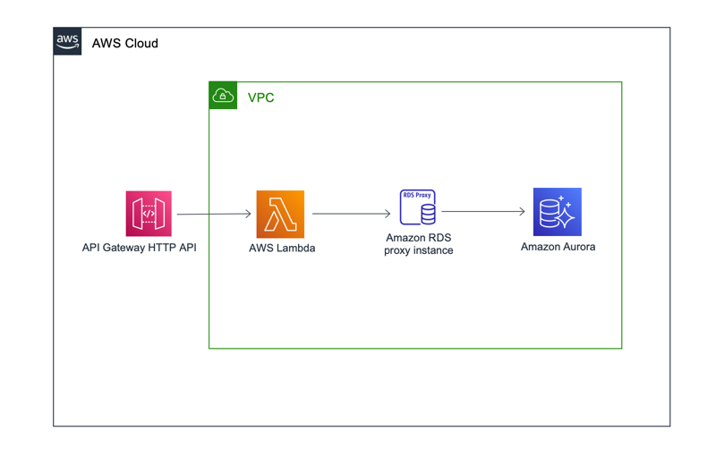

# AWS API Gateway HTTP API to AWS Lambda to RDS Proxy

This pattern sets up API Gateway HTTP API using AWS Lambda function as an integration which talks to RDS Aurora(MySql) via RDS Proxy
with force IAM Authentication enabled. Lambda function does not have access to database secrets directly and connect to database via IAM authentication.

The setup assumes you already have RDS Aurora Mysql cluster up and running together with the RDS proxy instance using 
force IAM authentication enabled. If you do not have the set-up for database and proxy you can optionally follow [these steps](#deploy-rds-aurora-clustermysql-with-rds-proxy)
to have RDS Aurora cluster and RDS proxy setup.

Learn more about this pattern at Serverless Land Patterns: https://serverlessland.com/patterns/apigw-http-api-lambda-rds-proxy

Important: this application uses various AWS services and there are costs associated with these services after the Free Tier usage - please see the [AWS Pricing page](https://aws.amazon.com/pricing/) for details. You are responsible for any AWS costs incurred. No warranty is implied in this example.

## Requirements

* [Create an AWS account](https://portal.aws.amazon.com/gp/aws/developer/registration/index.html) if you do not already have one and log in. The IAM user that you use must have sufficient permissions to make necessary AWS service calls and manage AWS resources.
* [AWS CLI](https://docs.aws.amazon.com/cli/latest/userguide/install-cliv2.html) installed and configured
* [Git Installed](https://git-scm.com/book/en/v2/Getting-Started-Installing-Git)
* [AWS Serverless Application Model](https://docs.aws.amazon.com/serverless-application-model/latest/developerguide/serverless-sam-cli-install.html) (AWS SAM) installed

## Deployment Instructions

1. Create a new directory, navigate to that directory in a terminal and clone the GitHub repository:
    ``` 
    git clone https://github.com/aws-samples/serverless-patterns
    ```
2. Change directory to the pattern directory:
    ```bash
    cd apigw-http-api-lambda-rds-proxy
    ```
3. From the command line, use AWS SAM to deploy the AWS resources for the pattern as specified in the template.yml file:
    ```bash
    sam build
    sam deploy --guided
    ```
4. During the prompts:
    * Enter a stack name
    * Enter the desired AWS Region
    * Pass in required parameters, refer parameter description if needed.
    * Allow SAM CLI to create IAM roles with the required permissions.

    Once you have run `sam deploy --guided` mode once and saved arguments to a configuration file (samconfig.toml), you can use `sam deploy` in future to use these defaults.

5. Note the outputs from the SAM deployment process. These contain the resource names and/or ARNs which are used for testing.

## Deploy RDS Aurora Cluster(Mysql) with RDS Proxy

**Note:** If you have already provisioned RDS Aurora cluster with RDS Proxy, you can skip 
this step and follow [these steps](#deployment-instructions) instead.

This stack will provision RDS Aurora(Mysql) cluster together with RDS proxy using force IAM authentication fronting it
inside a VPC with 3 private subnets. Required parameters needed by [deployment step](#deployment-instructions) is also 
provided as stack output.

   ```bash
    sam build -t template-rds-proxy.yaml
    sam deploy -t template-rds-proxy.yaml --guided
   ```

## How it works

This pattern sets up API Gateway HTTP API using AWS Lambda function as an integration which talks to RDS Aurora(MySql) via RDS Proxy
with force IAM Authentication enabled. Lambda function does not have access to database secrets directly and connect to database via IAM authentication.

The setup assumes you already have RDS Aurora Mysql cluster up and running. An RDS proxy instance is also setup with 
force IAM authentication enabled. If you do not have set up for database and proxy you can optionally follow [these steps](#deploy-rds-aurora-cluster-with-rds-proxy)
to have RDS Aurora cluster and RDS proxy setup.



## Testing

Use the Stack output `RdsProxyApiPath` after [above step](#deployment-instructions) completes and access using curl.
   
   ```bash
    curl "ENDPOINT_URL"
   ```

This should result in a json payload which returns current date. Current date is returned by [querying](src/app.py#L55) RDS Aurora(MySql) database 
for current date.

   ```
      [{"curdate()": "YYYY-MM-DD"}]
   ```

## Cleanup
 
1. Delete the stack
    ```bash
    aws cloudformation delete-stack --stack-name STACK_NAME
    ```
1. Confirm the stack has been deleted
    ```bash
    aws cloudformation list-stacks --query "StackSummaries[?contains(StackName,'STACK_NAME')].StackStatus"
    ```
----
Copyright 2021 Amazon.com, Inc. or its affiliates. All Rights Reserved.

SPDX-License-Identifier: MIT-0
