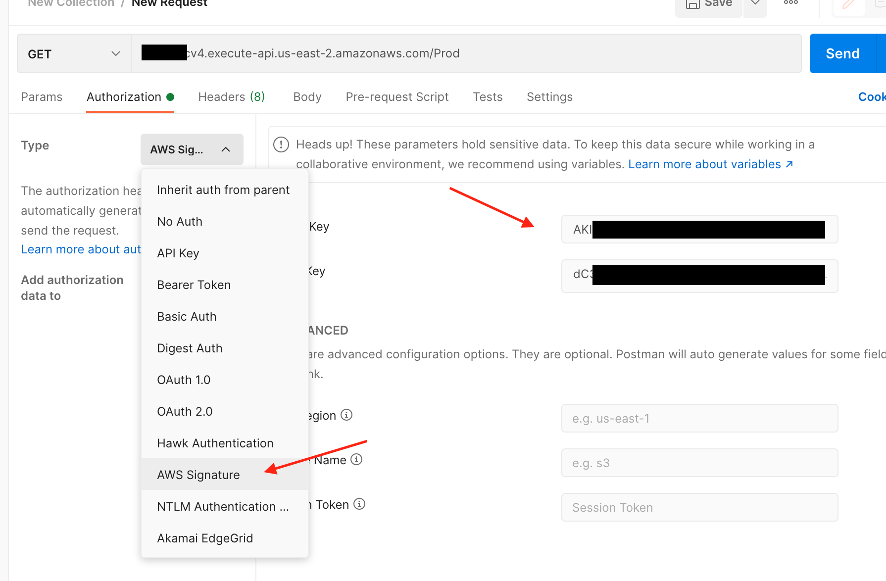

# Amazon API Gateway REST API with IAM authorizer

The SAM template deploys a Amazon API Gateway REST API endpoint that uses IAM credentials for access control. It is also configured use the IAM credentials passed to invoke a dummy Lambda function. IAM users and associated policies are created for testing purposes.

Note: when deploying this pattern, both *CAPABILITY_AUTO_EXPAND* and *CAPABILITY_IAM* are required.

Learn more about this pattern at Serverless Land Patterns: [https://serverlessland.com/patterns/apigw-iam](https://serverlessland.com/patterns/apigw-iam)

Important: this application uses various AWS services and there are costs associated with these services after the Free Tier usage - please see the [AWS Pricing page](https://aws.amazon.com/pricing/) for details. You are responsible for any AWS costs incurred. No warranty is implied in this example.

## Requirements

* [Create an AWS account](https://portal.aws.amazon.com/gp/aws/developer/registration/index.html) if you do not already have one and log in. The IAM user that you use must have sufficient permissions to make necessary AWS service calls and manage AWS resources.
* [AWS CLI](https://docs.aws.amazon.com/cli/latest/userguide/install-cliv2.html) installed and configured
* [Git Installed](https://git-scm.com/book/en/v2/Getting-Started-Installing-Git)
* [AWS Serverless Application Model](https://docs.aws.amazon.com/serverless-application-model/latest/developerguide/serverless-sam-cli-install.html) (AWS SAM) installed

## Deployment Instructions

1. Create a new directory, navigate to that directory in a terminal and clone the GitHub repository:
    ``` 
    git clone https://github.com/aws-samples/serverless-patterns
    ```
2. Change directory to the pattern directory:
    ```
    cd apigw-iam
    ```
3. From the command line, use AWS SAM to deploy the AWS resources for the pattern as specified in the template.yml file:
    ```
    sam deploy -g
    ```
1. During the prompts:
    * Enter a stack name
    * Select the desired AWS Region
    * Allow SAM to create roles with the required permissions if needed.

    Once you have run guided mode once, you can use `sam deploy` in future to use these defaults.

1. Note the outputs from the SAM deployment process. These contain the resource names and/or ARNs which are used for testing.

## Testing

The stack will output the **api endpoint** and **username** for both an authorized user and an unauthorized user. First let's generate access keys for those users.

This can easily be done using the CLI as a priviled users:

```
$ aws iam create-access-key --user-name apigw-iam-AuthorizedUser-xxxxxxxxx
```

Take note of `AccessKeyId` and `SecretAccessKey`. Now configure postman authorization as follows:



Now repeat the same process, now for the unauthorized user

## Cleanup
 
1. Delete the stack
    ```bash
    aws cloudformation delete-stack --stack-name STACK_NAME
    ```
1. Confirm the stack has been deleted
    ```bash
    aws cloudformation list-stacks --query "StackSummaries[?contains(StackName,'STACK_NAME')].StackStatus"
    ```
----
Copyright 2021 Amazon.com, Inc. or its affiliates. All Rights Reserved.

SPDX-License-Identifier: MIT-0