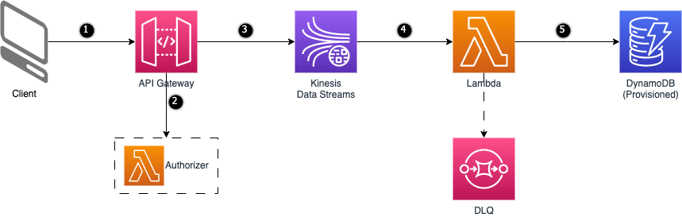

# Amazon API Gateway to Amazon Kinesis Data Stream to AWS Lambda to Amazon DynamoDB

This pattern explains how to deploy a SAM application with Amazon API Gateway, Amazon Kinesis Data Stream, AWS Lambda, and Amazon DynamoDB. When an HTTP POST request is made to the Amazon API Gateway endpoint, Gateway authorizes the request by checking Basic auth credentials and on valid credentials, request payload is sent to Amazon Kinesis Data Stream. This pattern is especially useful in cases of large payloads since Kinesis Data Stream can support upto 1MB paylod size. AWS Lambda function consumes event from the Data Stream and inserts the event/payload into the Amazon DynamoDB table. Amazon Lambda is also configured with a Dead Letter Queue where events are sent when retries to process those messages are repeatedly failed.

Important: this application uses various AWS services and there are costs associated with these services after the Free Tier usage - please see the [AWS Pricing page](https://aws.amazon.com/pricing/) for details. You are responsible for any AWS costs incurred. No warranty is implied in this example.

## Requirements

* [Create an AWS account](https://portal.aws.amazon.com/gp/aws/developer/registration/index.html) if you do not already have one and log in. The IAM user that you use must have sufficient permissions to make necessary AWS service calls and manage AWS resources.
* [AWS CLI](https://docs.aws.amazon.com/cli/latest/userguide/install-cliv2.html) installed and configured
* [Git Installed](https://git-scm.com/book/en/v2/Getting-Started-Installing-Git)
* [AWS Serverless Application Model](https://docs.aws.amazon.com/serverless-application-model/latest/developerguide/serverless-sam-cli-install.html) (AWS SAM) installed

## Deployment Instructions

1. Create a new directory, navigate to that directory in a terminal and clone the GitHub repository:
    ```
    git clone https://github.com/aws-samples/serverless-patterns
    ```
1. Change directory to the pattern directory:
    ```
    cd apigw-kinesis-lambda-ddb
    ```
1. From the command line, use AWS SAM to deploy the AWS resources for the pattern as specified in the template.yml file:
    ```
    sam deploy --guided
    ```
1. During the prompts:
    * Enter a stack name
    * Enter the desired AWS Region
    * Allow SAM CLI to create IAM roles with the required permissions.

    Once you have run `sam deploy -guided` mode once and saved arguments to a configuration file (samconfig.toml), you can use `sam deploy` in future to use these defaults.

1. Note the outputs from the SAM deployment process. These contain the resource names and/or ARNs which are used for testing.

## How it works



- This pattern deploys an Amazon API Gateway HTTP API with route /submit/{streamName}/{eventId} configured with basic authentication.
- On receiving a request, API Gateway will invoke a Lambda authorizer which validates the request and returns a policy informing API Gateway to accept or deny the request.
- When request is accepted, API Gateway sends the message payload to Kinesis Data Stream.
- Messages from Kinesis Data Streams is posted to a lambda function to process them. Lambda uses a SQS queue as Dead Letter Queue to send the messages in case of continued failures to process the messages.
- Lambda saves the received messages into a DynamoDB table.

## Testing

Once the application is deployed:
- Retrieve the HttpApiEndpoint value from CloudFormation Outputs
- Retrieve the username and password from Secrets Manager in AWS Console.
- Invoke the endpoint from Postman using some json payload and verify the payload saved in DynamoDB.

Request:
- Request URL: https://{RestApiEndpoint}.execute-api.{Region}.amazonaws.com/{gatewayStage}/submit/{streamName}/{eventId}
    - Region - Name of AWS Resion, Example: us-east-1
    - gatewayStage - Name of the API Gateway Stage. A stage is a named reference to a deployment, which is a snapshot of the API. "prod" is the stage name used in the SAM template.
    - streamName - This is the name of kinesis stream created i.e., GatewayEventsStream
    - eventId - Value in this attribute is used to choose PartitionKey in Kinesis stream. This example uses a single shard but when multiple shards are used, this eventId should be unique to share the load with multiple shards. Example: 55ad376f-86bf-4b06-9d3a-23237464dbd4
- Request Method: POST
- Request Header: "Content-Type: application/json"
- Request Header: "Authorization: Basic <credentials>" (where credentials is the Base64 encoding of ID and password joined by a single colon :)
- Request Body: {"eventId":"value1", "message":"event message for testing"} (This could be any JSON payload)

Example URL: https://abc1234def.execute-api.us-east-1.amazonaws.com/prod/submit/GatewayEventsStream/55ad376f-86bf-4b06-9d3a-23237464dbd4

## Cleanup

1. Delete the stack
    ```bash
    sam delete
    ```
This pattern was contributed by Ravi Kiran Ganji.

----
Copyright 2021 Amazon.com, Inc. or its affiliates. All Rights Reserved.

SPDX-License-Identifier: MIT-0
