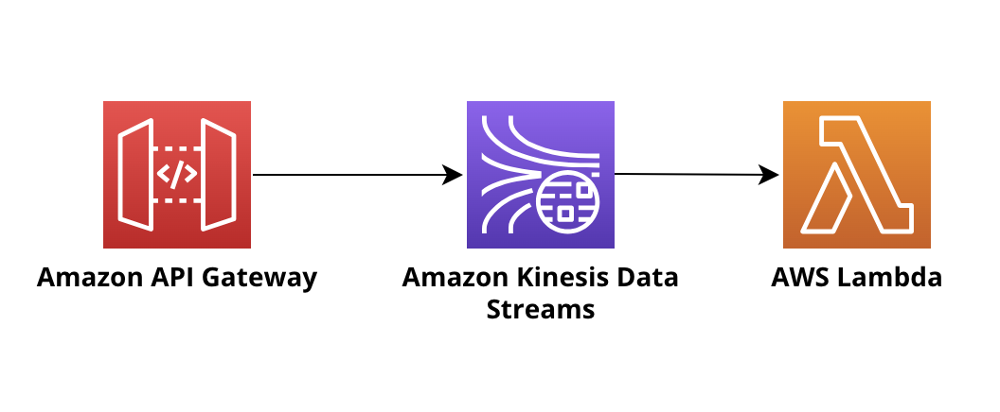

# Amazon API Gateway integration with Amazon Kinesis Stream with AWS Lambda function as consumer 

This pattern will help you to deploy Amazon API Gateway integration with Amazon Kinesis Stream and it will deploy a Lambda function as a consumer for deployed Amazon Kinesis Stream.

Learn more about this pattern at Serverless Land Patterns: https://serverlessland.com/patterns/apigw-kinesis-lambda
Important: this application uses various AWS services and there are costs associated with these services after the Free Tier usage - please see the [AWS Pricing page](https://aws.amazon.com/pricing/) for details.

## Requirements

* [Create an AWS account](https://portal.aws.amazon.com/gp/aws/developer/registration/index.html) if you do not already have one and log in. The IAM user that you use must have sufficient permissions to make necessary AWS service calls and manage AWS resources.
* [AWS CLI](https://docs.aws.amazon.com/cli/latest/userguide/install-cliv2.html) installed and configured
* [Git Installed](https://git-scm.com/book/en/v2/Getting-Started-Installing-Git)
* [AWS Serverless Application Model](https://docs.aws.amazon.com/serverless-application-model/latest/developerguide/serverless-sam-cli-install.html) (AWS SAM) installed

## Architecture 
The following diagram illustrates the solution architecture:



## Deployment Instructions

1. Create a new directory, navigate to that directory in a terminal and clone the GitHub repository:
    ```
    git clone https://github.com/aws-samples/serverless-patterns
    ```
1. Change directory to the pattern directory:
    ```
    cd apigw-kinesis-lambda
    ```
1. From the command line, use AWS SAM to deploy the AWS resources for the pattern as specified in the template.yml file:
    ```
    sam deploy --guided
    ```
1. During the prompts:
    * Enter a stack name
    * Enter the desired AWS Region
    * Allow SAM CLI to create IAM roles with the required permissions.

    Once you have run `sam deploy --guided` mode once and saved arguments to a configuration file (samconfig.toml), you can use `sam deploy` in future to use these defaults.

1. Note the outputs from the SAM deployment process. These contain the resource names and/or ARNs which are used for testing.

## How it works

You can use API Gateway endpoint appeared in Outputs of SAM deployment to make PutRecords action of Kinesis stream.

1. Makes use of PUT method on the API's /streams/{stream-name}/record resource to push single data record to the stream.

2. Makes use of PUT method on the API's /streams/{stream-name}/records resource to push list of data records to the stream.

## Testing

From the SAM deploy output in a previous step, you can get the URL of the API Gateway endpoint, Kinesis Stream name and Lambda ARN. 
 
Use your preferred client to send a HTTP request. Use API Gateway Id and Kinesis Stream name which you received in the Outputs of SAM deploy.

1. Push single record to kinesis stream

```bash
curl --location --request PUT 'https://<api-gateway-id>.execute-api.<region>.amazonaws.com/dev/streams/{KinesisStream-name}/record' \
--header 'Content-Type: application/json' \
--data-raw '{
   "Data": "test data",
   "PartitionKey": "key1"
}'                      '
```

The response would be like:

```bash
{
    "SequenceNumber": "49642636313397988766902760194803326071555094291815596034",
    "ShardId": "shardId-000000000000"
}                        '
```
2. Push multiple records to kinesis stream

```bash
curl --location --request PUT 'https://<api-gateway-id>.execute-api.<region>.amazonaws.com/dev/streams/{Kinesisstream-name}/records' \
--header 'Content-Type: application/json' \
--data-raw '
{
    "records": [
        {
            "data": "test data2",
            "partition-key": "key2"
        },
        {
            "data": "test data2",
            "partition-key": "key3"
        }
    ]
}
                        '
```

The response would be like:

```bash
{
    "FailedRecordCount": 0,
    "Records": [{
        "SequenceNumber": "49642636313397988766902760194800908219915836995919675394",
        "ShardId": "shardId-000000000000"
    }, {
        "SequenceNumber": "49642636313397988766902760194802117145735451625094381570",
        "ShardId": "shardId-000000000000"
    }]
}
```

Lastly, you can review Lambda function's execution logs from the Cloudwatch,

- Navigate to Lambda function from AWS Lambda console.
- Navigate to 'Monitor' tab.
- Click on 'View CloudWatch logs' button.
- Open latest log stream.
- Now, you should be able to see decoded message from the Kinesis Stream.


## Cleanup

1. In your command line, from the sam application project directory, run the following:
    ```bash
    sam delete

    ```
----
