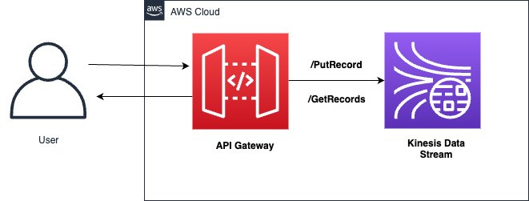

# Amazon API Gateway as an Amazon Kinesis proxy 

This pattern deploys an Amazon API Gateway REST API with a direct integration to Amazon Kinesis Data Streams.

Learn more about this pattern at Serverless Land Patterns: https://serverlessland.com/patterns/apigw-kinesis
Important: this application uses various AWS services and there are costs associated with these services after the Free Tier usage - please see the [AWS Pricing page](https://aws.amazon.com/pricing/) for details.

## Requirements

* [Create an AWS account](https://portal.aws.amazon.com/gp/aws/developer/registration/index.html) if you do not already have one and log in. The IAM user that you use must have sufficient permissions to make necessary AWS service calls and manage AWS resources.
* [AWS CLI](https://docs.aws.amazon.com/cli/latest/userguide/install-cliv2.html) installed and configured
* [Git Installed](https://git-scm.com/book/en/v2/Getting-Started-Installing-Git)
* [AWS Serverless Application Model](https://docs.aws.amazon.com/serverless-application-model/latest/developerguide/serverless-sam-cli-install.html) (AWS SAM) installed

## Architecture 
The following diagram illustrates the solution architecture:



## Deployment Instructions

1. Create a new directory, navigate to that directory in a terminal and clone the GitHub repository:
    ```
    git clone https://github.com/aws-samples/serverless-patterns
    ```
1. Change directory to the pattern directory:
    ```
    cd apigw-kinesis
    ```
1. From the command line, use AWS SAM to deploy the AWS resources for the pattern as specified in the template.yml file:
    ```
    sam deploy --guided
    ```
1. During the prompts:
    * Enter a stack name
    * Enter the desired AWS Region
    * Allow SAM CLI to create IAM roles with the required permissions.

    Once you have run `sam deploy --guided` mode once and saved arguments to a configuration file (samconfig.toml), you can use `sam deploy` in future to use these defaults.

1. Note the outputs from the SAM deployment process. These contain the resource names and/or ARNs which are used for testing.

## How it works

The API Gateway endpoint will expose GetRecords and PutRecords action of Kinesis stream.

1. Expose an HTTP PUT method on the API's /streams/{stream-name}/record resource and integrate the method with the PutRecord action in Kinesis. This enables the client to add a single data record to the named stream.

2. Expose an HTTP PUT method on the API's /streams/{stream-name}/records resource and integrate the method with the PutRecords action in Kinesis. This enables the client to add a list of data records to the named stream.

3. Expose an HTTP GET method on the API's /streams/{stream-name}/records resource and integrate the method with the GetRecords action in Kinesis. This enables the client to list data records in the named stream, with a specified shard iterator. A shard iterator specifies the shard position from which to start reading data records sequentially.

4. Expose an HTTP GET method on the API's /streams/{stream-name}/sharditerator resource and integrate the method with the GetShardIterator action in Kinesis. This helper method must be supplied to the ListStreams action in Kinesis.

## Testing

From the sam deploy output in a previous step, you can get the URL of the API Gateway endpoint and Kinesis Stream name. It should be of the form:

https://<api-gateway-id>.execute-api.<region>.amazonaws.com/<stage>
 
Use your preferred terminal to send a http request. Please make sure to paste your API Gateway Id and Kinesis Stream name while performing below tests.

1. PutRecord action to publish single record to kinesis stream

```bash
curl --location --request PUT 'https://<api-gateway-id>.execute-api.<region>.amazonaws.com/dev/streams/{Kinesisstream-name}/record' \
--header 'Content-Type: application/json' \
--data-raw '{
   "Data": "some data",
   "PartitionKey": "some key"
}'                      '
```

The response would be like:

```bash
{
    "SequenceNumber": "49639130162049733851389740282606464850831763972233887746",
    "ShardId": "shardId-000000000000"
}
                        '
```
2. PutRecords action to publish multiple records to kinesis stream

```bash
curl --location --request PUT 'https://<api-gateway-id>.execute-api.<region>.amazonaws.com/dev/streams/{Kinesisstream-name}/records' \
--header 'Content-Type: application/json' \
--data-raw '
{
    "records": [
        {
            "data": "data2",
            "partition-key": "key3"
        },
        {
            "data": "data3",
            "partition-key": "key4"
        }
    ]
}
                        '
```

The response would be like:

```bash
{
    "FailedRecordCount": 0,
    "Records": [
        {
            "SequenceNumber": "49639130162049733851389740282604046999192533064617033730",
            "ShardId": "shardId-000000000000"
        },
        {
            "SequenceNumber": "49639130162049733851389740282605255925012147693791739906",
            "ShardId": "shardId-000000000000"
        }
    ]
}
```

3. The GetRecords action takes as input a ShardIterator value, which is obtained by calling the GetShardIterator helper action. You need to pass the shard-id query string parameter received from the PutRecord request 

```bash
curl --location --request GET 'https://<api-gateway-id>.execute-api.<region>.amazonaws.com/dev/streams/{Kinesisstream-name}/sharditerator?shard-id=shardId-000000000000'
```

The response would be like:

```bash
{
    "ShardIterator": "AAAAAAAAAAFaNusUwPsYDf6383J/PEA82wHKteuzmfx3vniaKWWn1h+W28dPVY4e4Wpb0vQUXVG6GVzPYel2jXQ8SXpLAhO8rbJMMjFGI6Kc5x0vC5c8JDuWa1LCJvbFKbZQJlma2mrNtl2d2pAs3ySHwYKR/BDKziOrBYT27FzJW1/ZPvyrR/9ZWG3IxGnqJiIC2X8jCnvRgKBVA/tabW9MNjfRB1AASbqQRb8ZZG1PGjNkqupYnS+sJ39h7bhImtrlu1tzYWrSgYXDIUbgCgGoFii1ZioM"
}
```

4. GetRecords action to get all records that available in Kinesis shard. You need to pass the ShardIterator value that was received from the previous request response.

```bash
curl --location --request GET 'https://<api-gateway-id>.execute-api.<region>.amazonaws.com/dev/streams/{Kinesisstream-name}/records' \
--header 'Shard-Iterator: AAAAAAAAAAF5S2+NVrouHMA7i/0/f7ThnJeAtfLn2zqn4yY+Rnjg2aA9mkA9cqrdHeaDhkCpAuAlMbAHjle8/5rZBbqsCwMpVVtFONatqMDWH8CRSBjnOIymovdm6lxKJkLIgZvDTQ/Q4FeC2OUuEbukPKMUk+d1kAmeopkiXZewpNljqE6FGK7taOLQZDN6eZrYP7u6WasRWem64ond+edEMpBraxUUQRvsDHSKeNHATKo9B8Ihz+VjRscraRile8egdO6CZwE='
```

The response would be like:

```bash
{
    "MillisBehindLatest": 0,
    "NextShardIterator": "AAAAAAAAAAHDpzD4egvEMo3CXWNPOY3tjUG7AkaptqYMiGqbk4nM5aL+ZUktCezFEZN2Y4dznfvdTI6Cx1UiDqdlgFMW9WGPy3pYyS3n12oLzl1+k4u0smTjEJONCGjYMzd6vGY29aeIznleyNOJVbwePwuBsvlsSQKpV9uv6f0HBgZ8ZrOfYWZqoTV+4NyL6/KDakFn/C7L6cKIE/fvsCVJVema+uT2Mx8o2jpbzkSUNqGk0khlxEagF58ykPiVjuoDVT/6nNjqnkOVEcg16Wd00jaBIKgZ",
    "Records": [
        {
            "ApproximateArrivalTimestamp": 1.679520584772E9,
            "Data": "InNvbWUgZGF0YSI=",
            "PartitionKey": "some key",
            "SequenceNumber": "49639130162049733851389740247622569482822174383871623170"
        },
        {
            "ApproximateArrivalTimestamp": 1.679541693148E9,
            "Data": "InNvbWUgZGF0YSI=",
            "PartitionKey": "some key",
            "SequenceNumber": "49639130162049733851389740282606464850831763972233887746"
        }
    ]
}

```
## Cleanup

1. In your command line, from the sam application project directory, run the following:
    ```bash
    sam delete

    ```
----

