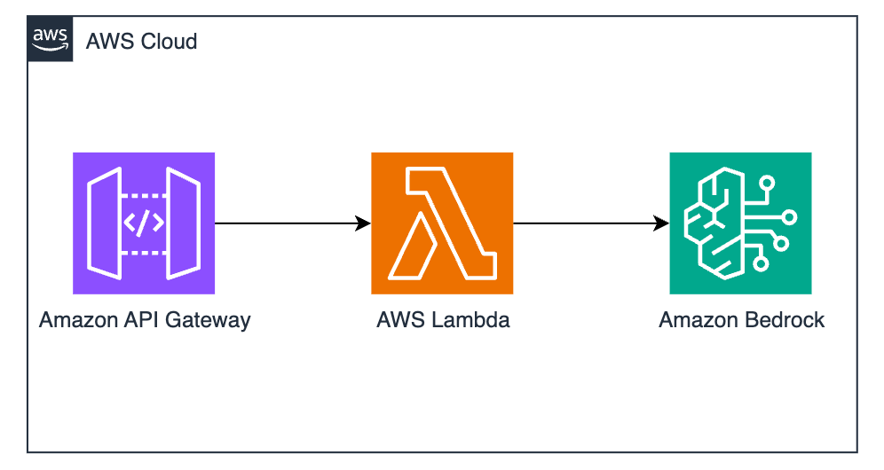

# Text generation via ApiGateway -> Lambda -> Bedrock



This pattern demonstrates how to expose an endpoint to invoke models in Amazon Bedrock.

Learn more about this pattern at Serverless Land Patterns: << Add the live URL here >>

Important: this application uses various AWS services and there are costs associated with these services after the Free Tier usage - please see the [AWS Pricing page](https://aws.amazon.com/pricing/) for details. You are responsible for any AWS costs incurred. No warranty is implied in this example.

## Requirements

* [Create an AWS account](https://portal.aws.amazon.com/gp/aws/developer/registration/index.html) if you do not already have one and log in. The IAM user that you use must have sufficient permissions to make necessary AWS service calls and manage AWS resources.
* [AWS CLI](https://docs.aws.amazon.com/cli/latest/userguide/install-cliv2.html) installed and configured
* [Git Installed](https://git-scm.com/book/en/v2/Getting-Started-Installing-Git)
* [AWS Serverless Application Model](https://docs.aws.amazon.com/serverless-application-model/latest/developerguide/serverless-sam-cli-install.html) (AWS SAM) installed

## Deployment Instructions

1. Create a new directory, navigate to that directory in a terminal and clone the GitHub repository:
    ``` 
    git clone https://github.com/aws-samples/serverless-patterns
    ```
1. Change directory to the pattern directory:
    ```
    cd apigw-lambda-bedrock-cdk-python
    ```
1. From the command line, use AWS CDK to deploy the AWS resources.
    ```
    cdk deploy
    ```

## How it works

CDK will create an Api Gateway, along with a resource and a POST method. There's a AWS Lambda function that will be taking the prompt and invoking an Amazon Bedrock model (anthropic.claude-v2). If you wish to try other models, make sure to modify the policy attached to the Lambda function and invoke the right model.

## Testing

After deployment, take note of the API Gateway URL (Check the Outputs section) and make a POST request to the *text_gen* endpoint with a desired prompt. For example:

    ```
    curl -X POST \
    https://ygah153dth.execute-api.us-east-1.amazonaws.com/prod/text_gen \
    -H "Content-Type: application/json" \
    -d '{"prompt": "Write an email to my department announcing I will lead a gen-ai workshop with Amazon Bedrock"}'
    ```


## Cleanup
 
1. Run below script in the `apigw-lambda-bedrock-cdk-python` directory to delete AWS resources created by this sample stack.
    ```bash
    cdk destroy
    ```

----
Copyright 2023 Amazon.com, Inc. or its affiliates. All Rights Reserved.

SPDX-License-Identifier: MIT-0