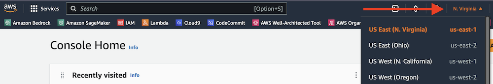

# Reel Generation with Amazon Bedrock Nova, API Gateway, Lambda, DynamoDB, and S3

This pattern demonstrates how to build a serverless reel generation service using Amazon Bedrock's Nova model. The service exposes REST APIs through API Gateway that allow users to submit reel generation requests and check their status. The generated reels are stored in S3.


Important: this application uses various AWS services and there are costs associated with these services after the Free Tier usage - please see the [AWS Pricing page](https://aws.amazon.com/pricing/) for details. You are responsible for any AWS costs incurred. No warranty is implied in this example.

### Requirements

* [Create an AWS account](https://portal.aws.amazon.com/gp/aws/developer/registration/index.html) if you do not already have one and log in. The IAM user that you use must have sufficient permissions to make necessary AWS service calls and manage AWS resources.
* [AWS CLI](https://docs.aws.amazon.com/cli/latest/userguide/install-cliv2.html) installed and configured
* [Git Installed](https://git-scm.com/book/en/v2/Getting-Started-Installing-Git)
* [AWS Cloud Development Kit](https://docs.aws.amazon.com/cdk/v2/guide/getting_started.html) installed
* [Amazon Bedrock Nova model Access](https://docs.aws.amazon.com/bedrock/latest/userguide/model-access.html#add-model-access)

## Amazon Bedrock setup instructions
You must request access to a model before you can use it. If you try to use the model (with the API or console) before you have requested access to it, you receive an error message. For more information, see [Model access](https://docs.aws.amazon.com/bedrock/latest/userguide/model-access.html).

1. In the AWS console, select the region from which you want to access Amazon Bedrock.

    

1. Find **Amazon Bedrock** by searching in the AWS console.

    

1. Expand the side menu.

    

1. From the side menu, select **Model access**.

    

1. Select the **Edit** button.

    

6. Use the checkboxes to select the models you wish to enable. Review the applicable EULAs as needed. Click **Save changes** to activate the models in your account. For this pattern we only need Amazon /  model id: amazon.nova-reel-v1:0.

## Deployment Instructions

1. Create a new directory, navigate to that directory in a terminal and clone the GitHub repository:
    ``` 
    git clone https://github.com/aws-samples/serverless-patterns
    ```
1. Change directory to the pattern directory:
    ```
    cd serverless-patterns/apigw-lambda-bedrock-dynamodb-s3-cdk-python
    ```
1. Create virtual environment for Python
    ```
    python -m venv .venv
    ```
    For a Windows platform, activate the virtualenv like this:
    ```
    .venv\Scripts\activate.bat
    ```
    For a OSX / Linux platform, activate the virtualenv like this:
    ```
    source .venv/bin/activate
    ```
1. Install the Python required dependencies:
    ```
    pip install -r requirements.txt
    ```
1. Run the command below to bootstrap your account. CDK needs it to deploy
    ```
    cdk bootstrap
    ```
1. Review the CloudFormation template CDK generates for you stack using the following AWS CDK CLI command:
    ```
    cdk synth
    ```
1. From the command line, use AWS CDK to deploy the AWS resources.
    ```
    cdk deploy
    ```
1. After deployment completes, take a look at the Outputs section. There will be an entry containing the URL of the API Gateway resource you just created. Copy that URL as you'll need it for your tests.

    The format of the URL will be something like `https://{id}.execute-api.{region}.amazonaws.com/prod`


## How it works

- Users submit video generation requests through an API endpoint

- The request is processed by a Lambda function that creates a job entry in DynamoDB

- A second Lambda function processes the request using Amazon Bedrock's Nova model

- The generated video is stored in S3

- Users can check the job status through another API endpoint


## Testing

We'll be making requests to the *reel_gen* endpoint with a desired prompt.

Follow the example below and replace `{your-api-url}` with your api url from step 8. 

```bash
    curl -X POST \
    {your-api-url}/prod/reel_gen \
    -H "Content-Type: application/json" \
    -d '{"prompt": "Your text description of the video"}'
```
Then you can use JobID from above response in below API to get latest status.

```bash
    curl {your-api-url}/prod/status/{job_id}
```

Example Prompts:
1. Noodles falling into a bowl of soup.
2. The camera pans left across a cozy, well-equipped kitchen, with sunlight streaming through large windows and illuminating the gleaming countertops and appliances. A steam-filled pot bubbles on the stovetop, hinting at the culinary creations to come.
3. A teddy bear in a leather jacket, baseball cap, and sunglasses playing guitar in front of a waterfall.


## Review results

Go to Amazon S3, and navigate to the S3 bucket. It will have a name similar to 'apigwlambdabedrockdynamodb-reelvideobucket...'. In the S3 bucket you should see `output.mp4`. 

Here is an example of generated reel:


## Cleanup
 
1. Run below script in the `apigw-lambda-bedrock-dynamodb-s3-cdk-python` directory to delete AWS resources created by this sample stack.
    ```bash
    cdk destroy
    ```

## Extra Resources
* [Bedrock Api Reference](https://docs.aws.amazon.com/bedrock/latest/APIReference/welcome.html)

----
Copyright 2025 Amazon.com, Inc. or its affiliates. All Rights Reserved.

SPDX-License-Identifier: MIT-0