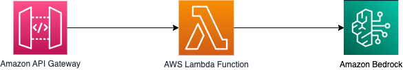

# Invoking Amazon Bedrock Mistral 7B LLM using Java based AWS Lambda

This sample project deploys an Amazon API Gateway REST API with an AWS Lambda integration. The Lambda function, written in Java, calls the Amazon Bedrock API for Mistral 7B Instruct V0.2 and returns a response containing the generated content.

Learn more about this pattern at Serverless Land Patterns: serverlessland.com/patterns/apigw-lambda-bedrock-sam-java

Important: this application uses various AWS services and there are costs associated with these services after the Free Tier usage - please see the [AWS Pricing page](https://aws.amazon.com/pricing/) for details. You are responsible for any AWS costs incurred. No warranty is implied in this example.

## Requirements

- [Create an AWS account](https://portal.aws.amazon.com/gp/aws/developer/registration/index.html) if you do not already have one and log in. The IAM user that you use must have sufficient permissions to make necessary AWS service calls and manage AWS resources.
- [AWS CLI](https://docs.aws.amazon.com/cli/latest/userguide/install-cliv2.html) installed and configured
- [Git Installed](https://git-scm.com/book/en/v2/Getting-Started-Installing-Git)
- [AWS Serverless Application Model](https://docs.aws.amazon.com/serverless-application-model/latest/developerguide/serverless-sam-cli-install.html) (AWS SAM) installed
- [Java 17 or above](https://docs.aws.amazon.com/corretto/latest/corretto-17-ug/downloads-list.html) installed
- [Maven 3.8.6 or above](https://maven.apache.org/download.cgi) installed

## Prerequisite
Amazon Bedrock users need to request access to the Amazon Bedrock model before they are available for use. Please refer to the link below for instruction:
[Model access](https://docs.aws.amazon.com/bedrock/latest/userguide/model-access.html).

## Deployment Instructions

1. Create a new directory, navigate to that directory in a terminal and clone the GitHub repository:
   ```bash
   git clone https://github.com/aws-samples/serverless-patterns
   ```

2. Change directory to the pattern directory:
   ```bash
   cd serverless-patterns/apigw-lambda-bedrock-sam-java
   ```

3. From the command line, execute the below command to build the Java based AWS Lambda funtion using Maven. This will create `MyBedrockInvokerFunction.zip` file under the `target` folder.
   ```bash
   mvn clean package
   ```

4. From the command line, use AWS SAM to deploy the AWS resources for the pattern as specified in the template.yml file:
   ```bash
   sam deploy --guided
   ```
4. During the prompts:

   - Enter a stack name
   - Enter the desired AWS Region. At the time of writing this, Mistral LLM on Amazon Bedrock is available in `us-west-2` region.
   - Allow SAM CLI to create IAM roles with the required permissions.
   - MyBedrockInvokerFunction has no authentication. Is this okay? [y/N]: select `y`
   

   When asked "`MyBedrockInvokerFunction` has no authentication. Is this okay? [y/N]", answer explicitly with y for the purposes of this sample application. As a result, anyone will be able to call this example REST API without any form of authentication.

   For production applications, you should [enable authentication for the API Gateway](https://docs.aws.amazon.com/apigateway/latest/developerguide/apigateway-control-access-to-api.html) using one of several available options and [follow the API Gateway security best practices](https://docs.aws.amazon.com/apigateway/latest/developerguide/security-best-practices.html).
   
   - Keep default values to the rest of the parameters.

   Once you have run `sam deploy --guided` mode once and saved arguments to a configuration file (samconfig.toml), you can use `sam deploy` in future to use these defaults.

5. Note the outputs from the SAM deployment process. These contain the resource names and/or ARNs which are used for next step as well as testing.

## How it works

This SAM project uses Amazon Bedrock API for Mistral 7B Instruct V0.2 model to generate content based on given prompt. This is exposed through a serverless REST API. Please refer to the architecture diagram below:



Here's a breakdown of the steps:

1. **Amazon API Gateway**: Receives the HTTP POST request containing the prompt.

2. **AWS Lambda**: Triggered by the API Gateway, this function forwards the prompt to Amazon Bedrock Java API. It uses Mistral 7B Instruct V0.2 model and sets other required parameters to fixed values for simplicity.

3. **Amazon Bedrock**: Based on the given prompt, using Mistral 7B Instruct V0.2 model generates the content and returns the response to the Lambda function.

4. **Response**: The Lambda function processes the Bedrock API response and sends it back to the user via the API Gateway.

## Testing

Test the deployed content generation API by providing a prompt. You can use [curl](https://curl.se/) to send a HTTP POST request to the API. Make sure to replace `APIGatewayEndpoint` with the one from your `sam deploy --guided` output:

```bash
curl -d '{"prompt": "Please write 5 sentences about Solar System"}' -H 'Content-Type: application/json' <APIGatewayEndpoint>
```

The API returns a response with generated content. Such as (Your out may vary): 

```json
{"outputs":[{"stop_reason":"stop","text":" 1. The Solar System is a celestial body system composed of the Sun, eight planets, their natural satellites, and various other objects, such as asteroids and comets.\n2. The planets in our Solar System are Mercury, Venus, Earth, Mars, Jupiter, Saturn, Uranus, and Neptune, each with unique characteristics and orbits around the Sun.\n3. The Sun, which is the center of the Solar System, is a nearly perfect spherical ball of hot, glowing gases, primarily hydrogen and helium.\n4. The planets in our Solar System orbit the Sun in roughly elliptical orbits, with Earth taking approximately 365.25 days to complete one orbit.\n5. The Solar System is believed to have formed from a giant molecular cloud about 4.6 billion years ago, through a process called gravitational collapse."}]}
```


## Cleanup

1. To delete the resources deployed to your AWS account via AWS SAM, run the following command:

```bash
sam delete
```


---

Copyright 2024 Amazon.com, Inc. or its affiliates. All Rights Reserved.

SPDX-License-Identifier: MIT-0
