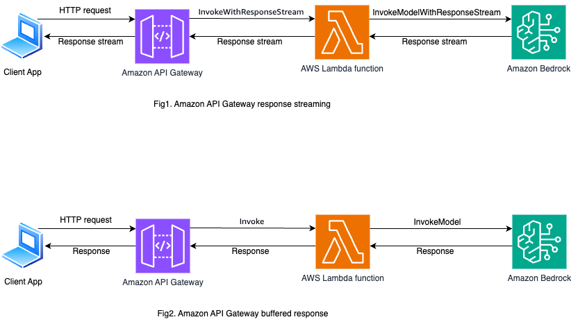

# Amazon API Gateway response streaming with AWS Lambda integration

This sample project demonstrates how to deploy Amazon API Gateway REST API with response streaming for AWS Lambda backend. The Lambda function invokes an Amazon Bedrock model to get response to user queries. The API Gateway streams the response back to the client.


## Requirements

- [Create an AWS account](https://portal.aws.amazon.com/gp/aws/developer/registration/index.html) if you do not already have one and log in. The IAM user that you use must have sufficient permissions to make necessary AWS service calls and manage AWS resources.
- [AWS CLI](https://docs.aws.amazon.com/cli/latest/userguide/install-cliv2.html) installed and configured
- [Git Installed](https://git-scm.com/book/en/v2/Getting-Started-Installing-Git)
- [AWS Serverless Application Model](https://docs.aws.amazon.com/serverless-application-model/latest/developerguide/serverless-sam-cli-install.html) (AWS SAM) installed
- [Node 24 or above](https://nodejs.org/en/download) installed


## Deployment Instructions

1. Create a new directory, navigate to that directory in a terminal and clone the GitHub repository:

   ```bash
   git clone https://github.com/aws-samples/serverless-patterns
   ```

2. Change directory to the pattern directory:

   ```bash
   cd serverless-patterns/apigw-lambda-bedrock-sam-node
   ```

3. From the command line, run the following commands:

   ```bash
   sam build
   sam deploy --guided
   ```

4. During the prompts:

   - Enter a stack name
   - Enter the desired AWS Region e.g. `us-east-1`.
   - Allow SAM CLI to create IAM roles with the required permissions.
   - Keep default values to the rest of the parameters.

   Once you have run `sam deploy --guided` mode once and saved arguments to a configuration file (samconfig.toml), you can use `sam deploy` in future to use these defaults.

5. Note the outputs from the SAM deployment process. These contain the resource names and/or ARNs which are used for next step as well as testing.

## How it works

This SAM project uses Amazon Bedrock API to generate content based on given user prompt. This is exposed through a serverless REST API. Please refer to the architecture diagram below:



Here's a breakdown of the steps:

The SAM template deploys two APIs following the same architecture - one with response streaming and another with buffered response. This is to demonstrate the difference in user experience.

1. **Amazon API Gateway**: Receives the HTTP POST request containing the user prompt.

2. **AWS Lambda**: The API Gateway invokes the Lambda functions which use either `InvokeModelWithResponseStreamCommand` or `InvokeModelCommand` to call Bedrock for streaming and non-streaming use cases.

3. **Amazon Bedrock**: Based on the given prompt, generates the content and streams/ returns the response to the respective Lambda functions.

4. **Response**: The API Gateway either streams the responses back to the client (Fig. 1) or returns the whole response together.

## Testing

Use [curl](https://curl.se/) to send a HTTP POST request to the API. Make sure to replace `api-id` with the one from your `sam deploy --guided` output:

```bash
curl -X POST https://[api-id].execute-api.us-west-1.amazonaws.com/Prod/ask \
  -H "Content-Type: application/json" \
  -d '{"message": "Explain quantum computing in simple terms"}'
```

Test with both `NonStreamingApiUrl` and `StreamingApiUrl` to compare the difference. The `StreamingApiUrl` streams the output to the console as received while `NonStreamingApiUrl` buffers the whole response and renders together.


## Cleanup

1. To delete the resources deployed to your AWS account via AWS SAM, run the following command:

```bash
sam delete
```


---

Copyright 2026 Amazon.com, Inc. or its affiliates. All Rights Reserved.

SPDX-License-Identifier: MIT-0
