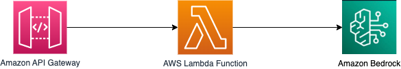

# Amazon API Gateway to AWS Lambda to Amazon Bedrock using SAM

This sample project deploys an Amazon API Gateway REST API with an AWS Lambda integration. The Lambda function is written in Python, calls the Amazon Bedrock API for Anthropic Claude-v2 model and returns a response containing the generated content.

Learn more about this pattern at Serverless Land Patterns: https://serverlessland.com/patterns/apigw-lambda-bedrock-sam

Important: this application uses various AWS services and there are costs associated with these services after the Free Tier usage - please see the [AWS Pricing page](https://aws.amazon.com/pricing/) for details. You are responsible for any AWS costs incurred. No warranty is implied in this example.

## Requirements

- [Create an AWS account](https://portal.aws.amazon.com/gp/aws/developer/registration/index.html) if you do not already have one and log in. The IAM user that you use must have sufficient permissions to make necessary AWS service calls and manage AWS resources.
- [AWS CLI](https://docs.aws.amazon.com/cli/latest/userguide/install-cliv2.html) installed and configured
- [Git Installed](https://git-scm.com/book/en/v2/Getting-Started-Installing-Git)
- [AWS Serverless Application Model](https://docs.aws.amazon.com/serverless-application-model/latest/developerguide/serverless-sam-cli-install.html) (AWS SAM) installed

## Prerequisite
Amazon Bedrock users need to request access to models before they are available for use. If you want to add additional models for text, chat, and image generation, you need to request access to models in Amazon Bedrock. Please refer to the link below for instruction:
[Model access](https://docs.aws.amazon.com/bedrock/latest/userguide/model-access.html).

## Deployment Instructions

1. Create a new directory, navigate to that directory in a terminal and clone the GitHub repository:
   ```bash
   git clone https://github.com/aws-samples/serverless-patterns
   ```
2. Change directory to the pattern directory:
   ```bash
   cd apigw-lambda-bedrock-sam
   ```
3. From the command line, use AWS SAM to deploy the AWS resources for the pattern as specified in the template.yml file:
   ```bash
   sam deploy --guided
   ```
4. During the prompts:

   - Enter a stack name
   - Enter the desired AWS Region
   - Allow SAM CLI to create IAM roles with the required permissions.

   Once you have run `sam deploy --guided` mode once and saved arguments to a configuration file (samconfig.toml), you can use `sam deploy` in future to use these defaults.

   When asked "`ContentGenerationLambdaFunction` has no authentication. Is this okay? [y/N]", answer explicitly with y for the purposes of this sample application. As a result, anyone will be able to call this example REST API without any form of authentication.

   For production applications, you should [enable authentication for the API Gateway](https://docs.aws.amazon.com/apigateway/latest/developerguide/apigateway-control-access-to-api.html) using one of several available options and [follow the API Gateway security best practices](https://docs.aws.amazon.com/apigateway/latest/developerguide/security-best-practices.html).

5. Note the outputs from the SAM deployment process. These contain the resource names and/or ARNs which are used for next step as well as testing.
6. Run the `create_lambda_layer.sh`. You may have to change the file permission to make it executable.  This will create the lambda layer with necessary boto3 api for bedrock.
   ```bash
   ./create_lambda_layer.sh
   ```
7. Provide a name for the Lambda layer. Such as: 
   ```bash
   Enter the name of the Layer: boto3-lambda-layer
   ```
   It will show output like below:
   ```bash
   Publishing the layer. Please wait ...
   {
    "Content": {
      .....
      .....
    },
    "LayerArn": "arn:aws:lambda:us-east-1:xxxxxxxxxxxx:layer:boto3-lambda-layer",
    "LayerVersionArn": "arn:aws:lambda:us-east-1:xxxxxxxxxxxx:layer:boto3-lambda-layer:1",
    "Description": "",
    "CreatedDate": "YYYY-MM-DDT10:47:36.983+0000",
    "Version": 1
   }
   ``` 
8. You may have to press `q` to come out of the output. Copy the value of `LayerVersionArn` from the above output and provide it into the next step. Such as:
   ```bash
   Enter the LayerVersionArn from the above command: arn:aws:lambda:us-east-1:xxxxxxxxxxxx:layer:boto3-lambda-layer:1
   ```
9. Please copy the value of `ContentGenerationLambdaFunction` from the `sam deploy --guided` output and provide that as response to next question. Such as:
   ```bash
   Enter the Lambda function name from the SAM deploy output: your-stack-name-ContentGenerationLambdaXx-xxxxxxxxxxxx
   ```
   The script will now run aws cli command to add the newly created layer to the Lambda function. It will show output as below:
   It will show output like below:
   ```bash
   Adding the new layer to your Lambda function's configuration. Please wait ...
   {
      "FunctionName": "your-stack-name-ContentGenerationLambdaXx-xxxxxxxxxxxx",
      ......
      ......
      "State": "Active",
      "LastUpdateStatus": "InProgress",
      "LastUpdateStatusReason": "The function is being created.",
      "LastUpdateStatusReasonCode": "Creating",
      "PackageType": "Zip",
      "Architectures": [
         "arm64"
      ],
      "EphemeralStorage": {
         "Size": 512
      }
   }      
   ```    
10. You may have to press `q` to come out of the output. The setup is ready for testing.

## How it works

This SAM project uses Amazon Bedrock API for Anthropic Claude-v2 model to generate content based on given prompt. This is exposed through a serverless REST API. Please refer to the architecture diagram below:


Here's a breakdown of the steps:

1. **Amazon API Gateway**: Receives the HTTP POST request containing the prompt.

2. **AWS Lambda**: Triggered by the API Gateway, this function forwards the prompt to Amazon Bedrock API using boto3 bedrock-runtime API. It uses Anthropic Claude-v2 model and sets other required parameters to fixed values for simplicity.

3. **Amazon Bedrock**: Based on the given prompt, using Anthropic Claude-v2 model generates the content and returns the response to Lambda.

4. **Response**: Lambda processes the Bedrock output and sends it back to the user via the API Gateway.

## Testing

Test the deployed content generation API by providing a prompt. You can use [curl](https://curl.se/) to send a HTTP POST request to the API. Make sure to replace `GenerateContentAPI` with the one from your `sam deploy --guided` output:

```bash
curl -d '{"prompt": "Please write 5 lines on Solar Systems"}' -H 'Content-Type: application/json'  <GenerateContentAPI>
```

The API returns a response with generated content. Such as (Your out may vary): 

```json
{"generated-text": {"completion": " Here is a 5 line paragraph on solar systems:\n\nThe solar system consists of the sun and everything that orbits around it. This includes planets, comets, asteroids, and other small objects like dust and gas. The sun is a star at the center of our solar system and is responsible for holding everything together with its gravitational pull. The planets in our solar system are Mercury, Venus, Earth, Mars, Jupiter, Saturn, Uranus, and Neptune. They all orbit the sun in elliptical paths at varying distances. Our solar system is located in the Milky Way galaxy which contains billions of other stars and solar systems.", "stop_reason": "stop_sequence"}}
```


## Cleanup

1. To delete the resources deployed to your AWS account via AWS SAM, run the following command:

```bash
sam delete
```
2. Delete the Lambda layer version using the `delete_lambda_layer.sh` script. You may have to give execution permission to the file. You will need to pass the Lambda layer name and the version in the inpout when requested:
```bash
./delete_lambda_layer.sh
```

---

Copyright 2023 Amazon.com, Inc. or its affiliates. All Rights Reserved.

SPDX-License-Identifier: MIT-0
