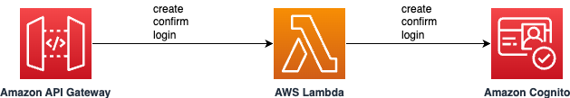

# Amazon Cognito user management using Amazon API Gateway and AWS Lambda

This sample project deploys an Amazon Cognitor user pool, an Amazon API Gateway REST API with an AWS Lambda integration. The Lambda function, written in Java, calls the Amazon Cognito API to create and confirm a user. The project also exposes API to return tokens after successful login by the user. 

Learn more about this pattern at Serverless Land Patterns: https://serverlessland.com/patterns/apigw-lambda-cognito-sam-java

Important: this application uses various AWS services and there are costs associated with these services after the Free Tier usage - please see the [AWS Pricing page](https://aws.amazon.com/pricing/) for details. You are responsible for any AWS costs incurred. No warranty is implied in this example.

## Requirements

- [Create an AWS account](https://portal.aws.amazon.com/gp/aws/developer/registration/index.html) if you do not already have one and log in. The IAM user that you use must have sufficient permissions to make necessary AWS service calls and manage AWS resources.
- [AWS CLI](https://docs.aws.amazon.com/cli/latest/userguide/install-cliv2.html) installed and configured
- [Git Installed](https://git-scm.com/book/en/v2/Getting-Started-Installing-Git)
- [AWS Serverless Application Model](https://docs.aws.amazon.com/serverless-application-model/latest/developerguide/serverless-sam-cli-install.html) (AWS SAM) installed
- [Java 21 or above](https://docs.aws.amazon.com/corretto/latest/corretto-21-ug/downloads-list.html) installed
- [Maven 3.8.6 or above](https://maven.apache.org/download.cgi) installed


## Deployment Instructions

1. Create a new directory, navigate to that directory in a terminal and clone the GitHub repository:
   ```bash
   git clone https://github.com/aws-samples/serverless-patterns
   ```

2. Change directory to the pattern directory:
   ```bash
   cd serverless-patterns/apigw-lambda-cognito-sam-java
   ```

3. From the command line, execute the below command to build the Java based AWS Lambda function.
   ```bash
   sam build
   ```

4. From the command line, use AWS SAM to deploy the AWS resources for the pattern as specified in the template.yml file:
   ```bash
   sam deploy --guided
   ```
4. During the prompts:

   - Enter a stack name
   - Enter the desired AWS Region.
   - Allow SAM CLI to create IAM roles with the required permissions.
   - MyCreateUserFunction has no authentication. Is this okay? [y/N]: select `y`
   - MyConfirmUserFunction has no authentication. Is this okay? [y/N]: select `y`
   - MyLoginUserFunction has no authentication. Is this okay? [y/N]: select `y`
   

   For production applications, you should [enable authentication for the API Gateway](https://docs.aws.amazon.com/apigateway/latest/developerguide/apigateway-control-access-to-api.html) using one of several available options and [follow the API Gateway security best practices](https://docs.aws.amazon.com/apigateway/latest/developerguide/security-best-practices.html).
   
   - Keep default values to the rest of the parameters.

   Once you have run `sam deploy --guided` mode once and saved arguments to a configuration file (samconfig.toml), you can use `sam deploy` in future to use these defaults.

5. Note the outputs from the SAM deployment process. These contain the resource names and/or ARNs which are used for next step as well as testing.

## How it works

Please refer to the architecture diagram below:



Here's a breakdown of the steps:

1. **Amazon API Gateway**: Receives the HTTP POST request containing the request details in JSON format. There are 3 POST methods exposed for create user, confirm user and login user operations.

2. **AWS Lambda**: Triggered by the API Gateway, this function written in Java uses Amazon Cognito API to create, confirm and login user.

3. **Amazon Cognito**: Depending on the operation invoked, user is created, confirmed or logged in the Amazon Cognito user pool.

4. **Response**: The Lambda function processes the Amazon Cognito API response and sends it back to the user via the API Gateway.

## Testing

1. You can use [curl](https://curl.se/) or any other tool of your choice to send a HTTP POST create user request to the API. Make sure to replace `CreateUserAPIGatewayEndpoint` with the corresponding values from your `sam deploy --guided` output. Replace `YourFirstName`, `YourLastName`, `your-email` and `your-password` with your values. The `email` should be a valid email id.

   ```bash
   curl -d '{"firstName": "{YourFirstName}", "lastName": "{YourLastName}", "email": "{your-email}", "password": "{your-password}"}' -H 'Content-Type: application/json' {CreateUserAPIGatewayEndpoint}
   ```

   The API returns a response as below: 

   ```json
   {"isSuccessful":true,"statusCode":200,"cognitoUserId":"84c8xxxx-xxxx-xxxx-xxx-xxxxx9846de1","isConfirmed":false}
   ```

2. You should receive an email with a verification code at your provided email id. Use the verification code to invoke the confirm user POST API:
   ```bash
   curl -d '{"email": "{your-email@mail.com}", "code": "{VerificationCode}"}' -H 'Content-Type: application/json' {ConfirmUserAPIGatewayEndpoint}
   ```

   The API returns a response as below: 

   ```json
   {"isSuccessful":true,"statusCode":200}
   ```

3. Now, you can call the login POST API. This API will return the token:
   ```bash
   curl -d '{"email": "{your-email@mail.com}", "password": "{your-password}"}' -H 'Content-Type: application/json' {LoginUserAPIGatewayEndpoint}
   ```

   The API returns a response as below: 

   ```json
   {"isSuccessful":true, "statusCode":200, "idToken":"eyJra...", "accessToken": "eyJra...", "refreshToken": "eyJj..."}
   ```

## Cleanup

1. To delete the resources deployed to your AWS account via AWS SAM, run the following command:

```bash
sam delete
```


---

Copyright 2024 Amazon.com, Inc. or its affiliates. All Rights Reserved.

SPDX-License-Identifier: MIT-0
