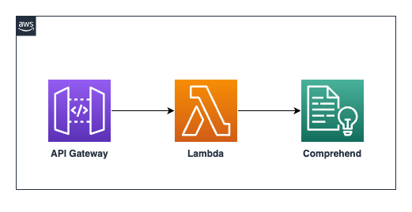

# API Gateway -> Lambda -> Comprehend
This patterns shows CDK deployment on how to leverage Amazon API Gateway, AWS Lambda, and Amazon Comprehend to perform Sentiment Analysis in a serverless fashion.

## Architecture


### What resources will be created?
This CDK code will create the following:
   - 1 API Gateway with HTTP Endpoint
   - 1 Lambda (to invoke the Comprehend API)
   - 1 IAM role (for the Lambda to invoke Comprehend)

## Requirements

### Development Environment
**Cloud 9**

This code for this pattern is executed in AWS Cloud9 environment. The EC2 instance used is m5.large (8 GiB RAM + 2 vCPU).

### AWS setup
**Region**

If you have not yet run `aws configure` and set a default region, you must do so, or you can also run `export AWS_DEFAULT_REGION=<your-region>`. The region used in the demonstration is us-east-1 as Bedrock service is available only in limited regions.

**Authorization**

You must use a role that has sufficient permissions to create Iam roles, as well as cloudformation resources

#### Python >=3.8
Make sure you have [python3](https://www.python.org/downloads/) installed at a version >=3.8.x in the CDK environment. The demonstration has used python version 3.10.

#### AWS CDK
Make sure you have the [AWS CDK](https://docs.aws.amazon.com/cdk/v2/guide/getting_started.html#getting_started_install) installed in the Cloud9 environment.


## Setup

### Set up environment and gather packages

```
cd apigw-lambda-comprehend-cdk-python
```

Install the required dependencies (aws-cdk-lib and constructs) into your Python environment 
```
pip install -r requirements.txt
```

### Gather and deploy resources with the CDK

First synthesize, which executes the application, defines which resources will be created, and translates this into a cloudformation template
```
cdk synth
```
Now bootstrap, which provisions the resources you'll use when deploying the application
```
cdk bootstrap
```
and deploy with
```
cdk deploy
```

The deployment will create a API Gateway endpoint, a Lambda and a IAM role.

## How it works
The API Gateway handles the incoming requests from user and it invokes the relevant route. The Lambda, triggered by API Gateway, invokes the Comprehend's DetectSentiment API and the analyzed response from Comprehend service is routed back to the requester.

## Testing
Upon successful deployment of the stack, the Output section would provide the `APIEndpoint` in the CDK environment. Alternatively, the `APIEndpoint` can be found from the `Outputs` section of the CloudFormation stack.

Use the below format to the test the API (replace the API Endpoint with the one retrieved from the above step):

```bash
curl -d '{"input": "I love AWS Services."}' -H 'Content-Type: application/json' https://<abcdefg>.execute-api.<region>.amazonaws.com/DetectSentiment
```

A response as below would be seen on the terminal console:
```
{
    "Sentiment": "POSITIVE",
    "Confidence Score": {
        "Positive": 0.9994897842407227,
        "Negative": 0.0000562662971788086,
        "Neutral": 0.00038276115083135664,
        "Mixed": 0.00007121496309991926
    }
}
```

## Cleanup

To clean up the resources created as part of this demonstration, run the command `cdk destroy` in the directory `apigw-lambda-comprehend-cdk-python`.
