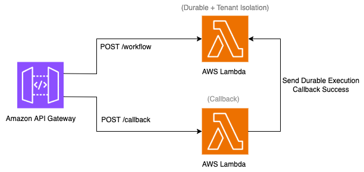

# Serverless multi-tenant workflow with external callback using Lambda durable functions



This pattern implements a multi-tenant workflow API that suspends execution while waiting for external confirmation and resumes processing when a callback arrives. It uses AWS Lambda durable functions for checkpoint-based execution and per-tenant compute isolation to ensure workflow state remains private across tenants.

When a tenant submits a request to the `/workflow` endpoint, the function validates the request, checkpoints its progress, and suspends — consuming no compute resources while waiting. This wait can represent any external dependency: a payment gateway confirming a charge, a compliance system returning a decision, a human approver clicking "approve," or a third-party API completing an async operation. When the confirmation arrives at the `/callback` endpoint, the workflow resumes from its checkpoint, completes its final processing step, and returns the result — without re-executing any previously completed work.

Multiple tenants can have workflows suspended simultaneously. Each tenant's execution environment is dedicated — cached configuration, intermediate results, and temporary files stored during Step 1 remain private and are never accessible to other tenants, even during long suspension periods.

The combination of durable execution and tenant isolation is essential for this use case. During the suspension period, tenant-specific data from Step 1 — such as cached configuration, validated credentials, or computed intermediate results — remains in the execution environment's memory. Without per-tenant isolation, a different tenant's invocation could be routed to that same environment during the wait, exposing the suspended tenant's in-memory state. Without durable execution, the function cannot suspend and resume across the wait boundary, forcing you to externalize all intermediate state to a database and build a separate mechanism to trigger resumption.

Please note that this pattern deploys API Gateway endpoints with no authorization. Production deployments should secure all endpoints with an appropriate authorization mechanism such as AWS IAM authorization, Amazon Cognito user pools, or API key usage plans.

Learn more about this pattern at Serverless Land Patterns: https://serverlessland.com/patterns/apigw-lambda-durable-tenant-isolation-callback-terraform

Important: this application uses various AWS services and there are costs associated with these services after the Free Tier usage - please see the [AWS Pricing page](https://aws.amazon.com/pricing/) for details. You are responsible for any AWS costs incurred. No warranty is implied in this example.

## Requirements

* [Create an AWS account](https://portal.aws.amazon.com/gp/aws/developer/registration/index.html) if you do not already have one and log in. The IAM user that you use must have sufficient permissions to make necessary AWS service calls and manage AWS resources.
* [AWS CLI](https://docs.aws.amazon.com/cli/latest/userguide/install-cliv2.html) installed and configured
* [Git Installed](https://git-scm.com/book/en/v2/Getting-Started-Installing-Git)
* [Terraform](https://learn.hashicorp.com/tutorials/terraform/install-cli?in=terraform/aws-get-started) installed
* [Node.js 22.x](https://nodejs.org/) installed (for installing Lambda dependencies)

## Deployment Instructions

1. Create a new directory, navigate to that directory in a terminal and clone the GitHub repository:
    ```
    git clone https://github.com/aws-samples/serverless-patterns
    ```
2. Change directory to the pattern directory:
    ```
    cd apigw-lambda-durable-tenant-isolation-callback-terraform
    ```
3. Install Lambda function dependencies:
    ```
    cd src/workflow && npm install && cd ../..
    cd src/callback && npm install && cd ../..
    ```
4. From the command line, initialize Terraform to download and install the providers defined in the configuration:
    ```
    terraform init
    ```
5. From the command line, apply the configuration in the main.tf file:
    ```
    terraform apply
    ```
6. During the prompts:

    var.aws_region
    - Enter a value: {enter the region for deployment, e.g. us-west-2}

    var.prefix
    - Enter a value: {enter any prefix to associate with resources, or press Enter for default "durable-tenant"}

7. Note the outputs from the Terraform deployment process. These contain the endpoint URLs used for testing.

## How it works

This pattern addresses a common SaaS requirement: processing tenant requests that depend on external confirmation before completing. Examples include order fulfillment waiting for payment confirmation, loan applications waiting for approval decisions, and document pipelines waiting for human review.

1. **Start workflow** — Client sends a POST request with an `x-tenant-id` header to the `/workflow` endpoint. API Gateway maps the header to `X-Amz-Tenant-Id` and invokes the workflow Lambda asynchronously in a tenant-dedicated execution environment.

2. **Step 1 executes and checkpoints** — The workflow function validates the request (e.g., checks business rules, caches tenant configuration) and creates a checkpoint. This step will not re-execute if the function is interrupted or resumed later.

3. **Workflow suspends** — The function calls `waitForCallback`, which suspends execution at zero compute cost. A callback token is logged to CloudWatch. In production, this token would be sent to the external system (payment provider, approval system, etc.).

4. **External confirmation arrives** — The external system sends the callback token and result payload to the `/callback` endpoint. This triggers the workflow to resume from its checkpoint.

5. **Step 2 executes** — The workflow resumes, skipping Step 1 entirely (using the stored checkpoint result), and completes processing with the confirmation payload included in the final result.

## Testing

Use [curl](https://curl.se/) to send HTTP requests to the API.

### 1. Start a workflow for Tenant A

```
curl -s -X POST "WORKFLOW_ENDPOINT" \
  -H "x-tenant-id: tenant-a" \
  -H "Content-Type: application/json" \
  -d '{"requestId": "req-001"}'
```

Note: Replace `WORKFLOW_ENDPOINT` with the `workflow_endpoint` output from Terraform.

For example:
```
curl -s -X POST "https://abc123.execute-api.us-west-2.amazonaws.com/dev/workflow" \
  -H "x-tenant-id: tenant-a" \
  -H "Content-Type: application/json" \
  -d '{"requestId": "req-001"}'
```

The response would be:
```
{"message": "Workflow started"}
```

### 2. Start a workflow for Tenant B

```
curl -s -X POST "WORKFLOW_ENDPOINT" \
  -H "x-tenant-id: tenant-b" \
  -H "Content-Type: application/json" \
  -d '{"requestId": "req-002"}'
```

The response would be:
```
{"message": "Workflow started"}
```

### 3. Verify workflows are suspended

Open the AWS Lambda Console, navigate to the workflow function, and select the **Durable executions** tab. You should see two executions, both with status **Running** (suspended at waitForCallback):

| Tenant ID | Status |
|-----------|--------|
| tenant-a  | Running |
| tenant-b  | Running |

### 4. Get the callback token

Open CloudWatch Logs, navigate to the log group `/aws/lambda/{prefix}-workflow`, and find the log entry containing the callback token for the tenant you want to resume:

```json
{"waiting":true,"callbackToken":"Ab9hZX...","tenantId":"tenant-a"}
```

Copy the `callbackToken` value.

### 5. Send callback to resume Tenant A only

```
curl -s -X POST "CALLBACK_ENDPOINT" \
  -H "Content-Type: application/json" \
  -d '{"callbackId": "CALLBACK_TOKEN", "payload": {"decision": "approved", "amount": 99.99}}'
```

Note: Replace `CALLBACK_ENDPOINT` with the `callback_endpoint` output from Terraform, and `CALLBACK_TOKEN` with the token from Step 4.

For example:
```
curl -s -X POST "https://abc123.execute-api.us-west-2.amazonaws.com/dev/callback" \
  -H "Content-Type: application/json" \
  -d '{"callbackId": "Ab9hZX...", "payload": {"decision": "approved", "amount": 99.99}}'
```

The response would be:
```
{"message": "Callback sent"}
```

### 6. Verify results

Return to the Lambda Console **Durable executions** tab:

| Tenant ID | Status |
|-----------|--------|
| tenant-a  | **Succeeded** |
| tenant-b  | Running |

Click on Tenant A's execution to see the complete timeline:
- Step 1: Validate — completed ✓
- Wait: external-confirmation — callback received ✓
- Step 2: Complete — completed ✓ (includes callback payload in result)

Tenant B remains suspended and unaffected, confirming tenant isolation.

### 7. Verify tenant isolation in CloudWatch Logs

Navigate to CloudWatch Logs → `/aws/lambda/{prefix}-workflow`. Each tenant's logs appear in **separate log streams**, confirming they ran in isolated execution environments. Step 1 appears only once per tenant despite the function being re-invoked after the callback (confirming checkpoint replay skips completed work).

## Cleanup

1. Change directory to the pattern directory:
    ```
    cd serverless-patterns/apigw-lambda-durable-tenant-isolation-callback-terraform
    ```

1. Delete all created resources:
    ```
    terraform destroy
    ```

1. During the prompts:
    ```
    Enter all details as entered during creation.
    ```

1. Confirm all created resources have been deleted:
    ```
    terraform show
    ```

----
Copyright 2026 Amazon.com, Inc. or its affiliates. All Rights Reserved.

SPDX-License-Identifier: MIT-0
