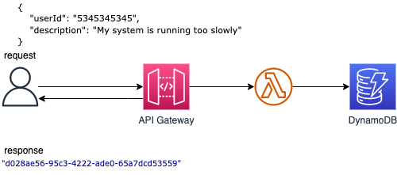

## API Gateway, Lambda Function and Dynamodb Table

This pattern creates an Amazon API Gateway HTTP API, a AWS Lambda function and a DynamoDB Table using SAM and Java 11.

Important: this application uses various AWS services and there are costs associated with these services after the Free Tier usage - please see the AWS Pricing page for details. You are responsible for any AWS costs incurred.

## Requirements

* [Create an AWS account](https://portal.aws.amazon.com/gp/aws/developer/registration/index.html) if you do not already have one and log in. The IAM user that you use must have sufficient permissions to make necessary AWS service calls and manage AWS resources.
* [AWS CLI](https://docs.aws.amazon.com/cli/latest/userguide/install-cliv2.html) installed and configured
* [Git Installed](https://git-scm.com/book/en/v2/Getting-Started-Installing-Git)
* [AWS Serverless Application Model](https://docs.aws.amazon.com/serverless-application-model/latest/developerguide/serverless-sam-cli-install.html) (AWS SAM) installed


## Language: This is a Maven project which uses Java 11 and AWS SDK

## Description 
The SAM template contains all the information to deploy AWS resources(an API Gateway, an Lambda function and a DynamoDB table) and also the permission required by these service to communicate.

You will be able to create and delete the CloudFormation stack using the CLI commands.

After the stack is created you can send an JSON object using curl or Postman to the URL provided by the API Gateway,
the request will be intercepted by the Lambda function which will persist the object into a DynamoDB table.

The lambda function will return the ID of the inserted object.

Topology




## Deployment commands

````
mvn clean package


# create an S3 bucket where the source code will be stored:

aws s3 mb s3://lambda-functions-some-random-letters


# copy the source code located in the target folder:

aws s3 cp target/ticketPublisher.zip s3://lambda-functions-some-random-letters


# SAM will deploy the CloudFormation stack described in the template.yml file:

sam deploy --s3-bucket lambda-functions-some-random-letters --stack-name ticket-stack --capabilities CAPABILITY_IAM


# REMEMBER to DELETE the CloudFormation stack

aws cloudformation delete-stack --stack-name ticket-stack


````

## Testing

To test the endpoint first send data using the following command. Be sure to update the endpoint with endpoint of your stack.

```
curl -X POST https://COPYfromAPIGateway/dev/ticket -H "Content-Type: application/json" -d '{"userId": "231deb432f3dd","description": "My monitor is broken."}' 
```

## Cleanup

Run the given command to delete the resources that were created. It might take some time for the CloudFormation stack to get deleted.
```
aws cloudformation delete-stack --stack-name ticket-stack
```


## Author bio 
Name: Razvan Minciuna
Photo URL:https://media-exp1.licdn.com/dms/image/C4E03AQEApa102Ad7kQ/profile-displayphoto-shrink_800_800/0/1599982021682?e=1649289600&v=beta&t=Vxvm0F3xD_WSPX0WIwn94BQ1QyE84aBg2M5y4WFN4PE
Linkedin: https://www.linkedin.com/in/razvanminciuna/
Description (up to 255 chars): Software Architect

