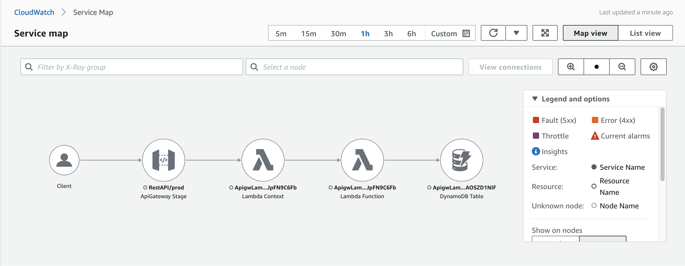

# Observing into Lambda downstreams with X-Ray SDK

AWS X-Ray records and visualizes requests made by applications, making it a great tool to analyze and debug applications built using a microservices and serverless architecture. This CDK application demonstrates how to integrate X-Ray SDK in Lambda functions to observe into downstream API calls. This example creates an Amazon API Gateway REST API that uses a Lambda function as the backend to scan a Dynamodb table. The REST API and Lambda function both have X-Ray tracing enabled. X-Ray SDK is also integrated in the Lambda function to observe into the API call to the downstream Dynamodb table.

Learn more about this pattern at Serverless Land Patterns: << Add the live URL here >>

Important: this application uses various AWS services and there are costs associated with these services after the Free Tier usage - please see the [AWS Pricing page](https://aws.amazon.com/pricing/) for details. You are responsible for any AWS costs incurred. No warranty is implied in this example.

## Requirements

* [Create an AWS account](https://portal.aws.amazon.com/gp/aws/developer/registration/index.html) if you do not already have one and log in. The IAM user that you use must have sufficient permissions to make necessary AWS service calls and manage AWS resources.
* [AWS CLI](https://docs.aws.amazon.com/cli/latest/userguide/install-cliv2.html) installed and configured
* [Git Installed](https://git-scm.com/book/en/v2/Getting-Started-Installing-Git)
* [Node and NPM](https://docs.npmjs.com/downloading-and-installing-node-js-and-npm) installed
* [AWS Cloud Developer Kit](https://docs.aws.amazon.com/cdk/v2/guide/cli.html) installed and configured

## Deployment Instructions

1. Create a new directory, navigate to that directory in a terminal and clone the GitHub repository:
    ``` 
    git clone https://github.com/aws-samples/serverless-patterns
    ```
2. Change directory to the pattern directory:
    ```
    cd serverless-patterns/apigw-lambda-dynamodb-xray/cdk
    ```
3. Run pre-build steps: installing dependencies and compiling typescript to js:
    ```
    npm run prebuild
    ```
4. Configure your AWS CLI to point to the AWS account and region where you want to deploy the solution. You can run the following command to verify which AWS account you are currently logged on:
    ```
    aws sts get-caller-identity
    ```
5. If you are using CDK to deploy to your AWS account for the first time, you will have to bootstrap your account. To do this, run the command:
    ```
    cdk bootstrap <account-number>/<region>
    ```
6. Deploy the stack
    ```
    cdk deploy
    ```
   Once deployment completes, you will see the REST API endpoint as an output. You will use this URL for testing/ making GET request.


## How it works

This CDK application deploys an Amazon API Gateway REST API that uses a Lambda function as the backend integration to scan a Dynamodb table. The REST API and Lambda function both have X-Ray tracing enabled. X-Ray SDK is also integrated in the Lambda function to observe into the API call to the downstream Dynamodb table. You can view the X-Ray service map in the Amazon Cloudwatch console.


## Testing

1. Retrieve the API Gateway URL from the `cdk deploy` output. It should look something like this
    ```
    ApigwLambdaDynamodbCdkTsStack.RestAPIEndpointB14C3C54 = https://abcd123efg.execute-api.us-west-2.amazonaws.com/prod/
    ```
2. To make the GET request to scan your Dynamodb table, run:
    ```
    curl <your-restapi-endpoint-url>/scan
    # example
    curl https://abcd123efg.execute-api.us-west-2.amazonaws.com/prod/scan
    ```
3. You will receive a response as follows because there is currently no items in the Dynamodb table:
    ```
    {"Items":[],"Count":0,"ScannedCount":0}
    ```
4. Now, you can navigate to the [Amazon Cloudwatch console](https://console.aws.amazon.com/cloudwatch). Under **X-Ray traces**, you will see the service map that shows the entire journey of the GET request.

   

## Cleanup

Delete the stack

```
cdk destroy
```
----
Copyright 2021 Amazon.com, Inc. or its affiliates. All Rights Reserved.

SPDX-License-Identifier: MIT-0
