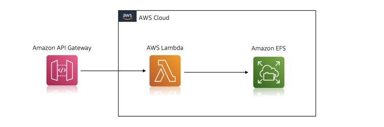

# Integration of Amazon EFS with AWS Lambda and Amazon API Gateway

This pattern explains how to deploy a SAM application that includes an API Gateway, Lambda Function and Amazon EFS. 

## Requirements

* [Create an AWS account](https://portal.aws.amazon.com/gp/aws/developer/registration/index.html) if you do not already have one and log in. The IAM user that you use must have sufficient permissions to make necessary AWS service calls and manage AWS resources.
* [AWS CLI](https://docs.aws.amazon.com/cli/latest/userguide/install-cliv2.html) installed and configured
* [Git Installed](https://git-scm.com/book/en/v2/Getting-Started-Installing-Git)
* [AWS Serverless Application Model](https://docs.aws.amazon.com/serverless-application-model/latest/developerguide/serverless-sam-cli-install.html) (AWS SAM) installed

## Architecture 
The following diagram illustrates the solution architecture:



## Deployment Instructions

1. Create a new project directory and a new serverless application in AWS SAM using the following command:
    ``` 
    $ mkdir efs-lambda-project
    $ cd efs-lambda-project
    $ sam init
    ```
2. Choose Custom Template Location (Choice: 2) as the template source, and provide the following GitHub template location: 
    ```
    https://github.com/debnsuma/apigw-lambda-efs.git
    ```
3. From the command line, build the application:
    ```
    $ sam build --use-container
    ```
4. Deploy the application
    ```
    $ sam deploy --guided
    ```
    Take a note of the HTTP API Gateway endpoint \

## Testing

Once the application is deployed, you can test by making some lambda invocation which will write, read and delete data from the Amazon EFS storage:

    $ curl https://<HTTP API Gateway Endpoint>
    null

    $ curl -X POST -H "Content-Type: text/plain" -d 'Hello from EFS!' https://<HTTP API Gateway Endpoint>
    Hello from EFS!

    $ curl -X POST -H "Content-Type: text/plain" -d 'Hello again :)' https://<HTTP API Gateway Endpoint>
    Hello from EFS!
    Hello again :)

    $ curl https://<HTTP API Gateway Endpoint>
    Hello from EFS!
    Hello again :)

    $ curl -X DELETE https://<HTTP API Gateway Endpoint>
    Messages deleted.

    $ curl https://<HTTP API Gateway Endpoint>
    null

    