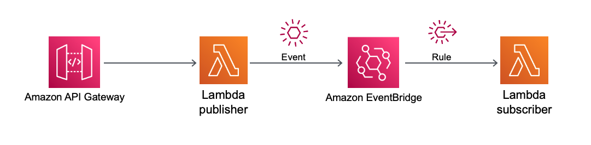

## Description
###API Gateway, Lambda to EventBridge to Lambda

This pattern creates an Amazon API Gateway HTTP API, a AWS Lambda function(publisher), a custom EventBridge and Event Rule and another Lambda function(subscriber) using SAM and Java 11.

This example is an implementation of an publisher/subscriber pattern in Event-Drivent Architecture.

Important: this application uses various AWS services and there are costs associated with these services after the Free Tier usage - please see the AWS Pricing page for details. You are responsible for any AWS costs incurred.


## Language:
###This is a Maven project which uses Java 11 and AWS SDK

## Framework

The framework used to deploy the infrastructure is SAM

## Services used

The AWS services used in this pattern are
### API Gateway - AWS Lambda - EventBridge - AWS Lambda

Topology




## Description
The SAM template contains all the information to deploy AWS resources(an API Gateway, two Lambda functions, a custom EventBridge and a custom EventBridge Rule) and also the permission required by these service to communicate.

You will be able to create and delete the CloudFormation stack using the CLI commands.

After the stack is created you can send an JSON object using curl or Postman to the URL provided by the API Gateway,
the request will be intercepted by the Lambda function which will publish an event to the EventBridge. The event Rule will 
send the event with the payload to the second lamnda function, the subscriber.

You can see the event received by the subscriber Lambda function in the CloudWatch Logs of the function.


## Deployment commands

````
mvn clean package


# create an S3 bucket where the source code will be stored:

aws s3 mb s3://ndis2dc92jd2s


# copy the source code located in the target folder:

aws s3 cp target/ticketPubSub.zip s3://ndis2dc92jd2s


# SAM will deploy the CloudFormation stack described in the template.yml file:

sam deploy --s3-bucket ndis2dc92jd2s --stack-name ticket-stack --capabilities CAPABILITY_IAM


# REMEMBER to DELETE the CloudFormation stack

aws cloudformation delete-stack --stack-name ticket-stack

````

## Testing

You can test the implementation using Postman and in the Body pasting the content of the ticket-example.json file:

````
{
  "data":{
    "userId":"338dnwu2sjw",
    "issue":"My system is running too slowly"
  },
  "medatada":{
    "correlationId":"38is22ssd"
  }
}
````

Or using curl which will return the event id generated by EventBridge

```
curl -X POST https://COPYfromAPIGateway/dev/ticket -H "Content-Type: application/json" -d '{"data":{"userId":"338dnwu2sjw","issue":"My system is running too slowly"},"medatada":{"correlationId":"38is22ssd"}}' 
```

## Cleanup

Run the given command to delete the resources that were created. It might take some time for the CloudFormation stack to get deleted.
```
aws cloudformation delete-stack --stack-name ticket-stack
```

## Requirements

* [Create an AWS account](https://portal.aws.amazon.com/gp/aws/developer/registration/index.html) if you do not already have one and log in. The IAM user that you use must have sufficient permissions to make necessary AWS service calls and manage AWS resources.
* [AWS CLI](https://docs.aws.amazon.com/cli/latest/userguide/install-cliv2.html) installed and configured
* [Git Installed](https://git-scm.com/book/en/v2/Getting-Started-Installing-Git)
* [AWS Serverless Application Model](https://docs.aws.amazon.com/serverless-application-model/latest/developerguide/serverless-sam-cli-install.html) (AWS SAM) installed


## Author bio
Name: Razvan Minciuna
Linkedin: https://www.linkedin.com/in/razvanminciuna/
Description (up to 255 chars): Software Architect

