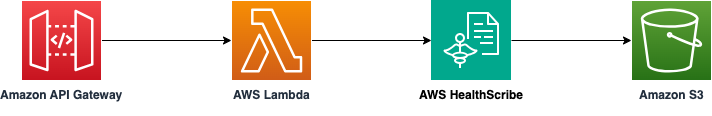

# Amazon API Gateway to AWS Lambda to AWS HealthScribe using SAM

This sample project deploys an Amazon API Gateway REST API with an AWS Lambda integration. The Lambda function is written in Python, calls the AWS HealthScribe API to automatically generate clinical notes from patient-clinician conversations.

Learn more about this pattern at Serverless Land Patterns: https://serverlessland.com/patterns/apigw-lambda-healthscribe-sam

Important: this application uses various AWS services and there are costs associated with these services after the Free Tier usage - please see the [AWS Pricing page](https://aws.amazon.com/pricing/) for details. You are responsible for any AWS costs incurred. No warranty is implied in this example.

## Requirements

- [Create an AWS account](https://portal.aws.amazon.com/gp/aws/developer/registration/index.html) if you do not already have one and log in. The IAM user that you use must have sufficient permissions to make necessary AWS service calls and manage AWS resources.
- [AWS CLI](https://docs.aws.amazon.com/cli/latest/userguide/install-cliv2.html) installed and configured
- [Git Installed](https://git-scm.com/book/en/v2/Getting-Started-Installing-Git)
- [AWS Serverless Application Model](https://docs.aws.amazon.com/serverless-application-model/latest/developerguide/serverless-sam-cli-install.html) (AWS SAM) installed

## Prerequisite
This code asset has a dependency on [boto3 v1.34.26](https://boto3.amazonaws.com/v1/documentation/api/latest/reference/services/transcribe/client/start_medical_scribe_job.html) or above. This is not the current default version of boto3 on AWS Lambda. Hence we will use a Lambda layer.

## Deployment Instructions

1. Create a new directory, navigate to that directory in a terminal and clone the GitHub repository:
   ```bash
   git clone https://github.com/aws-samples/serverless-patterns
   ```
2. Change directory to the pattern directory:
   ```bash
   cd apigw-lambda-healthscribe-sam
   ```
3. From the command line, use AWS SAM to deploy the AWS resources for the pattern as specified in the template.yml file:
   ```bash
   sam deploy --guided
   ```
4. During the prompts:

   - Enter a stack name
   - Enter the desired AWS Region. At the time of developing this sample application, AWS HealthScribe is only generally available in the `us-east-1` region. So please check the service availability while selecting a region.
   - Allow SAM CLI to create IAM roles with the required permissions.

   Once you have run `sam deploy --guided` mode once and saved arguments to a configuration file (samconfig.toml), you can use `sam deploy` in future to use these defaults.

   When asked "`ClinicalNotesGenerationLambdaFunction` has no authentication. Is this okay? [y/N]", answer explicitly with y for the purposes of this sample application. As a result, anyone will be able to call this example REST API without any form of authentication.

   For production applications, you should [enable authentication for the API Gateway](https://docs.aws.amazon.com/apigateway/latest/developerguide/apigateway-control-access-to-api.html) using one of several available options and [follow the API Gateway security best practices](https://docs.aws.amazon.com/apigateway/latest/developerguide/security-best-practices.html).

5. Note the outputs from the SAM deployment process. These contain the resource names and/or ARNs which are used for next step as well as testing.
6. Run the `create_lambda_layer.sh`. You may have to change the file permission to make it executable.  This will create the Lambda layer with the necessary boto3 version for calling AWS HealthScribe API.
   ```bash
   bash create_lambda_layer.sh
   ```
7. Provide a name for the Lambda layer. Such as: 
   ```bash
   Enter the name of the Layer: boto3-lambda-layer
   ```
   Provide the AWS region where you have depoyed. Such as: 
   ```bash
   Enter the deployment region: {your-region}
   ```

   It will show output like below:
   ```bash
   Publishing the layer. Please wait ...
   {
    "Content": {
      .....
      .....
    },
    "LayerArn": "arn:aws:lambda:{your-region}:xxxxxxxxxxxx:layer:boto3-lambda-layer",
    "LayerVersionArn": "arn:aws:lambda:{your-region}:xxxxxxxxxxxx:layer:boto3-lambda-layer:1",
    "Description": "",
    "CreatedDate": "YYYY-MM-DDT10:47:36.983+0000",
    "Version": 1
   }
   ``` 
8. You may have to press `q` to come out of the output. Copy the value of `LayerVersionArn` from the above output and provide it into the next step. Such as:

   ```bash
   Enter the LayerVersionArn from the above command: arn:aws:lambda:{your-region}:xxxxxxxxxxxx:layer:boto3-lambda-layer:1
   ```
9. Please replace the value of `{ClinicalNotesGenerationLambdaFunction}` with the value from the `sam deploy --guided` output:
   ```bash
   Enter the Lambda function name from the SAM deploy output: {ClinicalNotesGenerationLambdaFunction}
   ```
   The script will now run aws cli command to add the newly created layer to the Lambda function. It will show output as below:
   It will show output like below:
   ```bash
   Adding the new layer to your Lambda function's configuration. Please wait ...
   {
      "FunctionName": "{ClinicalNotesGenerationLambdaFunction}",
      ......
      ......
      "State": "Active",
      "LastUpdateStatus": "InProgress",
      "LastUpdateStatusReason": "The function is being created.",
      "LastUpdateStatusReasonCode": "Creating",
      "PackageType": "Zip",
      "Architectures": [
         "arm64"
      ],
      "EphemeralStorage": {
         "Size": 512
      }
   }      
   ```    
10. You may have to press `q` to come out of the output. The setup is ready for testing.

## How it works


Please refer to the architecture diagram below:



Here's a breakdown of the steps:

1. **Amazon API Gateway**: Receives the HTTP POST request. API Gateway forwards the request to the AWS Lambda function.

2. **AWS Lambda**: The function calls AWS HealthScribe API using boto3 to start the medical scribe job. 

3. **AWS HealthScribe**: Analyses the patient-clinician conversations audio file from Amazon S3 bucket and generates clinical notes from patient-clinician conversations. It then uploads the the clinical note in JSON format to a given S3 bucket.


## Testing

1. Upload the `conversation.mp3` file into the Amazon S3 bucket using the following command. Please replace `TranscribeNotesBucket` with the value from the `sam deploy --guided` output:

   ```bash
   aws s3 cp conversation.mp3 s3://{TranscribeNotesBucket}/conversation.mp3
   ```

2. We will use [curl](https://curl.se/) to send a HTTP POST request to the API. Make sure to replace `GenerateClinicalNotesAPI` with the one from your `sam deploy --guided` output:

   ```bash
   curl -X POST {GenerateClinicalNotesAPI}
   ```

   The API returns AWS HealthScribe `jobName`. Please make a note of it, we will use it on the next step. 

   ```json
   {"jobStatus": "IN_PROGRESS", "jobName": "3dcxxxx-xxxx-xxxx-xxxx-xxxx0fff25"}
   ```

3. Execute the below command to get the current job status. Please replace the `jobName` from the previous step and `your-region` with your deployment region. Please wait till the status is `COMPLETED` before moving to next step. 
   ```bash
   aws transcribe get-medical-scribe-job  --medical-scribe-job-name {jobName} --query 'MedicalScribeJob.MedicalScribeJobStatus' --region {your-region}
   ```

4. Execute the below command to download the generated clinical notes by AWS HealthScribe from the Amazon S3 bucket. Please replace `TranscribeNotesBucket` with the value from the `sam deploy --guided` output and `jobName` from the previous step. Please validate the downloaded `summary.json` content. Please refer to the `SummarizedSegment` tags under different segments.
   ```bash
   aws s3 cp s3://{TranscribeNotesBucket}/{jobName}/summary.json .
   ```


## Cleanup

1. Delete the content in the Amazon S3 bucket using the following command. Please *ensure* that the correct bucket name is provided to avoid accidental data loss:
   ```bash
   aws s3 rm s3://{TranscribeNotesBucket} --recursive
   ```

2. To delete the resources deployed to your AWS account via AWS SAM, run the following command:
   ```bash
   sam delete
   ```
3. Delete the Lambda layer version using the `delete_lambda_layer.sh` script. You may have to give execution permission to the file. You will need to pass the Lambda layer name, the version and the region in the inpout when requested:
   ```bash
   bash delete_lambda_layer.sh
   ```

---

Copyright 2023 Amazon.com, Inc. or its affiliates. All Rights Reserved.

SPDX-License-Identifier: MIT-0
