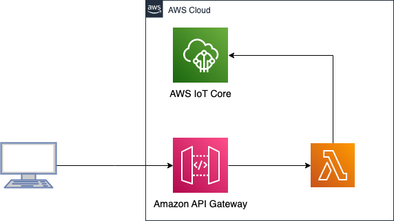

# API Gateway to Lambda to IoT Core

This patterns contains a sample CDK stack to create an API to invoke a Lambda function that publishes a message to AWS IoT.





This pattern creates an Amazon API Gateway REST API endpoint, that invokes a Lambda function. The Lambda function has been given permissions to publish to AWS IoT Core (`iot:Publish`). Make a POST call to the API Endpoint with `topic` and `message` in the body. 

Learn more about this pattern at Serverless Land Patterns: https://serverlessland.com/patterns/apigw-lambda-iot-cdk

Important: this application uses various AWS services and there are costs associated with these services after the Free Tier usage - please see the [AWS Pricing page](https://aws.amazon.com/pricing/) for details. You are responsible for any AWS costs incurred. No warranty is implied in this example.

## Requirements

* [Create an AWS account](https://portal.aws.amazon.com/gp/aws/developer/registration/index.html) if you do not already have one and log in. The IAM user that you use must have sufficient permissions to make necessary AWS service calls and manage AWS resources.
* [AWS CLI](https://docs.aws.amazon.com/cli/latest/userguide/install-cliv2.html) installed and configured
* [Git Installed](https://git-scm.com/book/en/v2/Getting-Started-Installing-Git)
* [Node and NPM](https://nodejs.org/en/download/) installed
* [AWS Cloud Development Kit](https://docs.aws.amazon.com/cdk/latest/guide/cli.html) (AWS CDK) installed
* [Curl](https://curl.se/download.html) Download `curl` and install it for your OS

## Deployment Instructions

1. Clone the project to your local working directory

   ```sh
   git clone https://github.com/aws-samples/serverless-patterns/ 
   ```

2. Change the working directory to this pattern's directory

   ```sh
   cd serverless-patterns/apigw-lambda-iot-cdk
   ```
3. Set up the stack in your AWS account and region. 
- Deploy the stack to your default AWS account and region. 

   ```sh
   cdk deploy
   ```
- Once the deployment is finished, the process will print an output providing the Base API URL, for example as shown below:
   
   ```sh
   Outputs:
   ApigwLambdaIotStack.iotPublishApiEndpoint6C3FF294 = https://3ueit22b5k.execute-api.us-east-2.amazonaws.com/prod/ 
   ```

## How it works

The CDK app deploys the resources and the IAM permissions required to run the application. It creates an API Gateway (REST API) and Lambda function.


## Testing

You can test the pattern using AWS Console and the `curl` command line tool.

### Using AWS Console

1. Open the AWS IoT Console in the second browser window.
2. In the AWS IoT Core Console, in the `Test` section (left-side pane), select the `MQTT test client`. 
3. Under the `Subscribe to a topic` subscribe to `#` topic.
4. Open a terminal window and use the following `curl` command to make a POST API call. Before running the command use the Base URL printed on the console by `cdk deploy`. Make sure to append `cmds` at the end of the Base URL.

```sh
curl -X POST -H "Content-Type: application/json" \
    -d '{"topic": "dt", "payload": {"temperature" : 97.88}}' \
    https://3ueit22b5k.execute-api.us-east-2.amazonaws.com/prod/cmds
```
5. Switch back to the `MQTT test client` and check if you got the message you used in the POST API call. For the example above you should see the following output in the `MQTT test client` window, on the `dt` topic:

```sh
{
    "temperature" : 97.88
}
```

## Cleanup
 
Run the given command to delete the resources that were created. It might take some time for the CloudFormation stack to get deleted. See the Notes section in [README](./README.md)

```sh
cdk destroy
```
## Resources

1. [Boto3 IoT Publish](https://boto3.amazonaws.com/v1/documentation/api/latest/reference/services/iot-data.html#IoTDataPlane.Client.publish)
2. [AWS IoT HTTPS](https://docs.aws.amazon.com/iot/latest/developerguide/http.html)
3. [Amazon API Gateway quotas and important notes](https://docs.aws.amazon.com/apigateway/latest/developerguide/limits.html)
4. [AWS IoT Core endpoints and quotas](https://docs.aws.amazon.com/general/latest/gr/iot-core.html)

## Notes and CDK Stack Info

This project is generated using `cdk` toolkit version `2.37` in Typescript. 
The `cdk.json` file tells the CDK Toolkit how to execute your app. 

To deploy the stack:

```sh
cdk deploy
```

To destroy the stack:

```sh
cdk destroy
```

If this is the first time you are using CDK with your AWS account/region, you would have to run the following:

```sh
cdk bootstrap
```

1. `apigw-lambda-iot-stack.ts` has the resources for creating the Lambda function, and API Gateway REST API resources. 
2. Lambda function is granted permissions to publish messages. The function code is in `src/handler.py`

### CDK Useful commands

* `npm run build`   compile typescript to js
* `npm run watch`   watch for changes and compile
* `npm run test`    perform the jest unit tests
* `cdk deploy`      deploy this stack to your default AWS account/region
* `cdk diff`        compare deployed stack with current state
* `cdk synth`       emits the synthesized CloudFormation template


----
Copyright Amazon.com, Inc. or its affiliates. All Rights Reserved. 

SPDX-License-Identifier: MIT-0