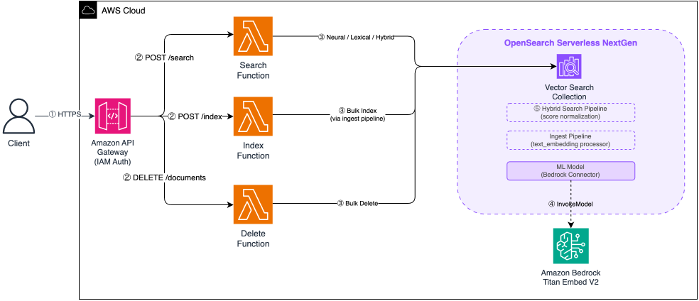

# Amazon API Gateway to AWS Lambda to Amazon OpenSearch Serverless NextGen

This pattern deploys a serverless semantic search API using Amazon API Gateway, AWS Lambda, and Amazon OpenSearch Serverless with the NextGen architecture. All three services operate on a pay-per-use model with no minimum baseline cost, meaning the entire stack incurs zero compute charges when idle. You pay only for storage of indexed data.

Learn more about this pattern at Serverless Land Patterns: https://serverlessland.com/patterns/apigw-lambda-opensearch-serverless-nextgen 

Important: this application uses various AWS services and there are costs associated with these services after the Free Tier usage - please see the [AWS Pricing page](https://aws.amazon.com/pricing/) for details. You are responsible for any AWS costs incurred. No warranty is implied in this example.

## Requirements

* [Create an AWS account](https://portal.aws.amazon.com/gp/aws/developer/registration/index.html) if you do not already have one and log in. The IAM user that you use must have sufficient permissions to make necessary AWS service calls and manage AWS resources.
* [AWS CLI installed and configured](https://docs.aws.amazon.com/cli/latest/userguide/install-cliv2.html)
* [Git installed](https://git-scm.com/book/en/v2/Getting-Started-Installing-Git)
* [AWS SAM CLI](https://docs.aws.amazon.com/serverless-application-model/latest/developerguide/serverless-sam-cli-install.html) installed
* [Python 3.14](https://www.python.org/downloads/)


## Deployment Instructions

1. Create a new directory, navigate to that directory in a terminal and clone the GitHub repository:
    ```
    git clone https://github.com/aws-samples/serverless-patterns
    ```
1. Change directory to the pattern directory:
    ```
    cd serverless-patterns/apigw-lambda-opensearch-serverless-nextgen
    ```
1. Build the application:
    ```
    sam build
    ```
1. Deploy the application:
    ```
    sam deploy --guided
    ```
1. During the prompts:
    * Enter a stack name
    * Enter the desired AWS Region
    * Accept the default parameter values or customize them
    * Allow SAM CLI to create IAM roles with the required permissions

    Once you have run `sam deploy --guided` mode once and saved arguments to a configuration file (samconfig.toml), you can use `sam deploy` in future to use these defaults.


## How it works



Figure 1 - Architecture

This pattern creates a REST API backed by three AWS Lambda functions that interact with an OpenSearch Serverless NextGen collection configured for vector search:

1. The client sends an HTTPS request (SigV4-signed) to Amazon API Gateway with IAM authorization.
2. API Gateway routes the request to the appropriate Lambda function based on path: Search (`POST /search`), Index (`POST /index`), or Delete (`DELETE /documents`).
3. The Lambda function calls the OpenSearch Serverless collection — performing a neural/lexical/hybrid query, bulk indexing via the ingest pipeline, or a bulk delete. Lambda functions send and receive plain text only; no client-side embedding generation is needed.
4. For semantic and hybrid search, and during document indexing, the OpenSearch ML model calls Amazon Bedrock (Amazon Titan Text Embeddings V2) to generate 1024-dimensional embeddings server-side.
5. For hybrid search, the search pipeline applies min-max score normalization to combine BM25 (lexical) and k-NN (semantic) results with configurable weights (0.3 lexical / 0.7 semantic).

The OpenSearch collection lives inside a NextGen collection group, which enables scale-to-zero behavior. When idle, both indexing and search OCUs (OpenSearch Compute Units) drop to zero. When a request arrives, capacity provisions in approximately 10 seconds. Requests are queued (not dropped) during this window.

The NextGen collection group is created using a Lambda-backed custom resources since CloudFormation doesn't yet natively support the `Generation` parameter.

## Testing

Install the test dependencies:

```bash
pip install -r tests/requirements.txt
```

### Unit tests

Run the unit tests (no deployed stack or AWS credentials required):

```bash
pytest tests/unit/ -v
```

### Integration tests

The repository includes integration tests that exercise all three search modes against a 50-product outdoor equipment catalog:

```bash
# Run integration tests (requires a deployed stack)
pytest tests/integration/ -v -s
```

The tests demonstrate semantic understanding: `"shoes for the beach"` matches "Summer Beach Sandals" (no keyword overlap), `"charging phone while camping"` matches "Solar Power Bank" (intent matching), and hybrid mode combines both signals for queries like `"waterproof bag for kayaking"` → "Dry Bag 20L".

### Manual testing with awscurl

Install the project dependencies (includes `awscurl`):

```bash
pip install -r requirements.txt
```

Set your stack name and region:

```bash
STACK_NAME="your-stack-name"
AWS_REGION="your-region"
```

Index a document:

```bash
awscurl --service execute-api --region $AWS_REGION -X POST \
  -H "Content-Type: application/json" \
  -d '{
    "documents": [{
      "id": "doc-1",
      "title": "OpenSearch Serverless NextGen",
      "content": "The next generation architecture scales to zero and provisions in seconds."
    }]
  }' \
  "$(aws cloudformation describe-stacks --stack-name $STACK_NAME --region $AWS_REGION --query 'Stacks[0].Outputs[?OutputKey==`IndexApiUrl`].OutputValue' --output text)"
```

Search for it:

```bash
awscurl --service execute-api --region $AWS_REGION -X POST \
  -H "Content-Type: application/json" \
  -d '{"query": "serverless scaling", "mode": "hybrid"}' \
  "$(aws cloudformation describe-stacks --stack-name $STACK_NAME --region $AWS_REGION --query 'Stacks[0].Outputs[?OutputKey==`SearchApiUrl`].OutputValue' --output text)"
```

Delete a document:

```bash
awscurl --service execute-api --region $AWS_REGION -X DELETE \
  -H "Content-Type: application/json" \
  -d '{"ids": ["doc-1"]}' \
  "$(aws cloudformation describe-stacks --stack-name $STACK_NAME --region $AWS_REGION --query 'Stacks[0].Outputs[?OutputKey==`DeleteApiUrl`].OutputValue' --output text)"
```

> **Note:** The first request after an idle period takes approximately 10 seconds while OpenSearch provisions compute from zero. Subsequent requests respond at normal latency.

## Cleanup

> **Warning:** This will permanently delete all indexed documents in the OpenSearch collection. Back up any data you need to retain before proceeding.

1. Delete the stack:
    ```bash
    sam delete --stack-name STACK_NAME
    ```

    This removes all resources including the API Gateway, Lambda functions, OpenSearch collection, collection group, security policies, IAM roles, and CloudWatch log groups.

----
Copyright 2026 Amazon.com, Inc. or its affiliates. All Rights Reserved.

SPDX-License-Identifier: MIT-0
