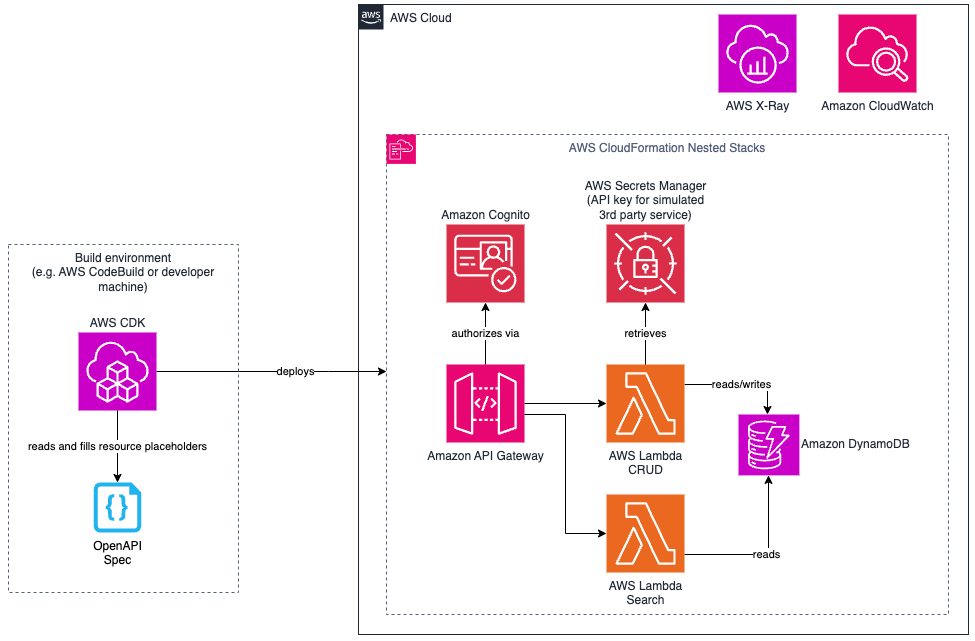

# AWS CDK Project with OpenAPI defined API Gateway and Powertools for AWS Lambda

This pattern demonstrates how to build a fully typed serverless API using AWS CDK, OpenAPI, and Powertools for AWS Lambda. The pattern leverages an OpenAPI specification to define the API Gateway configuration, including paths, methods, and Lambda integrations. The same OpenAPI specification is used to auto-generate TypeScript types, ensuring type safety and consistency across the API Gateway configuration and Lambda function implementations.

Key features of this pattern:

- Uses OpenAPI specification as a single source of truth for API definition
- Auto-generates TypeScript types from OpenAPI spec for Lambda functions
- Implements AWS Lambda Powertools for:
  - Structured logging to CloudWatch
  - Custom metrics collection
  - Distributed tracing with AWS X-Ray
  - Secure parameter and secrets management
- Demonstrates end-to-end type safety from API definition to function implementation
- Showcases best practices for building serverless APIs with AWS CDK

The pattern includes a sample Order API that demonstrates CRUD operations and search functionality, complete with authentication via Amazon Cognito. This architecture ensures that API contracts are always in sync between the API Gateway configuration and the Lambda function implementations, reducing runtime errors and improving developer experience.

Learn more about this pattern at Serverless Land Patterns: << Add the live URL here >>

Important: this application uses various AWS services and there are costs associated with these services after the Free Tier usage - please see the [AWS Pricing page](https://aws.amazon.com/pricing/) for details. You are responsible for any AWS costs incurred. No warranty is implied in this example.

## Requirements

- [Create an AWS account](https://portal.aws.amazon.com/gp/aws/developer/registration/index.html) if you do not already have one and log in. The IAM user that you use must have sufficient permissions to make necessary AWS service calls and manage AWS resources.
- [AWS CLI](https://docs.aws.amazon.com/cli/latest/userguide/install-cliv2.html) installed and configured
- [Git Installed](https://git-scm.com/book/en/v2/Getting-Started-Installing-Git)
- [AWS Cloud Development Kit](https://docs.aws.amazon.com/cdk/v2/guide/getting-started.html) (AWS CDK) installed

## Deployment Instructions

1. Create a new directory, navigate to that directory in a terminal and clone the GitHub repository:
   ```
   git clone https://github.com/aws-samples/serverless-patterns
   ```
1. Change directory to the pattern directory:
   ```
   cd apigw-lambda-powertools-openapi-cdk
   ```
1. Authenticate to the AWS account you want to deploy in.
1. From the command line, use AWS SAM to deploy the AWS resources for the pattern as specified in the template.yml file:

   ```
   cdk deploy
   ```

1. With successful deployment, cdk will print three Outputs to the terminal ("ApiGatewayEndpoint", "UserPoolClientId" and "UserPoolId"). Copy them to your text editor for later user.

## How it works



The pattern demonstrates a modern approach to building type-safe serverless APIs:

1. **API Definition**

   - The API is defined using OpenAPI 3.0 specification
   - The specification describes all API paths, methods, request/response schemas, and security requirements
   - API Gateway is configured directly from this OpenAPI specification using CDK

2. **Type Generation**

   - TypeScript types are automatically generated from the OpenAPI specification
   - These types are used in Lambda function implementations to ensure type safety
   - Any changes to the API contract in the OpenAPI spec are easily synchronized to the shared code for the AWS Lambda functions by executing `npx openapi-typescript ./lib/openapi/openapi.json -o ./lib/ordersCommonCode/types.ts`

3. **Lambda Function Implementation**

   - Lambda functions are implemented in TypeScript using the generated types
   - AWS Lambda Powertools provides the following capabilities:
     - Logger: Structured JSON logging with sampling and correlation IDs
     - Tracer: Distributed tracing with AWS X-Ray for request flow visualization
     - Metrics: Custom metrics collection for monitoring and alerting
     - Parameters: Secure access to parameters and secrets

4. **Authentication Flow**

   - Amazon Cognito User Pool handles user authentication
   - API Gateway validates JWT tokens from Cognito
   - Lambda functions receive authenticated requests with user context

5. **Data Flow**
   - Client makes authenticated requests to API Gateway
   - API Gateway routes requests to appropriate Lambda functions
   - Lambda functions process requests and interact with DynamoDB
   - Responses flow back through API Gateway to the client

The entire stack is deployed using AWS CDK, which creates and manages all required AWS resources including API Gateway, Lambda functions, DynamoDB tables, and Cognito User Pool.

## Testing

You will create an Amazon Cogntio user for authenticating against the API. Then, you will execute some requests against the Order API to generate events. Finally, you will observe the Logging, Tracing, Metrics and Parameters functionalities of the Powertools for AWS Lambda in the AWS console.

### Generate events

1. Set environment variables for the following commands. You will need the values of the Outputs you copied as last step of the Deployment Instructions:

   ```bash
   API_GATEWAY_ENDPOINT=<Value of the "ApiGatewayEndpoint" Output>
   USER_POOL_ID=<Value of the "UserPoolId" Output>
   USER_POOL_CLIENT_ID=<Value of the "UserPoolClientId" Output>
   USER_NAME=testuser
   USER_EMAIL=user@example.com
   USER_PASSWORD=MyUserPassword123!
   ```

1. Create a user in Cognito that will be used for authenticating test requests:

   ```bash
   aws cognito-idp admin-create-user \
       --user-pool-id $USER_POOL_ID \
       --username $USER_NAME \
       --user-attributes Name=email,Value=$USER_EMAIL \
       --temporary-password $USER_PASSWORD \
       --message-action SUPPRESS
   aws cognito-idp admin-set-user-password \
       --user-pool-id $USER_POOL_ID \
       --username $USER_NAME \
       --password $USER_PASSWORD \
       --permanent
   ```

1. Generate a Cognito IdToken for the user that will be sent as the Authorization header. Store it in the ID_TOKEN environment variable:

   ```bash
   ID_TOKEN=$(aws cognito-idp admin-initiate-auth \
       --user-pool-id $USER_POOL_ID \
       --client-id $USER_POOL_CLIENT_ID \
       --auth-flow ADMIN_USER_PASSWORD_AUTH \
       --auth-parameters USERNAME=$USER_NAME,PASSWORD=$USER_PASSWORD \
       --query 'AuthenticationResult.IdToken' \
       --output text)
   ```

1. Send a POST request that will create an order with the body being the content of the file `test/sample_create_order.json`. Store the order ID in the environment variable ORDER_ID for further use:

   ```bash
   ORDER_ID=$(curl -sS -H "Authorization: Bearer $ID_TOKEN" \
   -H "Content-Type: application/json" \
   -X POST \
   --data "@./test/sample_create_order.json" \
   $API_GATEWAY_ENDPOINT/order | tee /dev/tty | jq -r .orderId)
   ```

   You will get the Order json as response.

1. Update the order with new shipping information using a PUT request:

   ```bash
   curl -sS -H "Authorization: Bearer $ID_TOKEN" \
   $API_GATEWAY_ENDPOINT/order/$ORDER_ID -X PUT \
   -H "Content-Type: application/json" \
   --data '{
       "shippingMethod": "NEXT_DAY",
       "customerNotes": "Please deliver before noon",
       "shippingAddress": {
       "street": "777 Main Street",
       "city": "Anytown",
       "state": "WA",
       "postalCode": "31415",
       "country": "USA"
       }
   }'
   ```

   You will get the updated Order json as response.

1. Retrieve the order using a GET request:

   ```bash
   curl -sS -H "Authorization: Bearer $ID_TOKEN" \
   $API_GATEWAY_ENDPOINT/order/$ORDER_ID \
   -X GET
   ```

   You will again the the Order json as response.

1. Send a POST request that will create a second order with the body being the content of the file `test/sample_create_order2.json`.

   ```bash
   curl -sS -H "Authorization: Bearer $ID_TOKEN" \
   $API_GATEWAY_ENDPOINT/order \
   -X POST \
   -H "Content-Type: application/json" \
   --data "@./test/sample_create_order2.json"
   ```

   You will get the second Order json as response.

1. Send a request to the `/orders/search` endpoint, looking for orders containing the product ID "PROD111".

   ```bash
   curl -sS -H "Authorization: Bearer $ID_TOKEN" \
   -X POST \
   -H "Content-Type: application/json" \
   --data '{
       "productIds": ["PROD111"],
       "page": 1,
       "limit": 20,
       "sortBy": "createdAt",
       "sortOrder": "desc"
   }' \
   $API_GATEWAY_ENDPOINT/orders/search
   ```

   Only the second Order json will be returned as the first one does not include PROD111.

1. Delete the first order

   ```bash
   curl -sS -H "Authorization: Bearer $ID_TOKEN" \
   -X DELETE \
   $API_GATEWAY_ENDPOINT/order/$ORDER_ID
   ```

   There will be no response for this request.

Repeat the requests to the API gateway as often as desired for generating more events to observe. A new order ID will be generated during creation in the backend, so you can reuse the same request payloads without risking a collision.

### View results in the AWS console

The console direct links in this section default to the `us-east-1` region. Ensure you change your region selection if you deployed into a different one.

1. View the CloudWatch logs

   Open the [log group of the orderCRUD function](https://us-east-1.console.aws.amazon.com/cloudwatch/home?region=us-east-1#logsV2:log-groups/log-group/$252Faws$252Flambda$252ForderCRUD) and choose the first log stream. You will see the log format enhanced by the [Logger of Powertools for AWS Lambda](https://docs.powertools.aws.dev/lambda/python/latest/core/logger/#getting-started), e.g. adding a `cold_start` property to the JSON. With this, you could easily query CloudWatch Logs for the frequency and start time of new lambda environments.

1. View the CloudWatch metrics


1. View the X-Ray traces

   Open the [X-Ray traces](https://us-east-1.console.aws.amazon.com/cloudwatch/home?region=us-east-1#xray:traces/query) console. Ensure that you choose a long enough time frame on the top right to include the time of your test requests.

   In the **Query refiners** secion, open the **Refine query by** select item.
   
   Scrolling down, you see that you can filter by **customerId** and **orderId** as those were added as X-Ray annotations in the orderCRUD Lambda function. Choose **customerId**. The table right below will now allow you to choose the singular customer ID for the Cognito user you created. Activate the checkbox next to it, then choose the **Add to query** button.
   
   Next, choose **Service** in the **Refine query by** select item. In the table below, check the box next to **ordersCRUD** and again choose the **Add to query** button.
   
   Filter all traces to your selection by choosing the **Run query** buttons.

   The **Traces** table at the bottom of the page show you the operations you executed against the API. Opening them, you should e.g. observe that not all of them have the Lambda cold start "Init" phase as the environment could be reused if you executed the test requests in a close sequence.

   You will also see that if the environment was reused for multiple of the POST request for order creation, the **### payment processing** subsection will be considerably quicker for the subsequent reuses. This is due to the [Parameters functionality in Powertools for AWS Lambda](https://docs.powertools.aws.dev/lambda/python/latest/utilities/parameters/) caching the AWS Secrets Manager secret for the simulated payment processing operation.

## Cleanup

1. Delete the stacks
   ```bash
   cdk destroy
   ```

---

Copyright 2025 Amazon.com, Inc. or its affiliates. All Rights Reserved.

SPDX-License-Identifier: MIT-0
