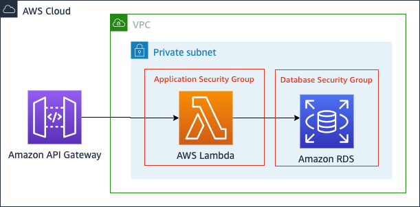

# Java REST API with Amazon API Gateway, RDS Postgres and AWS Lambda with SnapStart 



A pattern to show how to use Lambda SnapStart with relational databases.

Learn more about this pattern at Serverless Land Patterns: https://serverlessland.com/patterns/apigw-lambda-rds-snapstart

Important: this application uses various AWS services and there are costs associated with these services after the Free Tier usage - please see the [AWS Pricing page](https://aws.amazon.com/pricing/) for details. You are responsible for any AWS costs incurred. No warranty is implied in this example.

## Requirements

- [Create an AWS account](https://portal.aws.amazon.com/gp/aws/developer/registration/index.html) if you do not already have one and log in. The IAM user that you use must have sufficient permissions to make necessary AWS service calls and manage AWS resources.
- [AWS CLI](https://docs.aws.amazon.com/cli/latest/userguide/install-cliv2.html) installed and configured
- [Git Installed](https://git-scm.com/book/en/v2/Getting-Started-Installing-Git)
- [AWS CDK](https://docs.aws.amazon.com/cdk/v2/guide/getting_started.html#getting_started_install) (AWS CDK) installed
- [jq](https://stedolan.github.io/jq/download/)

## Deployment Instructions

1. Create a new directory, navigate to that directory in a terminal and clone the GitHub repository:
   ```
   git clone https://github.com/aws-samples/serverless-patterns
   ```
2. Change directory to the pattern directory:
   ```
   cd apigw-lambda-rds-snapstart
   ```
3. Build the database setup and unicorn functions
   ```
   ./mvnw clean package -f infrastructure/db-setup/pom.xml
   ./mvnw clean package -f software/unicorn-store/pom.xml
   ```
4. Deploy the infrastructure
   ```
   cd infrastructure/cdk
   cdk bootstrap
   cdk deploy UnicornStoreInfrastructure --require-approval never --outputs-file target/output.json
   ```
5. Execute the DB setup function to create the table
   ```
   aws lambda invoke --function-name $(cat target/output.json | jq -r '.UnicornStoreInfrastructure.DbSetupArn') /dev/stdout | cat;
   ```
6. Deploy the unicorn store
   ```
   cdk deploy UnicornStoreApp --outputs-file target/output.json --require-approval never
   ```

## Testing 

Create a new unicorn

```
curl --location --request POST $(cat target/output.json | jq -r '.UnicornStoreApp.ApiEndpoint')'/unicorns' \
  --header 'Content-Type: application/json' \
  --data-raw '{
    "id": "123",
    "name": "Something",
    "age": "Older",
    "type": "Animal",
    "size": "Very big"
}' | jq
```

Get a unicorn with the Id.

```
curl --location --request GET $(cat target/output.json | jq -r '.UnicornStoreApp.ApiEndpoint')'/unicorns/123'
```

## How it works

CDK creates all the infrastructure we need for the pattern, include the VPC, subnets, security groups,secrets and the DB.

The DB setup Lambda function is executed once to create the database table with a given structure.

This REST API is implemented with the [Micronaut framework](https://micronaut.io/). Credentials for the DB are passed as
environment variables to the application. 

# SnapStart Best Practice

The Micronaut Data component implements it's database connectivity using the Hikari data source library. When a Lambda 
function is initialised it automatically creates and opens a connection to the database, in this case to Postgres. 

This is advantageous if you are not using SnapStart, if you are then the application state is recorded with the
knowledge of an active db connection. This means that the first time a snapshot is resumed it has a stale db connection
and the database library has to repair this by making a new connection.

It is best practice to use [Runtime hooks](https://docs.aws.amazon.com/lambda/latest/dg/snapstart-runtime-hooks.html) to
suspend the data source and close any open connections before the snapshot is taken. You can then resume the data source
after the snapshot has been resumed.

The Micronaut framework has created additional support to help with this scenario. To enable it include the [Micronaut 
CRaC](https://micronaut-projects.github.io/micronaut-crac/latest/guide/) module in you project. 

```xml
<dependency>
   <groupId>io.micronaut.crac</groupId>
   <artifactId>micronaut-crac</artifactId>
   <scope>compile</scope>
</dependency>
```

When this is added the
Hikari data source hooks in <code>[HikariDataSourceResource.java](https://github.com/micronaut-projects/micronaut-crac/blob/master/crac/src/main/java/io/micronaut/crac/resources/datasources/HikariDataSourceResource.java)</code>
are activated.


| Test                  | Restore Duration | Duration | Total Duration |
|-----------------------|------------------|----------|----------------|
| without runtime hooks | 527ms            | 333ms    | 860ms          |
| with runtime hooks    | 280ms            | 438ms    | 718ms (-16%)   |

## Delete stack

```bash
cd infrastructure/cdk
cdk destroy --all
```

---

Copyright 2023 Amazon.com, Inc. or its affiliates. All Rights Reserved.

SPDX-License-Identifier: MIT-0