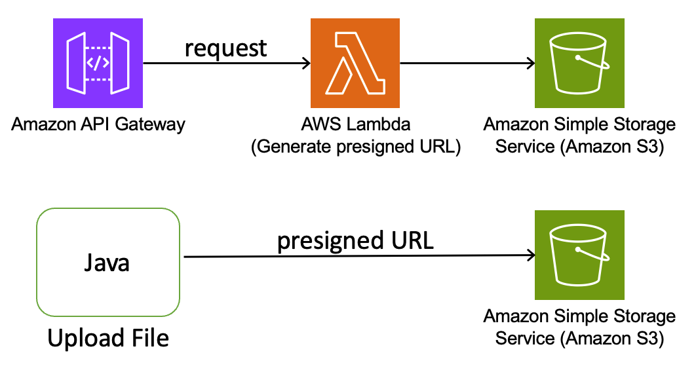

# Upload file to Amazon S3 bucket using presigned URL using Terraform 

This sample project deploys an Amazon API Gateway REST API with an AWS Lambda integration. The Lambda function, written in Java, generates a presigned URL with write access to an Amazon S3 Bucket. The provided test class uploads a file up to 5GB into the S3 bucket using the presigned URL.

Learn more about this pattern at Serverless Land Patterns: serverlessland.com/patterns/apigw-lambda-s3-terraform-java

Alternatively, to implement this project using AWS SAM, refer to https://serverlessland.com/patterns/apigw-lambda-s3-sam-java

Important: this application uses various AWS services and there are costs associated with these services after the Free Tier usage - please see the [AWS Pricing page](https://aws.amazon.com/pricing/) for details. You are responsible for any AWS costs incurred. No warranty is implied in this example.

## Requirements

- [Create an AWS account](https://portal.aws.amazon.com/gp/aws/developer/registration/index.html) if you do not already have one and log in. The IAM user that you use must have sufficient permissions to make necessary AWS service calls and manage AWS resources.
- [AWS CLI](https://docs.aws.amazon.com/cli/latest/userguide/install-cliv2.html) installed and configured
- [Git Installed](https://git-scm.com/book/en/v2/Getting-Started-Installing-Git)
- [Terraform](https://learn.hashicorp.cxom/tutorials/terraform/install-cli?in=terraform/aws-get-started) installed
- [Java 21 or above](https://docs.aws.amazon.com/corretto/latest/corretto-21-ug/amazon-linux-install.html) installed
- [Maven 3.8.6 or above](https://maven.apache.org/download.cgi) installed


## Deployment Instructions

1. Create a new directory, navigate to that directory in a terminal and clone the GitHub repository:
   ```bash
   git clone https://github.com/aws-samples/serverless-patterns
   ```

2. Change directory to the pattern directory:
   ```bash
   cd serverless-patterns/apigw-lambda-s3-terraform-java
   ```

3. From the command line, execute the below command to build the Java based AWS Lambda funtion using Maven. This will create `MyS3PreSignedURLGeneratorFunction.zip` file under the `target` folder.
   ```bash
   mvn clean package
   ```

4. From the command line, use Terraform to deploy the AWS resources for the pattern as specified in the main.tf file:
   ```bash
   terraform init
   terraform apply
   ```
5. During the prompts:

   - Enter the desired prefix to identify your project
   - Enter the desired AWS Region. 
   - Do you want to perform these actions? Enter 'yes'
   

6. Note the output from the terraform deployment process. This contains the REST API URL which is used for next step as well as testing.

## How it works

This Terraform project uses allows user to upload a file up to 5 GB size using Amazon S3 bucket presigned URL. Please refer to the architecture diagram below:



Here's a breakdown of the steps:

1. **Amazon API Gateway**: Receives the HTTP POST request containing the file name to be uploaded.

2. **AWS Lambda**: Triggered by the API Gateway, this function creates a presigned S3 bucket URL with PUT object permission for the provided key (file name).

3. **Amazon S3**: User uploads a file up to 5 GB size using presigned URL. 

## Testing

1. For testing this, you can use any file up to 5 GB in size. For example you can download the [Amazon S3 user guide](https://docs.aws.amazon.com/pdfs/AmazonS3/latest/userguide/s3-userguide.pdf). 


2. Run the following command from to run the test class to upload a file using Amazon S3 presigned URL:

   ```bash
   java -cp target/test-classes/ com.example.S3UploadIntegrationTest
   ```

2. During the prompts:

   - Enter the REST API URL to get the presigned URL: from the `terraform apply` output
   - Enter the file name on S3 (key): your-file.pdf
   - Enter the path to the local file: your-file.pdf

If everything goes fine you should get a confirmation message:
   ```bash
   File uploaded successfully!
   ```

3. Log into [Amazon S3 Console]() and open the {prefix}-s3-upload bucket to validate the file got uploaded successfully. 

## Cleanup

1. Delete the content in the Amazon S3 bucket using the following command. Please *ensure* that the correct bucket name is provided to avoid accidental data loss:
   ```bash
   aws s3 rm s3://{prefix}-s3-upload --recursive --region {your-region}

2. To delete the resources deployed to your AWS account via Terraform, run the following command:

   ```bash
   terraform destroy
   ```


---

Copyright 2024 Amazon.com, Inc. or its affiliates. All Rights Reserved.

SPDX-License-Identifier: MIT-0
