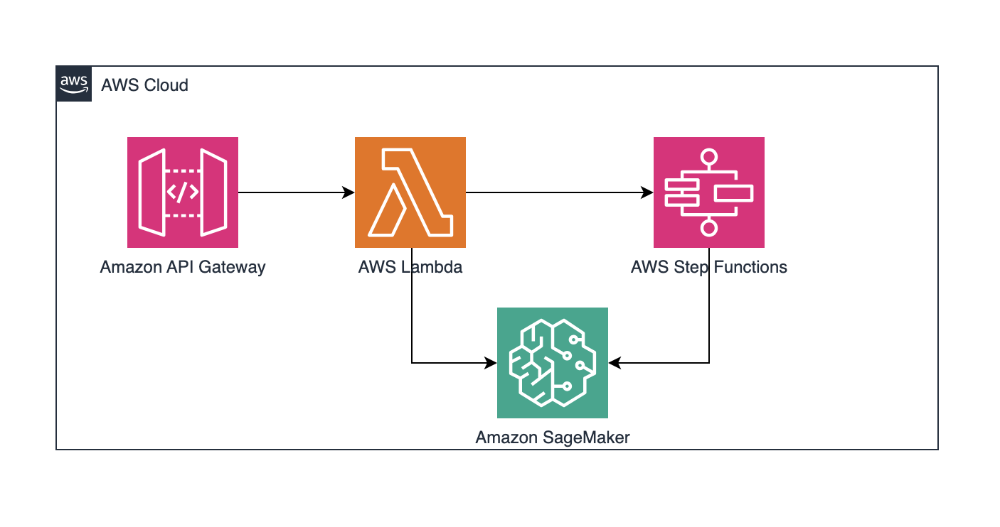

# API driven SageMaker domain creation

This pattern demonstrates how to use an API driven approach to provision SageMaker Domain & configurations. API Gateway/Lambda/SFN pattern with AWS Service APIs is used manage SageMaker Domain creation process.

Learn more about this pattern at Serverless Land Patterns: https://serverlessland.com/patterns/apigw-lambda-sfn-sagemaker

Important: this application uses various AWS services and there are costs associated with these services after the Free Tier usage - please see the [AWS Pricing page](https://aws.amazon.com/pricing/) for details. You are responsible for any AWS costs incurred. No warranty is implied in this example.

## Requirements

* [Create an AWS account](https://portal.aws.amazon.com/gp/aws/developer/registration/index.html) if you do not already have one and log in. The IAM user that you use must have sufficient permissions to make necessary AWS service calls and manage AWS resources.
* [AWS CLI](https://docs.aws.amazon.com/cli/latest/userguide/install-cliv2.html) installed and configured
* [Git Installed](https://git-scm.com/book/en/v2/Getting-Started-Installing-Git)
* [Terraform](https://developer.hashicorp.com/terraform/tutorials/aws-get-started/install-cli) (AWS SAM) installed

## Deployment Instructions

1. Create a new directory, navigate to that directory in a terminal and clone the GitHub repository:
    ``` 
    git clone https://github.com/aws-samples/serverless-patterns
    ```
1. Change directory to the pattern directory:
    ```
    cd apigw-lambda-sagemaker-jumpstartendpoint-cdk-python
    ```
1. From the command line, use Terraform commands to deploy the AWS resources for the pattern:
    ```
    terraform init
    terraform plan --auto-approve
    ```

1. Note the outputs from the above commands. These contain the resources/changes that will be made to infrastructure on your AWS account.
   ```
    terraform apply --auto-approve
   ```
## How it works


- API Gateway Post method invokes a Lambda which uses python boto3 to call AWS SageMaker api to create a SageMaker domain. 
- The Lambda function then invokes a Step Functions state machine to monitor the creation of the domain. 
- The Step Functions state machine uses AWS SDK to get the status of the Domain creation and has a wait pattern to monitor the status until successful/failed creation. 
- This orchestration can be further enhanced to add additional SageMaker configurations like User Profiles etc.

## Testing

- Invoke the API using cli or any client (eg: Postman) to trigger the SageMaker Domain creation process.
   ```
   curl --location 'https://9krsv61fm4.execute-api.us-east-1.amazonaws.com/dev/app' \
   --header 'Content-Type: application/json' \
   --data '{
     "domain_name": "serverless"
   }'
   ```
- Once the API response is successful, you can check the SageMaker Domains and you will notice the new domain creation in process.
- You can also review the Step Functions State Machine orchestration which will monitor this creation process until completion.

## Cleanup
 
1. Delete the stack
    ```bash
    terraform destroy --auto-approve
    ```

----
Copyright 2023 Amazon.com, Inc. or its affiliates. All Rights Reserved.

SPDX-License-Identifier: MIT-0