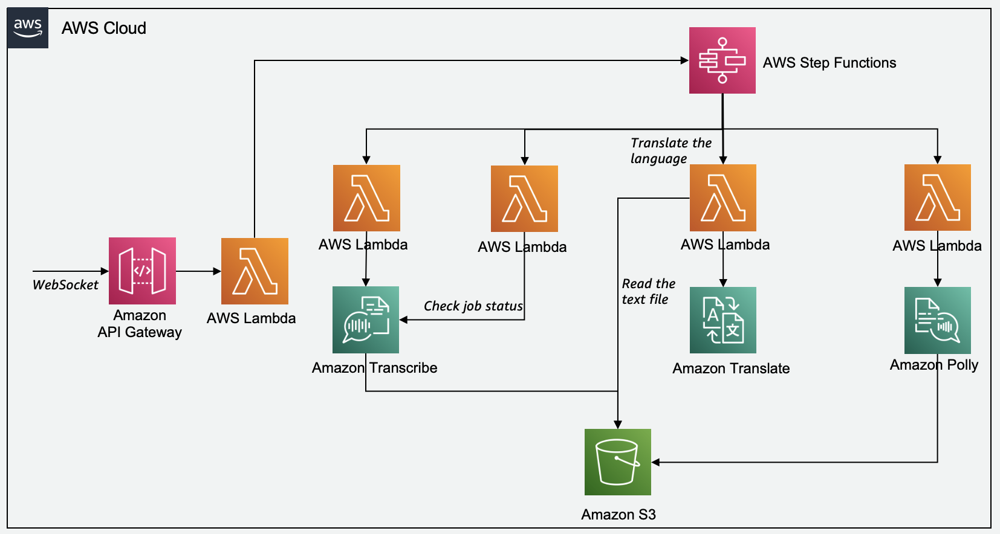

# API Gateway Websockets - Lambda - Step Functions - Transcribe - Translate - Polly - S3

This pattern demonstrates the use of API Gateway, Lambda, Step Functions, Transcribe, Translate, Polly and S3 to create an online language converter app.

Learn more about this pattern at Serverless Land Patterns: << Add the live URL here >>

Important: this application uses various AWS services and there are costs associated with these services after the Free Tier usage - please see the [AWS Pricing page](https://aws.amazon.com/pricing/) for details. You are responsible for any AWS costs incurred. No warranty is implied in this example.

## Programming Language

This is a Node.js project which uses WebPack along with AWS SDK for Javascript.

## Services

The AWS services used in this pattern are

- Amazon API Gateway
- Amazon S3
- AWS Lamdba
- AWS Step Functions
- Amazon Transcribe
- Amazon Translate
- Amazon Polly



## Requirements

* [Create an AWS account](https://portal.aws.amazon.com/gp/aws/developer/registration/index.html) if you do not already have one and log in. The IAM user that you use must have sufficient permissions to make necessary AWS service calls and manage AWS resources.
* [AWS CLI](https://docs.aws.amazon.com/cli/latest/userguide/install-cliv2.html) installed and configured
* [Git Installed](https://git-scm.com/book/en/v2/Getting-Started-Installing-Git)
* [AWS Serverless Application Model](https://docs.aws.amazon.com/serverless-application-model/latest/developerguide/serverless-sam-cli-install.html) (AWS SAM) installed

## Deployment Instructions

1. Create a new directory, navigate to that directory in a terminal and clone the GitHub repository:
    ``` 
    git clone https://github.com/aws-samples/serverless-patterns
    ```
1. Change directory to the pattern directory:
    ```
    cd serverless-patterns/apigw-lambda-sfn-transcribe-translate-polly-sam
    ```
1. Build the stack using sam:
    ```
    sam build
    ```
1. Once build succeeded, deploy the stack. Choose options as needed:
    ```
    sam deploy --guided --capabilities CAPABILITY_NAMED_IAM
    ```

1. Note the outputs from the Serverless deployment process. These contain the input bucket name where the audio file has to be copied, the state machine arn and websocket API.

## How it works

API Gateway handles incoming traffic and sends it to the lambda which in turn invokes the step function. The step function orchestrates the process to transcribe for converting speech to text, then to translate for language translation of the text file and finally to polly for converting text to speech and store the audio file in S3. The step function at last returns the S3 signed url to the lambda which is returned as response from API Gateway websockets.

## Testing

Follow the steps to test the pattern:

1. Copy the audio to the input bucket (available from the output of the cloudformation stack).
    ```bash
    aws s3 cp audio.ogg s3://{input-bucket-name}
    ```
1. Install the websocket client
    ```bash
    npm install -g wscat
    ```
1. Run websocket client to invoke the API Gateway. Get the API ID from the output of the deployment step
    ```bash
    wscat -c  wss://<API-ID>.execute-api.<Region>.amazonaws.com/dev?proto=https
    ```
1. On the next prompt, add the input parameters. Replace the input bucket name. It can be tested with other language codes as well.
    ```bash
    { "bucketName": "<input-bucket-name>", "objectKey": "audio.ogg", "inputLanguageCode": "en-IN", "outputLanguageCode" : "Hindi |hi-IN" }
    ```
1. A signed S3 url will be returned as an output containing the audio file. Play the file from the url.


## Cleanup
 
1. Manually delete all the S3 buckets created by the stack.

1. Delete the stack
    ```bash
    sam delete
    ```
----
Copyright 2023 Amazon.com, Inc. or its affiliates. All Rights Reserved.

SPDX-License-Identifier: MIT-0